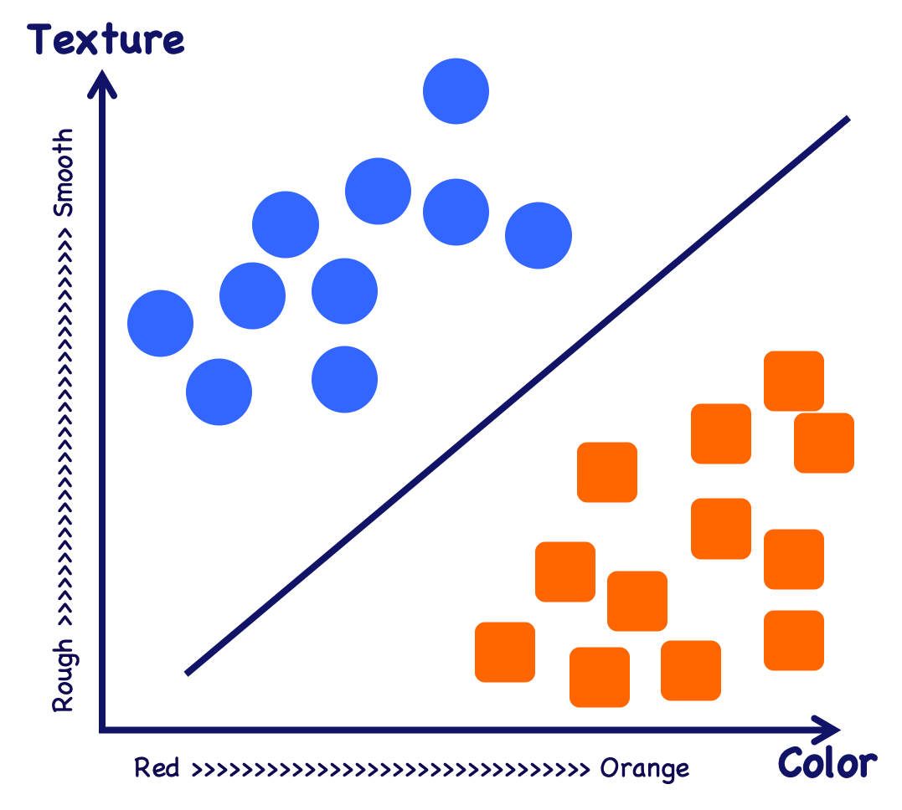

<div class="cell markdown">

# Dataset and Data Preprocessing

## Pandas

Pandas is a python library useful for data manipulation

</div>

<div class="cell code" data-execution_count="68">

``` python
import pandas as pd

iris = pd.read_csv("data/iris.csv") #read the csv file - default mode
iris.head() #show first 5 dataset entries
```

<div class="output execute_result" data-execution_count="68">

``` 
   sepal_length  sepal_width  petal_length  petal_width species
0           5.1          3.5           1.4          0.2  setosa
1           4.9          3.0           1.4          0.2  setosa
2           4.7          3.2           1.3          0.2  setosa
3           4.6          3.1           1.5          0.2  setosa
4           5.0          3.6           1.4          0.2  setosa
```

</div>

</div>

<div class="cell markdown">

You can custom read a csv file with these parameters:

  - **header**: from which row you can get features
  - **names**: you can define property names with a custom dictionary
  - **sep**: you can specify the separator of the columns in the file

Every property(column) in the dataframe is called *feature*

</div>

<div class="cell code" data-execution_count="69">

``` python
iris = pd.read_csv("data/iris.csv", sep=",", header=0, names=["sepal_length","sepal_width","petal_length","petal_width","species"]) #read the csv file - default mode
iris.head() #show first 5 dataset entries
```

<div class="output execute_result" data-execution_count="69">

``` 
   sepal_length  sepal_width  petal_length  petal_width species
0           5.1          3.5           1.4          0.2  setosa
1           4.9          3.0           1.4          0.2  setosa
2           4.7          3.2           1.3          0.2  setosa
3           4.6          3.1           1.5          0.2  setosa
4           5.0          3.6           1.4          0.2  setosa
```

</div>

</div>

<div class="cell markdown">

To show other usefull informations about the dataset:

</div>

<div class="cell code" data-execution_count="70">

``` python
iris.columns #show all features
iris.info() #other informations
```

<div class="output stream stdout">

    <class 'pandas.core.frame.DataFrame'>
    RangeIndex: 150 entries, 0 to 149
    Data columns (total 5 columns):
     #   Column        Non-Null Count  Dtype  
    ---  ------        --------------  -----  
     0   sepal_length  150 non-null    float64
     1   sepal_width   150 non-null    float64
     2   petal_length  150 non-null    float64
     3   petal_width   150 non-null    float64
     4   species       150 non-null    object 
    dtypes: float64(4), object(1)
    memory usage: 6.0+ KB

</div>

</div>

<div class="cell markdown">

## Dataframe and Series

A dataframe is composed by different *series*: another data type in
Pandas. A serie is a simple mono dimensional array.

You can get single serie with pandas by calling dataset with header
title as a key

</div>

<div class="cell code" data-execution_count="71">

``` python
Y = iris['species']
Y.head()
```

<div class="output execute_result" data-execution_count="71">

    0    setosa
    1    setosa
    2    setosa
    3    setosa
    4    setosa
    Name: species, dtype: object

</div>

</div>

<div class="cell markdown">

You can obtain same goal by calling dataset with keys array

</div>

<div class="cell code" data-execution_count="72">

``` python
X = iris[["sepal_length", "sepal_width", "petal_length", "petal_width", "species"]]
X.head()
```

<div class="output execute_result" data-execution_count="72">

``` 
   sepal_length  sepal_width  petal_length  petal_width species
0           5.1          3.5           1.4          0.2  setosa
1           4.9          3.0           1.4          0.2  setosa
2           4.7          3.2           1.3          0.2  setosa
3           4.6          3.1           1.5          0.2  setosa
4           5.0          3.6           1.4          0.2  setosa
```

</div>

</div>

<div class="cell markdown">

the main difference between series and dataframe is the header, in a
serie header there isn't a title, in this example you should remove
*species* column in a different way: by dropping it:

</div>

<div class="cell code" data-execution_count="73">

``` python
X = iris.drop('species', axis=1) #with axis=1 you remove a column, in this case you want to remove species and so it make sense 
X.head()
```

<div class="output execute_result" data-execution_count="73">

``` 
   sepal_length  sepal_width  petal_length  petal_width
0           5.1          3.5           1.4          0.2
1           4.9          3.0           1.4          0.2
2           4.7          3.2           1.3          0.2
3           4.6          3.1           1.5          0.2
4           5.0          3.6           1.4          0.2
```

</div>

</div>

<div class="cell markdown">

## Selection and editing of data

with *loc* or *iloc* method you can slicing data:

</div>

<div class="cell code" data-execution_count="74">

``` python
iris.loc[10] #select the row with index 10
iris.loc[:5, 'petal_length'] #select first 5 index rows (only feature petal_l) 
iris.iloc[10] #select the row in position 10 (not with index 10)
iris.iloc[:5, 2] #select first 5 rows (only second feature -> petal_l)
```

<div class="output execute_result" data-execution_count="74">

    0    1.4
    1    1.4
    2    1.3
    3    1.5
    4    1.4
    Name: petal_length, dtype: float64

</div>

</div>

<div class="cell markdown">

You can also randomize dataframe with *sample* function:

  - **n**: number of items from axis to return
  - **frac**: fraction of axis items to return (not compatible with *n*)
  - **weights**: default *none*, series of weights for every column
  - **random\_state**: if you pass a int it will be the seed for the
    pseudo number generator
  - **axis**: 1 for column, 0 for index
  - **ignore\_index**: if True the resulting index will be labeled in
    0,1...n-1

</div>

<div class="cell code" data-execution_count="75">

``` python

iris_sampled = iris.sample(frac=1, random_state=0) #randomize order of dataset
```

</div>

<div class="cell markdown">

To avoid to edit original dataset you can copy it with:

</div>

<div class="cell code" data-execution_count="76">

``` python
iris_copy = iris.copy() #copy dataset
```

</div>

<div class="cell markdown">

### Stats

</div>

<div class="cell code" data-execution_count="77">

``` python
iris.shape #dataset size
```

<div class="output execute_result" data-execution_count="77">

    (150, 5)

</div>

</div>

<div class="cell code" data-execution_count="78">

``` python

iris.describe() #some statistical informations
```

<div class="output execute_result" data-execution_count="78">

``` 
       sepal_length  sepal_width  petal_length  petal_width
count    150.000000   150.000000    150.000000   150.000000
mean       5.843333     3.054000      3.758667     1.198667
std        0.828066     0.433594      1.764420     0.763161
min        4.300000     2.000000      1.000000     0.100000
25%        5.100000     2.800000      1.600000     0.300000
50%        5.800000     3.000000      4.350000     1.300000
75%        6.400000     3.300000      5.100000     1.800000
max        7.900000     4.400000      6.900000     2.500000
```

</div>

</div>

<div class="cell markdown">

## Masks and filters

</div>

<div class="cell code" data-execution_count="79">

``` python
long_petal_mask = iris['petal_length'] > iris['petal_length'].mean() #this is the mask, a series of boolean values with true where conditions is true and false where condition is false
iris_long_petal = iris[long_petal_mask] # when you pass a boolean series of index to an array it returns only elements where index is true -> basically a mask
iris_long_petal.head()
```

<div class="output execute_result" data-execution_count="79">

``` 
    sepal_length  sepal_width  petal_length  petal_width     species
50           7.0          3.2           4.7          1.4  versicolor
51           6.4          3.2           4.5          1.5  versicolor
52           6.9          3.1           4.9          1.5  versicolor
53           5.5          2.3           4.0          1.3  versicolor
54           6.5          2.8           4.6          1.5  versicolor
```

</div>

</div>

<div class="cell markdown">

You can also edit dataframe conditionally with mask:

</div>

<div class="cell code" data-execution_count="80">

``` python
iris_copy = iris.copy()
setosa_mask = iris['species'] == 'setosa' #mask
iris_copy.loc[setosa_mask, 'species'] = "undefined" #assign undefined where specie is setosa
iris_copy['species'].unique()
```

<div class="output execute_result" data-execution_count="80">

    array(['undefined', 'versicolor', 'virginica'], dtype=object)

</div>

</div>

<div class="cell markdown">

### Visualization wiht Matplotlib

Plot has a lot of parameters and allow you to print charts on the page:

  - data : DataFrame
  - x : label or position, default None
  - y : label, position or list of label, positions, default None,
    Allows plotting of one column versus another
  - kind : str
      - *line* : line plot (default)
      - *bar* : vertical bar plot
      - *barh* : horizontal bar plot
      - *hist* : histogram
      - *box* : boxplot
      - *kde* : Kernel Density Estimation plot
      - *density* : same as *kde*
      - *area* : area plot
      - *pie* : pie plot
      - *scatter* : scatter plot
      - *hexbin* : hexbin plot
  - ax : matplotlib axes object, default None
  - subplots : boolean, default False, Make separate subplots for each
    column
  - sharex : boolean, default True if ax is None else False. In case
    subplots=True, share x axis and set some x axis labels to invisible;
    defaults to True if ax is None otherwise False if an ax is passed
    in; Be aware, that passing in both an ax and sharex=True will alter
    all x axis labels for all axis in a figure\!
  - sharey : boolean, default False. In case subplots=True, share y axis
    and set some y axis labels to invisible
  - layout : tuple (optional). (rows, columns) for the layout of
    subplots
  - figsize : a tuple (width, height) in inches
  - use\_index : boolean, default True. Use index as ticks for x axis
  - title : string or list, Title to use for the plot. If a string is
    passed, print the string at the top of the figure. If a list is
    passed and subplots is True, print each item in the list above the
    corresponding subplot.
  - grid : boolean, default None (matlab style default) Axis grid lines
  - legend : False/True/’reverse’. Place legend on axis subplots
  - style : list or dict. matplotlib line style per column
  - logx : boolean, default False. Use log scaling on x axis
  - logy : boolean, default False. Use log scaling on y axis
  - loglog : boolean, default False. Use log scaling on both x and y
    axes
  - xticks : sequence. Values to use for the xticks
  - yticks : sequence. Values to use for the yticks
  - xlim : 2-tuple/list
  - ylim : 2-tuple/list
  - rot : int, default None. Rotation for ticks (xticks for vertical,
    yticks for horizontal plots)
  - fontsize : int, default None. Font size for xticks and yticks
  - colormap : str or matplotlib colormap object, default None. Colormap
    to select colors from. If string, load colormap with that name from
    matplotlib.
  - colorbar : boolean, optional. If True, plot colorbar (only relevant
    for ‘scatter’ and ‘hexbin’ plots)
  - position : float. Specify relative alignments for bar plot layout.
    From 0 (left/bottom-end) to 1 (right/top-end). Default is 0.5
    (center)
  - table : boolean, Series or DataFrame, default False. If True, draw a
    table using the data in the DataFrame and the data will be
    transposed to meet matplotlib’s default layout. If a Series or
    DataFrame is passed, use passed data to draw a table.
  - yerr : DataFrame, Series, array-like, dict and str. See Plotting
    with Error Bars for detail.
  - xerr : same types as yerr.
  - stacked : boolean, default False in line and bar plots, and True in
    area plot. If True, create stacked plot.
  - sort\_columns : boolean, default False. Sort column names to
    determine plot ordering
  - secondary\_y : boolean or sequence, default False. Whether to plot
    on the secondary y-axis If a list/tuple, which columns to plot on
    secondary y-axis
  - mark\_right : boolean, default True. When using a secondary\_y axis,
    automatically mark the column labels with “(right)” in the legend
  - \*\*kwds : keywords. Options to pass to matplotlib plotting method

</div>

<div class="cell code" data-execution_count="81">

``` python
import matplotlib.pyplot as plt

iris_2feats = iris[['sepal_length','sepal_width']]
iris_2feats.plot(kind="scatter", x='sepal_length',y='sepal_width')
```

<div class="output execute_result" data-execution_count="81">

    <AxesSubplot:xlabel='sepal_length', ylabel='sepal_width'>

</div>

<div class="output display_data">


</div>

</div>

<div class="cell markdown">

## Operations on dataset

</div>

<div class="cell code" data-execution_count="82">

``` python
X = iris.drop('species',axis=1)
X_norm = (X - X.min())/(X.max()-X.min())  #min max normalization
X_norm.head()
```

<div class="output execute_result" data-execution_count="82">

``` 
   sepal_length  sepal_width  petal_length  petal_width
0      0.222222     0.625000      0.067797     0.041667
1      0.166667     0.416667      0.067797     0.041667
2      0.111111     0.500000      0.050847     0.041667
3      0.083333     0.458333      0.084746     0.041667
4      0.194444     0.666667      0.067797     0.041667
```

</div>

</div>

<div class="cell code" data-execution_count="83">

``` python
iris.sort_values('petal_length').head() #sort ascending, to descending use parameter ascending=False
```

<div class="output execute_result" data-execution_count="83">

``` 
    sepal_length  sepal_width  petal_length  petal_width species
22           4.6          3.6           1.0          0.2  setosa
13           4.3          3.0           1.1          0.1  setosa
14           5.8          4.0           1.2          0.2  setosa
35           5.0          3.2           1.2          0.2  setosa
36           5.5          3.5           1.3          0.2  setosa
```

</div>

</div>

<div class="cell code" data-execution_count="84">

``` python
grouped_species = iris.groupby(['species']) # group by species
grouped_species.mean()
```

<div class="output execute_result" data-execution_count="84">

``` 
            sepal_length  sepal_width  petal_length  petal_width
species                                                         
setosa             5.006        3.418         1.464        0.244
versicolor         5.936        2.770         4.260        1.326
virginica          6.588        2.974         5.552        2.026
```

</div>

</div>

<div class="cell markdown">

If you have invalid data inside a dataset. With Pandas you can fix it:

</div>

<div class="cell code" data-execution_count="85">

``` python
import numpy as np #ignore it for the moment, only to create random array

iris_nan = iris.copy()

n_val = iris.shape[0] #shape return array (n_index, n_features), we need number of indexes
samples = np.random.randint(n_val, size=(10)) #we create a random 10 elements array with each value between 0 and n_val -> only to random select 10 elements

iris_nan.loc[samples,'petal_length']=None #we replace 10 random petal length values with a None value

iris_nan['petal_length'].isnull().sum() #we count None element in iris_nan -> 10 of course
```

<div class="output execute_result" data-execution_count="85">

``` 
10
```

</div>

</div>

<div class="cell markdown">

Now we can fix invalid elements, we replace NaN values with the average
value of the dataset to avoid perturbing the statistic,
*fillna(value=None, method=None, axis=None, inplace=False, limit=None,
downcast=None)* fill na or NaN values:

  - **value**: value used to fill
  - **method**: *{‘backfill’, ‘bfill’, ‘pad’, ‘ffill’, None}, default
    None*
  - **axis**: *{0 or ‘index’, 1 or ‘columns’}*
  - **inplace**: True or False, if True fill-in-place
  - **limit**: If method is specified, this is the maximum number of
    consecutive NaN values to forward/backward fill
  - **downcast**: A dict of item-\>dtype of what to downcast if possible
  - return dataframe or not -\> depending on *inplace*

</div>

<div class="cell code" data-execution_count="86">

``` python
mean_petal_length = iris_nan['petal_length'].mean()
iris_nan['petal_length'].fillna(mean_petal_length, inplace=True) # fillna fill na or NaN values 
iris_nan['petal_length'].isnull().sum() #check invalid values
```

<div class="output execute_result" data-execution_count="86">

``` 
0
```

</div>

</div>

<div class="cell markdown">

We can do operations on row or column with *apply* method, first
argument must be function to apply

</div>

<div class="cell code" data-execution_count="87">

``` python
iris.apply(np.count_nonzero, axis=1).head() #we count values different from zero for every row
```

<div class="output execute_result" data-execution_count="87">

    0    5
    1    5
    2    5
    3    5
    4    5
    dtype: int64

</div>

</div>

<div class="cell code" data-execution_count="88">

``` python
iris.apply(np.count_nonzero, axis=0).head() #we count values different from zero for every feature
```

<div class="output execute_result" data-execution_count="88">

    sepal_length    150
    sepal_width     150
    petal_length    150
    petal_width     150
    species         150
    dtype: int64

</div>

</div>

<div class="cell markdown">

Use applymap to apply lambda function (elements)

</div>

<div class="cell code" data-execution_count="89">

``` python
X = iris.drop('species',axis=1)
X = X.applymap(lambda val:int(round(val,0))) #round values to closer int
X.head()
```

<div class="output execute_result" data-execution_count="89">

``` 
   sepal_length  sepal_width  petal_length  petal_width
0             5            4             1            0
1             5            3             1            0
2             5            3             1            0
3             5            3             2            0
4             5            4             1            0
```

</div>

</div>

<div class="cell markdown">

## Qualitative Data

All data in machine learning (and in computer science of course) must be
numeric and discrete. In real life there a lot of data types:

  - Continuos Quantitative variables: price, altitude, temperature etc.
  - Ordinal Qualitative Varaibles: clothes sizes, podium position
  - Nominal Qualitative Variables: colors

All machine learning input must be numeric so we have to convert all non
numeric values in numeric values.

### mapping of ordinal variables

#### Numpy

**Numpy** is a python library that offer a lot of vector operations,
**scikit-learn** is a library useful for machine learning purposes.

We can map ordinal variable with *numpy.vectorize(pyfunc, otypes=None,
doc=None, excluded=None, cache=False, signature=None)*:

  - **pyfunc**: python function or method
  - **otypes**: output data type, it should be *str* or *list of dtypes*
  - **doc**: docstring for the function
  - **excluded**: set of strings or integers representing the positional
    or keyword arguments

</div>

<div class="cell code" data-execution_count="90">

``` python
import numpy as np

shirts = pd.read_csv("data/shirts.csv",index_col=0)
X = shirts.values # -> from dataset to pure array
size_mapping = {"S":0,"M":1,"L":2,"XL":3} # dictionary, the map
fmap = np.vectorize(lambda t:size_mapping[t])
X[:,0] = fmap(X[:,0])
X[:5]
```

<div class="output execute_result" data-execution_count="90">

    array([[0, 'bianco', 4.99],
           [1, 'bianco', 19.99],
           [3, 'bianco', 12.49],
           [3, 'bianco', 14.99],
           [0, 'bianco', 14.99]], dtype=object)

</div>

</div>

<div class="cell markdown">

#### Pandas

we can obtain same result with pandas library

</div>

<div class="cell code" data-execution_count="91">

``` python
size_mapping = {"S":0,"M":1,"L":2,"XL":3} #dictionary, the map
shirts["taglia"] = shirts["taglia"].map(size_mapping) #we map sizes with correspondent number
shirts.head() #the return value is a dataset and not an array
```

<div class="output execute_result" data-execution_count="91">

``` 
   taglia  colore  prezzo
0       0  bianco    4.99
1       1  bianco   19.99
2       3  bianco   12.49
3       3  bianco   14.99
4       0  bianco   14.99
```

</div>

</div>

<div class="cell markdown">

### One-Hot encoding

We can't map Nominal qualitative variables with an ordinal list but can
use boolean encoding called one-hot. We have to create one column for
each class to encode, *true* or *1* value mean belonging, for example if
there are 3 colors: white, black and red. we can create 3 columns called
*white*, *black* and *red*, every single shirt has 1 only in the column
that correspond to its color and 0 in the others

this variables are called *dummy*

To do so we can use *ColumnTransformer(transformers, *,
remainder='drop', sparse\_threshold=0.3, n\_jobs=None,
transformer\_weights=None, verbose=False,
verbose\_feature\_names\_out=True)\* that apply transformations only in
specified columns:

  - **transformers**: list of (name, transformers, columns) tuples to be
    applied to subsets of the data
      - *Name*: this allows the transformer to be set
      - *transformer*
      - *columns*: Integers are interpreted as positional columns, while
        strings can reference DataFrame columns by name. A scalar string
        or int should be used where transformer expects X to be a 1d
        array-like (vector), otherwise a 2d array will be passed to the
        transformer. A callable is passed the input data X and can
        return any of the above
  - **Remainder**: non-specified columns dropped by default or passed
    through
  - **sparse\_threshold**: from 0 to 1, if the overall density of
    returned matrix is lower than this value it will be stacked as a
    sparse matrix
  - **n\_jobs**: jobs to run in parallel, -1 -\> all processors, 1 -\> 1
    processors
  - **transformer\_weights**: dictionary where keys are transformer
    name, values are weight for which returned value are multiplied
  - **verbose**: if True execution time will be printed
  - **verbose\_feature\_names\_out**: if True *get\_feature\_names\_out*
    will be prefix of returned features name

</div>

<div class="cell code" data-execution_count="92">

``` python
from sklearn.preprocessing import LabelEncoder
from sklearn.preprocessing import OneHotEncoder
from sklearn.compose import ColumnTransformer


X = shirts.values 
transf = ColumnTransformer([('ohe', OneHotEncoder(), [1])], remainder="passthrough")

X = transf.fit_transform(X)

X[:5] 
```

<div class="output execute_result" data-execution_count="92">

    array([[1.0, 0.0, 0.0, 0, 4.99],
           [1.0, 0.0, 0.0, 1, 19.99],
           [1.0, 0.0, 0.0, 3, 12.49],
           [1.0, 0.0, 0.0, 3, 14.99],
           [1.0, 0.0, 0.0, 0, 14.99]], dtype=object)

</div>

</div>

<div class="cell markdown">

You should obtain same result with pandas dataframe:

</div>

<div class="cell code" data-execution_count="93">

``` python
shirts_copy = shirts.copy()
shirts_copy = pd.get_dummies(shirts,columns=["colore"])
shirts_copy.tail()
```

<div class="output execute_result" data-execution_count="93">

``` 
    taglia  prezzo  colore_bianco  colore_rosso  colore_verde
95       2    9.99              1             0             0
96       1   14.99              0             0             1
97       0   12.49              0             1             0
98       2   12.49              0             1             0
99       0   19.99              0             1             0
```

</div>

</div>

<div class="cell markdown">

## Missing data

to manage missing data we will use numpy and pandas

</div>

<div class="cell code" data-execution_count="94">

``` python
import pandas as pd
import numpy as np

iris = pd.read_csv("data/iris.csv", header=0, names=["sepal_length","sepal_width","petal_length","petal_width","class"])
iris.head()
```

<div class="output execute_result" data-execution_count="94">

``` 
   sepal_length  sepal_width  petal_length  petal_width   class
0           5.1          3.5           1.4          0.2  setosa
1           4.9          3.0           1.4          0.2  setosa
2           4.7          3.2           1.3          0.2  setosa
3           4.6          3.1           1.5          0.2  setosa
4           5.0          3.6           1.4          0.2  setosa
```

</div>

</div>

<div class="cell code" data-execution_count="95">

``` python
iris_nan = iris.copy()
max_val = iris.shape[0]

samples = np.random.randint(max_val, size=(10)) #we create 10 elements random array
iris_nan.loc[samples,'petal_length']=None #we sobstitute random index element with None value

nan_count = iris_nan['petal_length'].isnull().sum() #count Non element (of course they are 10)
print("Dataset has "+str(nan_count)+" missing values")
iris_nan.to_csv("data/iris_with_nan.csv") # save into new file
```

<div class="output stream stdout">

    Dataset has 10 missing values

</div>

</div>

<div class="cell markdown">

We create also new numpy array with these values:

</div>

<div class="cell code" data-execution_count="96">

``` python
Y = iris_nan["class"].values # only values of class feature
X = iris_nan.drop("class",axis=1).values #all values except for class feature
```

</div>

<div class="cell markdown">

There are 2 methods to manage missing values:

### method 1: remove properties or examples with missing values

</div>

<div class="cell code" data-execution_count="97">

``` python
samples_before = iris_nan.shape[0]
iris_drop = iris_nan.dropna() #function that remove NaN values from iris_nan

samples_after = iris_drop.shape[0] #get new size

print("Number before dropping: "+str(samples_before))
print("Number after dropping: "+str(samples_after))
```

<div class="output stream stdout">

    Number before dropping: 150
    Number after dropping: 140

</div>

</div>

<div class="cell markdown">

### method 2: Imputation -\> replace missing values with an estimation

#### Pandas

we can do it with pandas (dataset) or numpy (array)

</div>

<div class="cell code" data-execution_count="98">

``` python
replace_with = iris_nan['petal_length'].mean() # imputation with average value
#replace_with = iris_nan['petal_length'].median() # imputation with median value
#replace_with = iris_nan['petal_length'].mode() # imputation with mode value
iris_nan['petal_length'].fillna(replace_with,inplace=True) # replace NaN values with first argument
nan_count = iris_nan['petal_length'].isnull().sum() #count numbers of NaN values
print("Dataset has now "+str(nan_count)+" missing values")
```

<div class="output stream stdout">

    Dataset has now 0 missing values

</div>

</div>

<div class="cell markdown">

#### Numpy and scikit-learn

we can use *SimpleImputer(\*, missing\_values=nan, strategy='mean',
fill\_value=None, verbose='deprecated', copy=True,
add\_indicator=False)\[source\]* function (scikit-learn library), type
of imputation can be specified:

  - **missing values**:
  - **strategy**: mean / median / most\_frequent / constant
  - **fill\_value**: when constant\!=0 specify here the value
  - **copy**: if True a copy will be created, if False imputation will
    be made in-place where possible
  - **add\_indicator**: If True, a MissingIndicator transform will stack
    onto output of the imputer’s transform. This allows a predictive
    estimator to account for missingness despite imputation

</div>

<div class="cell code" data-execution_count="99">

``` python
import numpy as np
from sklearn.impute import SimpleImputer

imp = SimpleImputer(missing_values = np.nan, strategy = 'mean')
X_imp = imp.fit_transform(X)

nan_count = np.count_nonzero(np.isnan(X_imp))
print("dataset has "+str(nan_count)+" missing values")
```

<div class="output stream stdout">

    dataset has 0 missing values

</div>

</div>

<div class="cell markdown">

## Feature and Scaling

if a dataset values are in same range of values train phase will be
faster. There are 2 methods to achieve this goal:

  - **normalization**: brings values in a range between 0 and 1:
    \[x_{norm} = \frac{x^i - x_{min}}{x_{max} - x_{min}}\]
  - **standardization** brings values in a range between -1 and 1 with
    mean value equal to 0 and variance equal to 1:
    \[x_{std} = \frac{x^i - x_{mean}}{x_{sd}}\]

### Normalization

#### Numpy and scikit-learn

</div>

<div class="cell code" data-execution_count="100">

``` python
""" 
IMPORT DATA
"""
import pandas as pd
wines = pd.read_csv("https://archive.ics.uci.edu/ml/machine-learning-databases/wine/wine.data", names=['class','alcol','flavonoidi'], 
                    usecols=[0,1,7])
"""
END IMPORT DATA
"""

from sklearn.preprocessing import MinMaxScaler

mms = MinMaxScaler()
X = wines.drop("class",axis=1).values # target value has classes and it should not be normalized, so we remove it
X_norm = mms.fit_transform(X)
X_norm[:5]
```

<div class="output execute_result" data-execution_count="100">

    array([[0.84210526, 0.57383966],
           [0.57105263, 0.51054852],
           [0.56052632, 0.61181435],
           [0.87894737, 0.66455696],
           [0.58157895, 0.49578059]])

</div>

</div>

<div class="cell markdown">

#### Pandas

</div>

<div class="cell code" data-execution_count="101">

``` python
wines_norm = wines.copy()

features = ["alcol","flavonoidi"] # columns to normalize
to_norm = wines_norm[features]
wines_norm[features] = (to_norm-to_norm.min())/(to_norm.max()-to_norm.min()) #we implement custom algorithm and we execute it on the entire dataframe
wines_norm.head()
```

<div class="output execute_result" data-execution_count="101">

``` 
   class     alcol  flavonoidi
0      1  0.842105    0.573840
1      1  0.571053    0.510549
2      1  0.560526    0.611814
3      1  0.878947    0.664557
4      1  0.581579    0.495781
```

</div>

</div>

<div class="cell markdown">

### Standardization

#### Numpy and scikit-learn

we use *class sklearn.preprocessing.StandardScaler(*, copy=True,
with\_mean=True, with\_std=True)\*:

  - **copy**: if false try to in place substitution
  - **with\_mean**: if True center the data before scaling
  - **with\_std**: if True scale the data to unit variance

standard scaler has these methods:

  - *fit(X\[, y, sample\_weight\])*: Compute the mean and std to be used
    for later scaling.
  - *fit\_transform(X\[, y\])*: Fit to data, then transform it
  - *get\_feature\_names\_out(\[input\_features\])*: get output feature
    names for transformation
  - *get\_params(\[deep\])*: get parameters for this estimator
  - *inverse\_transform(X\[, copy\])*: scale back the data to the
    original representation
  - *partial\_fit(X\[, y, sample\_weight\])*: Online computation of mean
    and std on X for later scaling
  - *set\_params(\*\*params)*: Set the parameters of this estimator
  - *transform(X\[, copy\])*: perform standardization by centering and
    scaling

</div>

<div class="cell code" data-execution_count="102">

``` python
from sklearn.preprocessing import StandardScaler

ss = StandardScaler()
X = wines.drop("class",axis=1).values
X_std = ss.fit_transform(X) #compute meand and std before transform 
X_std[:5]
```

<div class="output execute_result" data-execution_count="102">

    array([[1.51861254, 1.03481896],
           [0.24628963, 0.73362894],
           [0.19687903, 1.21553297],
           [1.69154964, 1.46652465],
           [0.29570023, 0.66335127]])

</div>

</div>

<div class="cell markdown">

#### Pandas

N.B. Pandas use sample std with denominator-1 (sampling standard
deviation) so results could be different from numpy standardization
(this difference become insignificant when number of samples tend to
infinite)

</div>

<div class="cell code" data-execution_count="103">

``` python
wines_std = wines.copy()

features = ["alcol","flavonoidi"]
to_std = wines_std[features]
wines_std[features] = (to_std - to_std.mean())/to_std.std()
wines_std[:5]
```

<div class="output execute_result" data-execution_count="103">

``` 
   class     alcol  flavonoidi
0      1  1.514341    1.031908
1      1  0.245597    0.731565
2      1  0.196325    1.212114
3      1  1.686791    1.462399
4      1  0.294868    0.661485
```

</div>

</div>

<div class="cell markdown">

## Dataset splitting

to test predictive model we have to split dataset into 2 parts: train
part and test part, we can train machine on trainset and we can test it
on testset. Keep in mind that target of a dataset is the feature about
which we want to gain a deeper understanding.

we can load boston dataset directly from scikit learn library:

</div>

<div class="cell code" data-execution_count="104">

``` python
import pandas as pd
import numpy as np
from sklearn.datasets import load_boston
boston = load_boston() #deprecated from 1.2 version 
```

<div class="output stream stderr">

    c:\Users\miche\anaconda3\lib\site-packages\sklearn\utils\deprecation.py:87: FutureWarning: Function load_boston is deprecated; `load_boston` is deprecated in 1.0 and will be removed in 1.2.
    
        The Boston housing prices dataset has an ethical problem. You can refer to
        the documentation of this function for further details.
    
        The scikit-learn maintainers therefore strongly discourage the use of this
        dataset unless the purpose of the code is to study and educate about
        ethical issues in data science and machine learning.
    
        In this special case, you can fetch the dataset from the original
        source::
    
            import pandas as pd
            import numpy as np
    
    
            data_url = "http://lib.stat.cmu.edu/datasets/boston"
            raw_df = pd.read_csv(data_url, sep="\s+", skiprows=22, header=None)
            data = np.hstack([raw_df.values[::2, :], raw_df.values[1::2, :2]])
            target = raw_df.values[1::2, 2]
    
        Alternative datasets include the California housing dataset (i.e.
        :func:`~sklearn.datasets.fetch_california_housing`) and the Ames housing
        dataset. You can load the datasets as follows::
    
            from sklearn.datasets import fetch_california_housing
            housing = fetch_california_housing()
    
        for the California housing dataset and::
    
            from sklearn.datasets import fetch_openml
            housing = fetch_openml(name="house_prices", as_frame=True)
    
        for the Ames housing dataset.
        
      warnings.warn(msg, category=FutureWarning)

</div>

</div>

<div class="cell markdown">

### Numpy and scikit learn (more important)

we will use *sklearn.model\_selection.train\_test\_split(*arrays,
test\_size=None, train\_size=None, random\_state=None, shuffle=True,
stratify=None)\*:

  - **\*arrays**: Allowed inputs are lists, numpy arrays, scipy-sparse
    matrices or pandas dataframes
  - **test\_size**: if Float between 0.0 and 1.0, if Int it represent
    the absolute number of test samples, if None the value is set by
    *train\_size* (alternatively is 0.25 by default)
  - **train\_size**: complement of *test\_size*
  - **random\_state**: Int seed for a random shuffle
  - **shuffle**: Whether or not to shuffle the data before splitting. If
    False then Stratify must be None
  - **Stratify**: if not None data is split in a stratified fashion,
    using this as the class labels 

</div>

<div class="cell code" data-execution_count="105">

``` python
from sklearn.model_selection import train_test_split

X = boston.data
Y = boston.target

X_train, X_test, Y_train, Y_test = train_test_split(X,Y, test_size=0.3) #l'attributo test_size corrisponde  alla frazione di dataset da usare per il test
```

</div>

<div class="cell markdown">

### Pandas

</div>

<div class="cell code" data-execution_count="106">

``` python
import pandas as pd
import numpy as np

boston_df = pd.DataFrame(data= np.c_[boston.data, boston.target], columns= np.append(boston['feature_names'], 'TARGET'))
boston_df.head()
```

<div class="output execute_result" data-execution_count="106">

``` 
      CRIM    ZN  INDUS  CHAS    NOX     RM   AGE     DIS  RAD    TAX  \
0  0.00632  18.0   2.31   0.0  0.538  6.575  65.2  4.0900  1.0  296.0   
1  0.02731   0.0   7.07   0.0  0.469  6.421  78.9  4.9671  2.0  242.0   
2  0.02729   0.0   7.07   0.0  0.469  7.185  61.1  4.9671  2.0  242.0   
3  0.03237   0.0   2.18   0.0  0.458  6.998  45.8  6.0622  3.0  222.0   
4  0.06905   0.0   2.18   0.0  0.458  7.147  54.2  6.0622  3.0  222.0   

   PTRATIO       B  LSTAT  TARGET  
0     15.3  396.90   4.98    24.0  
1     17.8  396.90   9.14    21.6  
2     17.8  392.83   4.03    34.7  
3     18.7  394.63   2.94    33.4  
4     18.7  396.90   5.33    36.2  
```

</div>

</div>

<div class="cell code" data-execution_count="107">

``` python
boston_test_df = boston_df.sample(frac=0.3)
boston_train_df = boston_df.drop(boston_test_df.index)

print("Train set element numbers: "+str(boston_train_df.shape[0]))
print("Test set element numbers: "+str(boston_test_df.shape[0]))
```

<div class="output stream stdout">

    Train set element numbers: 354
    Test set element numbers: 152

</div>

</div>

<div class="cell markdown">

# Regression

</div>

<div class="cell markdown">

## Simple Linear Regression

We will predict *value of houses* in Boston Dataset

### 1\. Import data

</div>

<div class="cell code" data-execution_count="108">

``` python
import pandas as pd
import numpy as np
boston = pd.read_csv("https://archive.ics.uci.edu/ml/machine-learning-databases/housing/housing.data", sep='\s+', usecols=[5,13], names=["RM", "MEDV"])
boston.head()
```

<div class="output execute_result" data-execution_count="108">

``` 
      RM  MEDV
0  6.575  24.0
1  6.421  21.6
2  7.185  34.7
3  6.998  33.4
4  7.147  36.2
```

</div>

</div>

<div class="cell markdown">

### 2\. Creation of variables for regression

MEDV will be our target: Median value of owner-occupied homes in $1000s

</div>

<div class="cell code" data-execution_count="109">

``` python
X = boston.drop("MEDV", axis=1).values #all except for medv (data)
Y = boston["MEDV"].values #target

from sklearn.model_selection import train_test_split

X_train, X_test, Y_train, Y_test = train_test_split(X,Y, test_size=0.3)
```

</div>

<div class="cell markdown">

we can implement now linear regression on train set and prediction on
test set.

*class sklearn.linear\_model.LinearRegression(\*,
fit\_intercept=True,copy\_X=True, n\_jobs=None,
positive=False)\[source\]* has these parameters:

  - **fit\_intercept**: default to True, calculate intercept for this
    model. If False, no intercept will be used
  - **copy\_X**: if True X will be copied; else it will be overwritten
  - **n\_jobs**: number of jobs to use for the computation
  - **positive**: only for dense array, if True force coefficients to be
    positive

Methods are:

  - **fit(X, y\[, sample\_weight\])**: Fit linear model
  - **get\_params(\[deep\])**: Get parameters for this estimator
  - **predict(X)**: Predict using the linear model
  - **score(X, y\[, sample\_weight\])**: Return the coefficient of
    determination of the prediction
  - **set\_params(\*\*params)**: set the parameters of this estimator

</div>

<div class="cell code" data-execution_count="110">

``` python
from sklearn.linear_model import LinearRegression

ll = LinearRegression()
ll.fit(X_train, Y_train) # Linear regression on train test composed by target and other data
Y_pred = ll.predict(X_test) # Prediction of target from Test Data, in the following steps we will compare this prediction with Y test, it should be as closer as possible
```

</div>

<div class="cell markdown">

There are a lot of metrics to evaluate a prediction:

  - Mean squared error:
    \(MSE = \frac{1}{N} \sum_{i=1}^{N}(Y_i-\widehat{Y}_i)^2\)
      - 
  - Determination Coefficient:
    \(R^2 = 1 - \frac{RSS}{SST} = 1-\frac{\sum_{i=1}^{N}(Y_i-\widehat{Y}_i)}{\sum_{i=1}^{N}(Y_i-\widehat{Y}_{mean})}\)
      - r2 \< .3 -\> model is useless
      - .5 r2 \< .7 -\> model is decent
      - .7 r2 \< .9 -\> model is good
      - .9 r2 \< 1 -\> model is perfect
      - 1 -\> deterministic -\> error

</div>

<div class="cell code" data-execution_count="111">

``` python
from sklearn.metrics import mean_squared_error, r2_score

print("MSE = %.4f" % mean_squared_error(Y_test, Y_pred)) #MSE
print("R^2 = %.4f" % r2_score(Y_test, Y_pred)) # R^2
```

<div class="output stream stdout">

    MSE = 26.1359
    R^2 = 0.6448

</div>

</div>

<div class="cell markdown">

We can plot the model and observe that the only problems are outliers,
in general the model is a good model

</div>

<div class="cell code" data-execution_count="112">

``` python
import matplotlib.pyplot as plt

print("RM Weight: "+ str(ll.coef_[0]))
print("Bias: "+str(ll.intercept_))


plt.scatter(X_train, Y_train, c="green",  edgecolor='white', label="Train set")
plt.scatter(X_test, Y_test, c="blue",  edgecolor='white', label="Test set")

plt.xlabel('Mean number of room [RM]')
plt.ylabel('Value in $1000s [MEDV]')

plt.legend(loc='upper left')

plt.plot(X_test, Y_pred, color='red', linewidth=3)
```

<div class="output stream stdout">

    RM Weight: 8.736117681448633
    Bias: -32.36618812313125

</div>

<div class="output execute_result" data-execution_count="112">

    [<matplotlib.lines.Line2D at 0x2be9fca9070>]

</div>

<div class="output display_data">


</div>

</div>

<div class="cell markdown">

## Multiple Linear Regression

We use Boston dataset described as follow:

  - CRIM per capita crime rate by town
  - ZN proportion of residential land zoned for lots over 25,000 sq.ft.
  - INDUS proportion of non-retail business acres per town
  - CHAS Charles River dummy variable (= 1 if tract bounds river; 0
    otherwise)
  - NOX nitric oxides concentration (parts per 10 million)
  - RM average number of rooms per dwelling
  - AGE proportion of owner-occupied units built prior to 1940
  - DIS weighted distances to five Boston employment centres
  - RAD index of accessibility to radial highways
  - TAX full-value property-tax rate per $10,000
  - PTRATIO pupil-teacher ratio by town
  - B 1000(Bk - 0.63)^2 where Bk is the proportion of blacks by town
  - LSTAT % lower status of the population
  - MEDV Median value of owner-occupied homes in $1000's

our goal is to predict medv using 2 or more features.

</div>

<div class="cell code" data-execution_count="113">

``` python
import pandas as pd
import numpy as np
import matplotlib.pyplot as plt
from sklearn.model_selection import train_test_split
from sklearn.linear_model import LinearRegression
from sklearn.metrics import mean_squared_error, r2_score

boston = pd.read_csv("https://archive.ics.uci.edu/ml/machine-learning-databases/housing/housing.data", sep='\s+', 
                     names=["CRIM","ZN","INDUS","CHAS","NOX","RM","AGE","DIS","RAD","TAX","PRATIO","B","LSTAT","MEDV"])
boston.head()
```

<div class="output execute_result" data-execution_count="113">

``` 
      CRIM    ZN  INDUS  CHAS    NOX     RM   AGE     DIS  RAD    TAX  PRATIO  \
0  0.00632  18.0   2.31     0  0.538  6.575  65.2  4.0900    1  296.0    15.3   
1  0.02731   0.0   7.07     0  0.469  6.421  78.9  4.9671    2  242.0    17.8   
2  0.02729   0.0   7.07     0  0.469  7.185  61.1  4.9671    2  242.0    17.8   
3  0.03237   0.0   2.18     0  0.458  6.998  45.8  6.0622    3  222.0    18.7   
4  0.06905   0.0   2.18     0  0.458  7.147  54.2  6.0622    3  222.0    18.7   

        B  LSTAT  MEDV  
0  396.90   4.98  24.0  
1  396.90   9.14  21.6  
2  392.83   4.03  34.7  
3  394.63   2.94  33.4  
4  396.90   5.33  36.2  
```

</div>

</div>

<div class="cell markdown">

First step is to find correlation between different features, we can use
*DataFrame.corr(method='pearson', min\_periods=1)* method in pandas:

  - **method**:
      - [Pearson](https://en.wikipedia.org/wiki/Pearson_correlation_coefficient)
      - [Kendall](https://en.wikipedia.org/wiki/Kendall_rank_correlation_coefficient)
      - [Spearman](https://en.wikipedia.org/wiki/Spearman%27s_rank_correlation_coefficient)
  - **min\_periods**: minimum number of observations required per pair
    of columns to have a valid result

Keep in mind that -1 means inverse correlation, 0 means no correlation
and 1 means positive correlation

</div>

<div class="cell code" data-execution_count="114">

``` python
boston.corr()
```

<div class="output execute_result" data-execution_count="114">

``` 
            CRIM        ZN     INDUS      CHAS       NOX        RM       AGE  \
CRIM    1.000000 -0.200469  0.406583 -0.055892  0.420972 -0.219247  0.352734   
ZN     -0.200469  1.000000 -0.533828 -0.042697 -0.516604  0.311991 -0.569537   
INDUS   0.406583 -0.533828  1.000000  0.062938  0.763651 -0.391676  0.644779   
CHAS   -0.055892 -0.042697  0.062938  1.000000  0.091203  0.091251  0.086518   
NOX     0.420972 -0.516604  0.763651  0.091203  1.000000 -0.302188  0.731470   
RM     -0.219247  0.311991 -0.391676  0.091251 -0.302188  1.000000 -0.240265   
AGE     0.352734 -0.569537  0.644779  0.086518  0.731470 -0.240265  1.000000   
DIS    -0.379670  0.664408 -0.708027 -0.099176 -0.769230  0.205246 -0.747881   
RAD     0.625505 -0.311948  0.595129 -0.007368  0.611441 -0.209847  0.456022   
TAX     0.582764 -0.314563  0.720760 -0.035587  0.668023 -0.292048  0.506456   
PRATIO  0.289946 -0.391679  0.383248 -0.121515  0.188933 -0.355501  0.261515   
B      -0.385064  0.175520 -0.356977  0.048788 -0.380051  0.128069 -0.273534   
LSTAT   0.455621 -0.412995  0.603800 -0.053929  0.590879 -0.613808  0.602339   
MEDV   -0.388305  0.360445 -0.483725  0.175260 -0.427321  0.695360 -0.376955   

             DIS       RAD       TAX    PRATIO         B     LSTAT      MEDV  
CRIM   -0.379670  0.625505  0.582764  0.289946 -0.385064  0.455621 -0.388305  
ZN      0.664408 -0.311948 -0.314563 -0.391679  0.175520 -0.412995  0.360445  
INDUS  -0.708027  0.595129  0.720760  0.383248 -0.356977  0.603800 -0.483725  
CHAS   -0.099176 -0.007368 -0.035587 -0.121515  0.048788 -0.053929  0.175260  
NOX    -0.769230  0.611441  0.668023  0.188933 -0.380051  0.590879 -0.427321  
RM      0.205246 -0.209847 -0.292048 -0.355501  0.128069 -0.613808  0.695360  
AGE    -0.747881  0.456022  0.506456  0.261515 -0.273534  0.602339 -0.376955  
DIS     1.000000 -0.494588 -0.534432 -0.232471  0.291512 -0.496996  0.249929  
RAD    -0.494588  1.000000  0.910228  0.464741 -0.444413  0.488676 -0.381626  
TAX    -0.534432  0.910228  1.000000  0.460853 -0.441808  0.543993 -0.468536  
PRATIO -0.232471  0.464741  0.460853  1.000000 -0.177383  0.374044 -0.507787  
B       0.291512 -0.444413 -0.441808 -0.177383  1.000000 -0.366087  0.333461  
LSTAT  -0.496996  0.488676  0.543993  0.374044 -0.366087  1.000000 -0.737663  
MEDV    0.249929 -0.381626 -0.468536 -0.507787  0.333461 -0.737663  1.000000  
```

</div>

</div>

<div class="cell markdown">

we can visualize this table with a heatmap

</div>

<div class="cell code" data-execution_count="115">

``` python
import seaborn as sns

hm = sns.heatmap(boston.corr(),
                 cbar=True, #bar with color intensity
                 square=True, #force cell to be squared
                 yticklabels=boston.columns, #labels on y
                 xticklabels=boston.columns,#labels on x
                 annot=True, #numbers in cell
                    annot_kws={'size':7} #number annotation size
                ) 
plt.show()
```

<div class="output display_data">


</div>

</div>

<div class="cell markdown">

we can observe that most correlated features (with MEDV) are LM and
LSTAT, we can built multiple regression model with these 2 features:

</div>

<div class="cell code" data-execution_count="116">

``` python
X = boston[["RM","LSTAT"]].values #regression variable
Y = boston["MEDV"].values #target

X_train, X_test, Y_train, Y_test = train_test_split(X,Y, test_size=0.3, random_state=0)

ll = LinearRegression()
ll.fit(X_train, Y_train)
Y_pred = ll.predict(X_test)

print("MSE: "+str(mean_squared_error(Y_test, Y_pred)))
print("R2 score: "+str(r2_score(Y_test, Y_pred)))
```

<div class="output stream stdout">

    MSE: 32.72507169281496
    R2 score: 0.6069792285352371

</div>

</div>

<div class="cell markdown">

Now we want to try to build regression with all variables and not only
with most correlated ones

</div>

<div class="cell code" data-execution_count="117">

``` python
from sklearn.preprocessing import StandardScaler

X = boston.drop("MEDV", axis=1).values
Y = boston["MEDV"].values

#splitting
X_train, X_test, Y_train, Y_test = train_test_split(X,Y, test_size=0.3, random_state=0)

#variable standardization
ss = StandardScaler() 
X_train_std = ss.fit_transform(X_train)
X_test_std = ss.transform(X_test) #only trasform because variable is already fitted

#regression
ll = LinearRegression()
ll.fit(X_train_std, Y_train)
Y_pred = ll.predict(X_test_std)

print("MSE: "+str(mean_squared_error(Y_test, Y_pred)))
print("R2 score: "+str(r2_score(Y_test, Y_pred)))
```

<div class="output stream stdout">

    MSE: 27.195965766883205
    R2 score: 0.6733825506400195

</div>

</div>

<div class="cell markdown">

we can observe that score is better than before. We can try to
understand what variables were more impactful in regression: with
*zip()* we merge arguments in tuple, with *list()* we create a list of
tuple, *LinearRegression* has a lot of attributes:

  - **coef\_**: Estimated coefficients for the linear regression problem
  - **rank\_**: rank of matrix X, only if x is dense
  - **singular\_**: singular values of X, only if X is dense
  - **intercept\_**: Independent term in the linear model. Set to 0.0 if
    fit\_intercept = False
  - **n\_features\_in\_**: Number of features seen during fit
  - **features\_names\_in\_**: Names of features seen during fit.
    Defined only when X has feature names that are all strings

</div>

<div class="cell code" data-execution_count="118">

``` python
weights = pd.DataFrame(data=list(zip(boston.columns, ll.coef_)), columns=['feature', 'weight'])
weights
```

<div class="output execute_result" data-execution_count="118">

``` 
   feature    weight
0     CRIM -1.011901
1       ZN  1.050280
2    INDUS  0.079210
3     CHAS  0.618962
4      NOX -1.873691
5       RM  2.705270
6      AGE -0.279573
7      DIS -3.097665
8      RAD  2.096900
9      TAX -1.886063
10  PRATIO -2.261105
11       B  0.582643
12   LSTAT -3.440498
```

</div>

</div>

<div class="cell markdown">

## Polynomial Regression with SciKit-Learn

With polynomial regression we can find correlation between independent
and dependent variables trough a polynomial independent variable

</div>

<div class="cell code" data-execution_count="119">

``` python
import pandas as pd
import numpy as np
import matplotlib.pyplot as plt
import seaborn as sns
from sklearn.model_selection import train_test_split
from sklearn.linear_model import LinearRegression
from sklearn.metrics import mean_squared_error, r2_score

boston = pd.read_csv("https://archive.ics.uci.edu/ml/machine-learning-databases/housing/housing.data", sep='\s+', 
                     names=["CRIM", "ZN","INDUS","CHAS","NOX","RM","AGE","DIS","RAD","TAX","PRATIO","B","LSTAT","MEDV"])
boston.head()

#first try with only 1 variable
X = boston[['LSTAT']].values
Y = boston['MEDV'].values

X_train, X_test, Y_train, Y_test = train_test_split(X,Y, test_size=0.3, random_state=0)
```

</div>

<div class="cell markdown">

for polynomial regression there are more parameters, for example the
degree. We have to import *class
sklearn.preprocessing.PolynomialFeatures(degree=2, *,
interaction\_only=False, include\_bias=True, order='C')\* from sklearn:

  - **degree**: If a single int is given, it specifies the maximal
    degree of the polynomial features. If a tuple (min\_degree,
    max\_degree) is passed, then min\_degree is the minimum and
    max\_degree is the maximum polynomial degree of the generated
    features. Note that min\_degree=0 and min\_degree=1 are equivalent
    as outputting the degree zero term is determined by include\_bias
  - **interaction\_only**: If True, only interaction features are
    produced: features that are products of at most degree distinct
    input features
  - **include\_bias**: If True (default), then include a bias column,
    the feature in which all polynomial powers are zero
  - **order**: *{F,C}* Order of output array in the dense case. 'F'
    order is faster to compute, but may slow down subsequent estimators

The rest of process is equal to the multiple or simple version, we try
to do 10 different regression to test 10 polynomial degrees

</div>

<div class="cell code" data-execution_count="120">

``` python
from sklearn.preprocessing import PolynomialFeatures

scores = []

for i in range(1,11):
    #create regression function
    polyfeats = PolynomialFeatures(degree=i)
    X_train_poly = polyfeats.fit_transform(X_train)
    X_test_poly = polyfeats.transform(X_test)
    
    #polynomial regression
    ll = LinearRegression()
    ll.fit(X_train_poly, Y_train)
    Y_pred = ll.predict(X_test_poly)
    
    #check score
    mse = mean_squared_error(Y_test, Y_pred)
    r2 = r2_score(Y_test, Y_pred)
    scores.append(r2)
    print("DEGREE "+str(i)+": MSE="+str(mse)+" R2="+str(r2))
```

<div class="output stream stdout">

    DEGREE 1: MSE=39.81715050474416 R2=0.5218049526125568
    DEGREE 2: MSE=33.60239474228596 R2=0.5964427754767518
    DEGREE 3: MSE=32.091676573441816 R2=0.6145861618613053
    DEGREE 4: MSE=29.843976067638522 R2=0.6415805408226356
    DEGREE 5: MSE=29.84701333665813 R2=0.6415440639029076
    DEGREE 6: MSE=29.5482979569237 R2=0.6451315686177527
    DEGREE 7: MSE=29.67171081021597 R2=0.6436494079286977
    DEGREE 8: MSE=31.82327509909759 R2=0.6178096033712046
    DEGREE 9: MSE=30.460452196211786 R2=0.6341768007814894
    DEGREE 10: MSE=35.37825532046339 R2=0.5751150882221386

</div>

</div>

<div class="cell markdown">

You can note that performance increase until *degree 4*, after degree 4
it decrease.

Now we can use all features and not only one of them:

</div>

<div class="cell code" data-execution_count="121">

``` python
import pandas as pd
import numpy as np
import matplotlib.pyplot as plt
import seaborn as sns
from sklearn.model_selection import train_test_split
from sklearn.linear_model import LinearRegression
from sklearn.metrics import mean_squared_error, r2_score
from sklearn.preprocessing import PolynomialFeatures

boston = pd.read_csv("https://archive.ics.uci.edu/ml/machine-learning-databases/housing/housing.data", sep='\s+', 
                     names=["CRIM", "ZN","INDUS","CHAS","NOX","RM","AGE","DIS","RAD","TAX","PRATIO","B","LSTAT","MEDV"])

X = boston.drop(['MEDV'], axis=1).values
Y = boston['MEDV'].values

#create sets
X_train, X_test, Y_train, Y_test = train_test_split(X,Y, test_size=0.3, random_state=0)

scores = []

#loop to try polynomial regression in different degrees
for i in range(1,6):
    #create regression function
    polyfeats = PolynomialFeatures(degree=i)
    X_train_poly = polyfeats.fit_transform(X_train)
    X_test_poly = polyfeats.transform(X_test)
    
    #polynomial regression
    ll = LinearRegression()
    ll.fit(X_train_poly, Y_train)
    Y_pred = ll.predict(X_test_poly)
    
    #check score
    mse = mean_squared_error(Y_test, Y_pred)
    r2 = r2_score(Y_test, Y_pred)
    scores.append(r2)
    print("DEGREE "+str(i)+": MSE="+str(mse)+" R2="+str(r2))
```

<div class="output stream stdout">

    DEGREE 1: MSE=27.195965766883198 R2=0.6733825506400196
    DEGREE 2: MSE=29.004173799742382 R2=0.6516663777095527
    DEGREE 3: MSE=85912.07676339304 R2=-1030.7847736022554
    DEGREE 4: MSE=546667.2171232016 R2=-6564.3506713456045
    DEGREE 5: MSE=14811.522412351813 R2=-176.88306225004337

</div>

</div>

<div class="cell markdown">

we can observe we obtain best result with first degree. Other results
are bad, this is overfitting: complexity of the model is too high and it
will not be adapted to a generic model (works only for X\_train case)

# Overfitting and Regularization

Overfitting manifests when model fit to strictly with test set and can
not be generalized to a different model:

  - **High variance** between different predictions, so they will be
    very different from each other
  - **Low Bias** so the error for the single prediction is very low

</div>

<div class="cell code" data-execution_count="1">

``` python
import pandas as pd
import numpy as np 
from sklearn.linear_model import LinearRegression
from sklearn.preprocessing import PolynomialFeatures
from sklearn.model_selection import train_test_split
from sklearn.metrics import mean_squared_error, r2_score
from sklearn.preprocessing import StandardScaler

boston = pd.read_csv("https://archive.ics.uci.edu/ml/machine-learning-databases/housing/housing.data", sep='\s+', 
                     names=["CRIM", "ZN","INDUS","CHAS","NOX","RM","AGE","DIS","RAD","TAX","PRATIO","B","LSTAT","MEDV"])
boston.head()
```

<div class="output execute_result" data-execution_count="1">

``` 
      CRIM    ZN  INDUS  CHAS    NOX     RM   AGE     DIS  RAD    TAX  PRATIO  \
0  0.00632  18.0   2.31     0  0.538  6.575  65.2  4.0900    1  296.0    15.3   
1  0.02731   0.0   7.07     0  0.469  6.421  78.9  4.9671    2  242.0    17.8   
2  0.02729   0.0   7.07     0  0.469  7.185  61.1  4.9671    2  242.0    17.8   
3  0.03237   0.0   2.18     0  0.458  6.998  45.8  6.0622    3  222.0    18.7   
4  0.06905   0.0   2.18     0  0.458  7.147  54.2  6.0622    3  222.0    18.7   

        B  LSTAT  MEDV  
0  396.90   4.98  24.0  
1  396.90   9.14  21.6  
2  392.83   4.03  34.7  
3  394.63   2.94  33.4  
4  396.90   5.33  36.2  
```

</div>

</div>

<div class="cell code" data-execution_count="3">

``` python
#we build sets
X = boston.drop('MEDV',axis=1).values
Y = boston['MEDV'].values

X_train, X_test, Y_train, Y_test = train_test_split(X,Y, test_size=0.3, random_state=0)
```

</div>

<div class="cell code" data-execution_count="4">

``` python
#we create polynomial features
polyfeats = PolynomialFeatures(degree=2)
X_train_poly = polyfeats.fit_transform(X_train)
X_test_poly = polyfeats.transform(X_test)

print("Number of examples in test set: "+str(X_train_poly.shape[0]))
print("Number of features: "+str(X_train_poly.shape[1]))
```

<div class="output stream stdout">

    Number of examples in test set: 354
    Number of features: 105

</div>

</div>

<div class="cell code">

``` python
#Standardization (MANDATORY FOR REGULARIZATION)
ss = StandardScaler()
X_train_poly = ss.fit_transform(X_train_poly)
X_test_poly = ss.transform(X_test_poly)
```

</div>

<div class="cell markdown">

We can create a function to recognize overfitting, keep in mind that
overfitting store test set data instead of learn from it, so MSE should
be very low for train set predict and very high for test set.

</div>

<div class="cell code" data-execution_count="5">

``` python
def overfit_eval(model, X, Y):
    
    """
    model: predictive model already trained
    X: a tupla containing X information of train set and test set (X_train, X_test)
    Y: a tupla containing target information of train set and test set (Y_train, Y_test)
    """
    
    Y_pred_train = model.predict(X[0])
    Y_pred_test = model.predict(X[1])
    
    mse_train = mean_squared_error(Y[0], Y_pred_train)
    mse_test = mean_squared_error(Y[1], Y_pred_test)

    r2_train = r2_score(Y[0], Y_pred_train)
    r2_test = r2_score(Y[1], Y_pred_test)    
    
    print("Train set:  MSE="+str(mse_train)+" R2="+str(r2_train))
    print("Test set:  MSE="+str(mse_test)+" R2="+str(r2_test))   
```

</div>

<div class="cell code" data-execution_count="6">

``` python
#Regression
ll = LinearRegression()
ll.fit(X_train_poly, Y_train)

overfit_eval(ll, (X_train_poly, X_test_poly),(Y_train, Y_test))
```

<div class="output stream stdout">

    Train set:  MSE=4.123989217497917 R2=0.9513476919918851
    Test set:  MSE=29.004173799742382 R2=0.6516663777095527

</div>

</div>

<div class="cell markdown">

On train set MSE is very low and R2 is very high, on test set
performance are bad -\> overfitting

</div>

<div class="cell markdown">

## L2 Regulation: Ridge Regression

This regulation works adding a penalty to weights of cost function
during train phase. \[\alpha  \sum_{j=1}^{M}W_j^2\] \(\Alpha\) is the
penalty parameter, best values for \(\alpha\) are power of 10

</div>

<div class="cell code" data-execution_count="7">

``` python
from sklearn.linear_model import Ridge

alphas = [0.0001, 0.001, 0.01, 0.1 ,1 ,10] #alpha

for alpha in alphas:
    print("Alpha="+str(alpha))
    ridge = Ridge(alpha=alpha)
    ridge.fit(X_train_poly, Y_train)

    overfit_eval(ridge, (X_train_poly, X_test_poly),(Y_train, Y_test))
```

<div class="output stream stdout">

    Alpha=0.0001
    Train set:  MSE=4.092050424281049 R2=0.9517244863827146
    Test set:  MSE=29.26663162187659 R2=0.6485143181296559
    Alpha=0.001
    Train set:  MSE=4.092423597563994 R2=0.9517200839120619
    Test set:  MSE=29.60591683046999 R2=0.6444395788691996
    Alpha=0.01
    Train set:  MSE=4.103565799616381 R2=0.9515886350120886
    Test set:  MSE=31.515751179987774 R2=0.6215028966683723
    Alpha=0.1
    Train set:  MSE=4.186034070303276 R2=0.9506157246830966
    Test set:  MSE=32.099767939612576 R2=0.6144889863683229
    Alpha=1
    Train set:  MSE=4.438560434760282 R2=0.9476365727465196
    Test set:  MSE=29.909133436966624 R2=0.6407980154304738
    Alpha=10
    Train set:  MSE=4.993224161313832 R2=0.941092988599715
    Test set:  MSE=21.366403813403693 R2=0.7433942822494933

</div>

<div class="output stream stderr">

    c:\Users\miche\anaconda3\lib\site-packages\sklearn\linear_model\_ridge.py:157: LinAlgWarning: Ill-conditioned matrix (rcond=6.36657e-18): result may not be accurate.
      return linalg.solve(A, Xy, sym_pos=True, overwrite_a=True).T
    c:\Users\miche\anaconda3\lib\site-packages\sklearn\linear_model\_ridge.py:157: LinAlgWarning: Ill-conditioned matrix (rcond=6.36657e-17): result may not be accurate.
      return linalg.solve(A, Xy, sym_pos=True, overwrite_a=True).T

</div>

</div>

<div class="cell markdown">

## L1 Regularization: Lasso

The only difference between L1 and L2 regularization is the weights sum,
in L1 the sum is in module and not squared.
\[\alpha  \sum_{j=1}^{M} |W_j|\]

</div>

<div class="cell code" data-execution_count="8">

``` python
from sklearn.linear_model import Lasso

alphas = [0.0001, 0.001, 0.01, 0.1 ,1 ,10] #alpha is a power of 10

for alpha in alphas:
    print("Alpha="+str(alpha))
    lasso = Lasso(alpha=alpha)
    lasso.fit(X_train_poly, Y_train)

    overfit_eval(lasso, (X_train_poly, X_test_poly),(Y_train, Y_test))
```

<div class="output stream stdout">

    Alpha=0.0001
    Train set:  MSE=5.394068365290135 R2=0.9363640733076051
    Test set:  MSE=29.578033804087994 R2=0.6447744477624534
    Alpha=0.001
    Train set:  MSE=5.410455513615849 R2=0.9361707477323745
    Test set:  MSE=28.075283291590633 R2=0.6628221443812649
    Alpha=0.01

</div>

<div class="output stream stderr">

    c:\Users\miche\anaconda3\lib\site-packages\sklearn\linear_model\_coordinate_descent.py:647: ConvergenceWarning: Objective did not converge. You might want to increase the number of iterations, check the scale of the features or consider increasing regularisation. Duality gap: 9.587e+02, tolerance: 3.001e+00
      model = cd_fast.enet_coordinate_descent(
    c:\Users\miche\anaconda3\lib\site-packages\sklearn\linear_model\_coordinate_descent.py:647: ConvergenceWarning: Objective did not converge. You might want to increase the number of iterations, check the scale of the features or consider increasing regularisation. Duality gap: 9.813e+02, tolerance: 3.001e+00
      model = cd_fast.enet_coordinate_descent(
    c:\Users\miche\anaconda3\lib\site-packages\sklearn\linear_model\_coordinate_descent.py:647: ConvergenceWarning: Objective did not converge. You might want to increase the number of iterations, check the scale of the features or consider increasing regularisation. Duality gap: 1.062e+03, tolerance: 3.001e+00
      model = cd_fast.enet_coordinate_descent(
    c:\Users\miche\anaconda3\lib\site-packages\sklearn\linear_model\_coordinate_descent.py:647: ConvergenceWarning: Objective did not converge. You might want to increase the number of iterations, check the scale of the features or consider increasing regularisation. Duality gap: 1.301e+03, tolerance: 3.001e+00
      model = cd_fast.enet_coordinate_descent(

</div>

<div class="output stream stdout">

    Train set:  MSE=5.554901344330457 R2=0.9344666639737174
    Test set:  MSE=24.897165410687123 R2=0.7009906273439133
    Alpha=0.1
    Train set:  MSE=6.5142302859634915 R2=0.9231490865776866
    Test set:  MSE=17.627180147945058 R2=0.7883015198400687
    Alpha=1
    Train set:  MSE=7.912515471829987 R2=0.9066529712975318
    Test set:  MSE=20.578625301071533 R2=0.7528553254999539
    Alpha=10
    Train set:  MSE=9.873591524755371 R2=0.8835173928267056
    Test set:  MSE=21.153689577897172 R2=0.7459489325104632

</div>

<div class="output stream stderr">

    c:\Users\miche\anaconda3\lib\site-packages\sklearn\linear_model\_coordinate_descent.py:647: ConvergenceWarning: Objective did not converge. You might want to increase the number of iterations, check the scale of the features or consider increasing regularisation. Duality gap: 1.617e+03, tolerance: 3.001e+00
      model = cd_fast.enet_coordinate_descent(
    c:\Users\miche\anaconda3\lib\site-packages\sklearn\linear_model\_coordinate_descent.py:647: ConvergenceWarning: Objective did not converge. You might want to increase the number of iterations, check the scale of the features or consider increasing regularisation. Duality gap: 2.095e+03, tolerance: 3.001e+00
      model = cd_fast.enet_coordinate_descent(

</div>

</div>

<div class="cell markdown">

## L1 + L2 Regularization: ElasticNet

*class sklearn.linear\_model.ElasticNet(alpha=1.0, *, l1\_ratio=0.5,
fit\_intercept=True, normalize='deprecated', precompute=False,
max\_iter=1000, copy\_X=True, tol=0.0001, warm\_start=False,
positive=False, random\_state=None, selection='cyclic')\*:

  - **alpha: float, default=1.0**: Constant that multiplies the penalty
    terms
  - **l1\_ratio: float, default=0.5**: The ElasticNet mixing parameter,
    with 0 \<= l1\_ratio \<= 1. For l1\_ratio = 0 the penalty is an L2
    penalty. For l1\_ratio = 1 it is an L1 penalty
  - **fit\_intercept: bool, default=True**: Whether the intercept should
    be estimated or not
  - **normalize: bool, default=False**: This parameter is ignored when
    fit\_intercept is set to False. If True, the regressors X will be
    normalized before regression by subtracting the mean and dividing by
    the l2-norm
  - **precompute: bool or array-like of shape (n\_features,
    n\_features), default=False**: Whether to use a precomputed Gram
    matrix to speed up calculations
  - **max\_iter: int, default=1000**: The maximum number of iterations
  - **copy\_X: bool, default=True**: If True, X will be copied; else, it
    may be overwritten
  - **tol: float, default=1e-4**: The tolerance for the optimization: if
    the updates are smaller than tol, the optimization code checks the
    dual gap for optimality and continues until it is smaller than tol
  - **warm\_start: bool, default=False**: When set to True, reuse the
    solution of the previous call to fit as initialization, otherwise,
    just erase the previous solution
  - **positive: bool, default=False**: When set to True, forces the
    coefficients to be positive
  - **random\_state: int, RandomState instance, default=None**: The seed
    of the pseudo random number generator that selects a random feature
    to update. Used when selection == ‘random’. Pass an int for
    reproducible output across multiple function calls
  - **selection: {‘cyclic’, ‘random’}, default=’cyclic’**: If set to
    ‘random’, a random coefficient is updated every iteration rather
    than looping over features sequentially by default. This (setting to
    ‘random’) often leads to significantly faster convergence especially
    when tol is higher than 1e-4

</div>

<div class="cell code" data-execution_count="10">

``` python
from sklearn.linear_model import ElasticNet

alphas = [0.0001, 0.001, 0.01, 0.1 ,1 ,10]

for alpha in alphas:
    print("Lambda is: "+str(alpha))
    elastic = ElasticNet(alpha=alpha, l1_ratio=0.5)
    elastic.fit(X_train_poly, Y_train)
    overfit_eval(elastic, (X_train_poly, X_test_poly),(Y_train, Y_test))
```

<div class="output stream stdout">

    Lambda is: 0.0001
    Train set:  MSE=5.406254278214403 R2=0.9362203113437192
    Test set:  MSE=28.37277958481279 R2=0.659249280622016
    Lambda is: 0.001
    Train set:  MSE=5.493351970912163 R2=0.9351927859190774
    Test set:  MSE=26.237609365499885 R2=0.6848921960808442
    Lambda is: 0.01
    Train set:  MSE=5.624518652229553 R2=0.9336453614610358
    Test set:  MSE=24.25370565701346 R2=0.7087184346706387
    Lambda is: 0.1
    Train set:  MSE=6.310832728820977 R2=0.9255486468277979
    Test set:  MSE=18.38457175830812 R2=0.7792054164670946
    Lambda is: 1
    Train set:  MSE=7.432788317608775 R2=0.9123124994961015
    Test set:  MSE=19.151773695552336 R2=0.7699914932685341
    Lambda is: 10
    Train set:  MSE=9.21799480356295 R2=0.8912517228470725
    Test set:  MSE=21.17108193833971 R2=0.7457400541623

</div>

<div class="output stream stderr">

    c:\Users\miche\anaconda3\lib\site-packages\sklearn\linear_model\_coordinate_descent.py:647: ConvergenceWarning: Objective did not converge. You might want to increase the number of iterations, check the scale of the features or consider increasing regularisation. Duality gap: 9.651e+02, tolerance: 3.001e+00
      model = cd_fast.enet_coordinate_descent(
    c:\Users\miche\anaconda3\lib\site-packages\sklearn\linear_model\_coordinate_descent.py:647: ConvergenceWarning: Objective did not converge. You might want to increase the number of iterations, check the scale of the features or consider increasing regularisation. Duality gap: 9.939e+02, tolerance: 3.001e+00
      model = cd_fast.enet_coordinate_descent(
    c:\Users\miche\anaconda3\lib\site-packages\sklearn\linear_model\_coordinate_descent.py:647: ConvergenceWarning: Objective did not converge. You might want to increase the number of iterations, check the scale of the features or consider increasing regularisation. Duality gap: 1.062e+03, tolerance: 3.001e+00
      model = cd_fast.enet_coordinate_descent(
    c:\Users\miche\anaconda3\lib\site-packages\sklearn\linear_model\_coordinate_descent.py:647: ConvergenceWarning: Objective did not converge. You might want to increase the number of iterations, check the scale of the features or consider increasing regularisation. Duality gap: 1.258e+03, tolerance: 3.001e+00
      model = cd_fast.enet_coordinate_descent(
    c:\Users\miche\anaconda3\lib\site-packages\sklearn\linear_model\_coordinate_descent.py:647: ConvergenceWarning: Objective did not converge. You might want to increase the number of iterations, check the scale of the features or consider increasing regularisation. Duality gap: 1.505e+03, tolerance: 3.001e+00
      model = cd_fast.enet_coordinate_descent(
    c:\Users\miche\anaconda3\lib\site-packages\sklearn\linear_model\_coordinate_descent.py:647: ConvergenceWarning: Objective did not converge. You might want to increase the number of iterations, check the scale of the features or consider increasing regularisation. Duality gap: 1.911e+03, tolerance: 3.001e+00
      model = cd_fast.enet_coordinate_descent(

</div>

</div>

<div class="cell markdown">

# Supervisioned learning - Classification

## Logistic regression

Logistic Regression is a linear classification model that allow binomial
classification i.e. between two classes. The problem could be reduced as
find coefficient of a rect who best divide two classes.



In this chapter we will use [Wisconsin breast cancer
dataset](https://archive.ics.uci.edu/ml/datasets/Breast+Cancer+Wisconsin+%28Diagnostic%29),
the goal is to recognize malign cancer.

*class sklearn.linear\_model.LogisticRegression(penalty='l2', \*,
dual=False, tol=0.0001, C=1.0, fit\_intercept=True,
intercept\_scaling=1, class\_weight=None, random\_state=None,
solver='lbfgs', max\_iter=100, multi\_class='auto', verbose=0,
warm\_start=False, n\_jobs=None, l1\_ratio=None)*:

  - **penalty{'l1', 'l2', 'elasticnet', 'none'}, default='l2'**: Specify
    the norm of the penalty
      - *none*
      - *l2*
      - *l1*
      - *elasticnet*
  - **dualbool, default=False**: Dual or primal formulation. Dual
    formulation is only implemented for l2 penalty with liblinear
    solver. Prefer dual=False when n\_samples \> n\_features
  - **tolfloat, default=1e-4**:Tolerance for stopping criteria
  - **Cfloat, default=1.0**: Inverse of regularization strength
    (\(\alpha\)); must be a positive float. Like in support vector
    machines, smaller values specify stronger regularization
  - **fit\_interceptbool, default=True**: Specifies if a constant
    (a.k.a. bias or intercept) should be added to the decision function
  - **intercept\_scalingfloat, default=1**: Useful only when the solver
    'liblinear' is used and self.fit\_intercept is set to True. In this
    case, x becomes \[x, self.intercept\_scaling\], i.e. a "synthetic"
    feature with constant value equal to intercept\_scaling is appended
    to the instance vector. The intercept becomes intercept\_scaling \*
    synthetic\_feature\_weight
  - **class\_weightdict or 'balanced', default=None**: Weights
    associated with classes in the form {class\_label: weight}. If not
    given, all classes are supposed to have weight one. The "balanced"
    mode uses the values of y to automatically adjust weights inversely
    proportional to class frequencies in the input data as n\_samples /
    (n\_classes \* np.bincount(y)). Note that these weights will be
    multiplied with sample\_weight (passed through the fit method) if
    sample\_weight is specified
  - **random\_stateint, RandomState instance, default=None**: Used when
    solver == 'sag', 'saga' or 'liblinear' to shuffle the data
  - **solver{'newton-cg', 'lbfgs', 'liblinear', 'sag', 'saga'},
    default='lbfgs'**: Algorithm to use in the optimization problem.
    Default is 'lbfgs'. To choose a solver, you might want to consider
    the following aspects
      - For small datasets, 'liblinear' is a good choice, whereas 'sag'
        and 'saga' are faster for large ones;
      - For multiclass problems, only 'newton-cg', 'sag', 'saga' and
        'lbfgs' handle multinomial loss;
      - 'liblinear' is limited to one-versus-rest schemes.
  - **max\_iterint, default=100**: Maximum number of iterations taken
    for the solvers to converge
  - **multi\_class{‘auto’, ‘ovr’, ‘multinomial’}, default=’auto’**: If
    the option chosen is ‘ovr’, then a binary problem is fit for each
    label. For ‘multinomial’ the loss minimised is the multinomial loss
    fit across the entire probability distribution, even when the data
    is binary. ‘multinomial’ is unavailable when solver=’liblinear’.
    ‘auto’ selects ‘ovr’ if the data is binary, or if
    solver=’liblinear’, and otherwise selects ‘multinomial’
  - **verboseint, default=0**: For the liblinear and lbfgs solvers set
    verbose to any positive number for verbosity
  - **warm\_startbool, default=False**: When set to True, reuse the
    solution of the previous call to fit as initialization, otherwise,
    just erase the previous solution. Useless for liblinear solver. See
    the Glossary.
  - **n\_jobsint, default=None**: Number of CPU cores used when
    parallelizing over classes if multi\_class=’ovr’”
  - **l1\_ratiofloat, default=None**: The Elastic-Net mixing parameter,
    with 0 \<= l1\_ratio \<= 1. Only used if penalty='elasticnet'.
    Setting l1\_ratio=0 is equivalent to using penalty='l2', while
    setting l1\_ratio=1 is equivalent to using penalty='l1'. For 0 \<
    l1\_ratio \<1, the penalty is a combination of L1 and L2

Methods:

  - **decision\_function(X)**: Predict confidence scores for samples
  - **densify()**: Convert coefficient matrix to dense array format
  - **fit(X, y\[, sample\_weight\])**: Fit the model according to the
    given training data
  - **get\_params(\[deep\])**: Get parameters for this estimator
  - **predict(X)**: Predict class labels for samples in X
  - **predict\_log\_proba(X)**: Predict logarithm of probability
    estimates
  - **predict\_proba(X)**: Probability estimates
  - **score(X, y\[, sample\_weight\])**: Return the mean accuracy on the
    given test data and labels
  - **set\_params(\*\*params)**: Set the parameters of this estimator
  - **sparsify()**: Convert coefficient matrix to sparse format

</div>

<div class="cell code" data-execution_count="12">

``` python
import pandas as pd
import numpy as np
import matplotlib.pyplot as plt
from sklearn.model_selection import train_test_split
from sklearn.preprocessing import StandardScaler
from sklearn.preprocessing import LabelEncoder

breast_cancer = pd.read_csv("https://archive.ics.uci.edu/ml/machine-learning-databases/breast-cancer-wisconsin/wdbc.data",
                           names=["id","diagnosis","radius_mean","texture_mean","perimeter_mean","area_mean","smoothness_mean","compactness_mean","concavity_mean","concave points_mean","symmetry_mean","fractal_dimension_mean","radius_se","texture_se","perimeter_se","area_se","smoothness_se","compactness_se","concavity_se","concave points_se","symmetry_se","fractal_dimension_se","radius_worst","texture_worst","perimeter_worst","area_worst","smoothness_worst","compactness_worst","concavity_worst","concave points_worst","symmetry_worst","fractal_dimension_worst"])

breast_cancer.head()
```

<div class="output execute_result" data-execution_count="12">

``` 
         id diagnosis  radius_mean  texture_mean  perimeter_mean  area_mean  \
0    842302         M        17.99         10.38          122.80     1001.0   
1    842517         M        20.57         17.77          132.90     1326.0   
2  84300903         M        19.69         21.25          130.00     1203.0   
3  84348301         M        11.42         20.38           77.58      386.1   
4  84358402         M        20.29         14.34          135.10     1297.0   

   smoothness_mean  compactness_mean  concavity_mean  concave points_mean  \
0          0.11840           0.27760          0.3001              0.14710   
1          0.08474           0.07864          0.0869              0.07017   
2          0.10960           0.15990          0.1974              0.12790   
3          0.14250           0.28390          0.2414              0.10520   
4          0.10030           0.13280          0.1980              0.10430   

   ...  radius_worst  texture_worst  perimeter_worst  area_worst  \
0  ...         25.38          17.33           184.60      2019.0   
1  ...         24.99          23.41           158.80      1956.0   
2  ...         23.57          25.53           152.50      1709.0   
3  ...         14.91          26.50            98.87       567.7   
4  ...         22.54          16.67           152.20      1575.0   

   smoothness_worst  compactness_worst  concavity_worst  concave points_worst  \
0            0.1622             0.6656           0.7119                0.2654   
1            0.1238             0.1866           0.2416                0.1860   
2            0.1444             0.4245           0.4504                0.2430   
3            0.2098             0.8663           0.6869                0.2575   
4            0.1374             0.2050           0.4000                0.1625   

   symmetry_worst  fractal_dimension_worst  
0          0.4601                  0.11890  
1          0.2750                  0.08902  
2          0.3613                  0.08758  
3          0.6638                  0.17300  
4          0.2364                  0.07678  

[5 rows x 32 columns]
```

</div>

</div>

<div class="cell markdown">

We can take a look at info() and we can note that there are 32 columns,
1 target (diagnosis) who tell whether a tumor is benign (**B**) or
malignant (**M**)

</div>

<div class="cell code" data-execution_count="13">

``` python
breast_cancer.info()
```

<div class="output stream stdout">

    <class 'pandas.core.frame.DataFrame'>
    RangeIndex: 569 entries, 0 to 568
    Data columns (total 32 columns):
     #   Column                   Non-Null Count  Dtype  
    ---  ------                   --------------  -----  
     0   id                       569 non-null    int64  
     1   diagnosis                569 non-null    object 
     2   radius_mean              569 non-null    float64
     3   texture_mean             569 non-null    float64
     4   perimeter_mean           569 non-null    float64
     5   area_mean                569 non-null    float64
     6   smoothness_mean          569 non-null    float64
     7   compactness_mean         569 non-null    float64
     8   concavity_mean           569 non-null    float64
     9   concave points_mean      569 non-null    float64
     10  symmetry_mean            569 non-null    float64
     11  fractal_dimension_mean   569 non-null    float64
     12  radius_se                569 non-null    float64
     13  texture_se               569 non-null    float64
     14  perimeter_se             569 non-null    float64
     15  area_se                  569 non-null    float64
     16  smoothness_se            569 non-null    float64
     17  compactness_se           569 non-null    float64
     18  concavity_se             569 non-null    float64
     19  concave points_se        569 non-null    float64
     20  symmetry_se              569 non-null    float64
     21  fractal_dimension_se     569 non-null    float64
     22  radius_worst             569 non-null    float64
     23  texture_worst            569 non-null    float64
     24  perimeter_worst          569 non-null    float64
     25  area_worst               569 non-null    float64
     26  smoothness_worst         569 non-null    float64
     27  compactness_worst        569 non-null    float64
     28  concavity_worst          569 non-null    float64
     29  concave points_worst     569 non-null    float64
     30  symmetry_worst           569 non-null    float64
     31  fractal_dimension_worst  569 non-null    float64
    dtypes: float64(30), int64(1), object(1)
    memory usage: 142.4+ KB

</div>

</div>

<div class="cell markdown">

We can start with logistic regression with 2 features only

</div>

<div class="cell code" data-execution_count="18">

``` python
X = breast_cancer[["radius_se","concave points_worst"]].values
Y = breast_cancer['diagnosis'].values

X_train, X_test, Y_train, Y_test = train_test_split(X,Y, test_size=0.3, random_state=0)

#conversion of M and B in 1 and 0 respectively, we use Y_train and Y_test entirely because this is the target
le = LabelEncoder()
Y_train = le.fit_transform(Y_train)
Y_test = le.transform(Y_test)

#dataframe standardization
ss = StandardScaler()
X_train = ss.fit_transform(X_train)
X_test = ss.transform(X_test)

#Logistic regression
from sklearn.linear_model import LogisticRegression
from sklearn.metrics import accuracy_score, log_loss

lr = LogisticRegression()
lr.fit(X_train, Y_train) #train the model

Y_pred = lr.predict(X_test) #predict absolutely (boolean)
Y_pred_proba = lr.predict_proba(X_test) #predict with probability of belonging

print("ACCURACY: "+str(accuracy_score(Y_test, Y_pred))) # % of correct occurrence
print("LOG LOSS: "+str(log_loss(Y_test, Y_pred_proba))) # the smaller the better, 
```

<div class="output stream stdout">

    ACCURACY: 0.9064327485380117
    LOG LOSS: 0.21521128199037198

</div>

</div>

<div class="cell markdown">

we can show decision boundary in a plot, decision bundary is the border
between two classes

</div>

<div class="cell code" data-execution_count="22">

``` python
def showBounds(model, X, Y, labels=["Negative","Positive"]):
    
    h = .02 

    x_min, x_max = X[:, 0].min(), X[:, 0].max()
    y_min, y_max = X[:, 1].min(), X[:, 1].max()

    xx, yy = np.meshgrid(np.arange(x_min, x_max, h),
                         np.arange(y_min, y_max, h))

    Z = model.predict(np.c_[xx.ravel(), yy.ravel()])

    Z = Z.reshape(xx.shape)
    plt.contourf(xx, yy, Z, cmap=plt.cm.Paired)

    X_m = X[Y==1]
    X_b = X[Y==0]
    plt.scatter(X_b[:, 0], X_b[:, 1], c="green",  edgecolor='white', label=labels[0])
    plt.scatter(X_m[:, 0], X_m[:, 1], c="red",  edgecolor='white', label=labels[1])
    plt.legend()
    
showBounds(lr, X_train, Y_train, labels=["Benign","Malignant"]) #for train

```

<div class="output display_data">


</div>

</div>

<div class="cell code" data-execution_count="23">

``` python
showBounds(lr, X_test, Y_test, labels=["Benign","Malignant"]) #for test
```

<div class="output display_data">


</div>

</div>

<div class="cell markdown">

Now we can try logistic regression with all features:

</div>

<div class="cell code" data-execution_count="33">

``` python
import pandas as pd
import numpy as np
import matplotlib.pyplot as plt
from sklearn.model_selection import train_test_split
from sklearn.preprocessing import StandardScaler
from sklearn.preprocessing import LabelEncoder

breast_cancer = pd.read_csv("https://archive.ics.uci.edu/ml/machine-learning-databases/breast-cancer-wisconsin/wdbc.data",
                           names=["id","diagnosis","radius_mean","texture_mean","perimeter_mean","area_mean","smoothness_mean","compactness_mean","concavity_mean","concave points_mean","symmetry_mean","fractal_dimension_mean","radius_se","texture_se","perimeter_se","area_se","smoothness_se","compactness_se","concavity_se","concave points_se","symmetry_se","fractal_dimension_se","radius_worst","texture_worst","perimeter_worst","area_worst","smoothness_worst","compactness_worst","concavity_worst","concave points_worst","symmetry_worst","fractal_dimension_worst"])

X = breast_cancer.drop(["diagnosis"], axis=1).values # all features a part of target
Y = breast_cancer['diagnosis'].values
breast_cancer
X_train, X_test, Y_train, Y_test = train_test_split(X,Y, test_size=0.3, random_state=0)

#conversion of M and B in 1 and 0 respectively, we use Y_train and Y_test entirely because this is the target
le = LabelEncoder()
Y_train = le.fit_transform(Y_train)
Y_test = le.transform(Y_test)

#dataframe standardization
ss = StandardScaler()
X_train = ss.fit_transform(X_train)
X_test = ss.transform(X_test)

#Logistic regression
from sklearn.linear_model import LogisticRegression
from sklearn.metrics import accuracy_score, log_loss

lr = LogisticRegression()
lr.fit(X_train, Y_train) #train the model

Y_pred = lr.predict(X_test) #predict absolutely (boolean)
Y_pred_proba = lr.predict_proba(X_test) #predict with probability of belonging

print("ACCURACY: "+str(accuracy_score(Y_test, Y_pred))) # % of correct occurrence
print("LOG LOSS: "+str(log_loss(Y_test, Y_pred_proba))) # the smaller the better, 
```

<div class="output stream stdout">

    ACCURACY: 0.9649122807017544
    LOG LOSS: 0.11068153613898739

</div>

</div>

<div class="cell markdown">

P.s. Logistic regression automatically include Regularization with L2
and L1

</div>

<div class="cell markdown">

</div>
