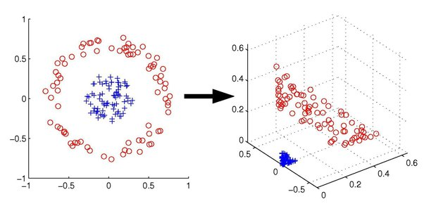

<div class="cell markdown">

# Dataset and Data Preprocessing

Pandas is a useful python library for data manipulation

</div>

<div class="cell code" data-execution_count="68">

``` python
import pandas as pd

iris = pd.read_csv("data/iris.csv") #read the csv file - default mode
iris.head() #show first 5 dataset entries
```

<div class="output execute_result" data-execution_count="68">

``` 
   sepal_length  sepal_width  petal_length  petal_width species
0           5.1          3.5           1.4          0.2  setosa
1           4.9          3.0           1.4          0.2  setosa
2           4.7          3.2           1.3          0.2  setosa
3           4.6          3.1           1.5          0.2  setosa
4           5.0          3.6           1.4          0.2  setosa
```

</div>

</div>

<div class="cell markdown">

You can custom read a csv file with these parameters:

  - **header**: from which row you can get features
  - **names**: you can define property names with a custom dictionary
  - **sep**: you can specify the separator of the columns in the file

Every property(column) in the dataframe is called *feature*

</div>

<div class="cell code" data-execution_count="69">

``` python
iris = pd.read_csv("data/iris.csv", sep=",", header=0, names=["sepal_length","sepal_width","petal_length","petal_width","species"]) #read the csv file - default mode
iris.head() #show first 5 dataset entries
```

<div class="output execute_result" data-execution_count="69">

``` 
   sepal_length  sepal_width  petal_length  petal_width species
0           5.1          3.5           1.4          0.2  setosa
1           4.9          3.0           1.4          0.2  setosa
2           4.7          3.2           1.3          0.2  setosa
3           4.6          3.1           1.5          0.2  setosa
4           5.0          3.6           1.4          0.2  setosa
```

</div>

</div>

<div class="cell markdown">

To show other usefull informations about the dataset:

</div>

<div class="cell code" data-execution_count="70">

``` python
iris.columns #show all features
iris.info() #other informations
```

<div class="output stream stdout">

    <class 'pandas.core.frame.DataFrame'>
    RangeIndex: 150 entries, 0 to 149
    Data columns (total 5 columns):
     #   Column        Non-Null Count  Dtype  
    ---  ------        --------------  -----  
     0   sepal_length  150 non-null    float64
     1   sepal_width   150 non-null    float64
     2   petal_length  150 non-null    float64
     3   petal_width   150 non-null    float64
     4   species       150 non-null    object 
    dtypes: float64(4), object(1)
    memory usage: 6.0+ KB

</div>

</div>

<div class="cell markdown">

## Dataframe and Series

A dataframe is composed by different *series*: another data type in
Pandas. A serie is a simple mono dimensional array.

You can get single serie with pandas by calling dataset with header
title as a key

</div>

<div class="cell code" data-execution_count="71">

``` python
Y = iris['species']
Y.head()
```

<div class="output execute_result" data-execution_count="71">

    0    setosa
    1    setosa
    2    setosa
    3    setosa
    4    setosa
    Name: species, dtype: object

</div>

</div>

<div class="cell markdown">

You can obtain same goal by calling dataset with keys array

</div>

<div class="cell code" data-execution_count="72">

``` python
X = iris[["sepal_length", "sepal_width", "petal_length", "petal_width", "species"]]
X.head()
```

<div class="output execute_result" data-execution_count="72">

``` 
   sepal_length  sepal_width  petal_length  petal_width species
0           5.1          3.5           1.4          0.2  setosa
1           4.9          3.0           1.4          0.2  setosa
2           4.7          3.2           1.3          0.2  setosa
3           4.6          3.1           1.5          0.2  setosa
4           5.0          3.6           1.4          0.2  setosa
```

</div>

</div>

<div class="cell markdown">

the main difference between series and dataframe is the header, in a
serie header there isn't a title, in this example you should remove
*species* column in a different way: by dropping it:

</div>

<div class="cell code" data-execution_count="73">

``` python
X = iris.drop('species', axis=1) #with axis=1 you remove a column, in this case you want to remove species and so it make sense 
X.head()
```

<div class="output execute_result" data-execution_count="73">

``` 
   sepal_length  sepal_width  petal_length  petal_width
0           5.1          3.5           1.4          0.2
1           4.9          3.0           1.4          0.2
2           4.7          3.2           1.3          0.2
3           4.6          3.1           1.5          0.2
4           5.0          3.6           1.4          0.2
```

</div>

</div>

<div class="cell markdown">

## Selection and editing of data

with *loc* or *iloc* method you can slicing data:

</div>

<div class="cell code" data-execution_count="74">

``` python
iris.loc[10] #select the row with index 10
iris.loc[:5, 'petal_length'] #select first 5 index rows (only feature petal_l) 
iris.iloc[10] #select the row in position 10 (not with index 10)
iris.iloc[:5, 2] #select first 5 rows (only second feature -> petal_l)
```

<div class="output execute_result" data-execution_count="74">

    0    1.4
    1    1.4
    2    1.3
    3    1.5
    4    1.4
    Name: petal_length, dtype: float64

</div>

</div>

<div class="cell markdown">

You can also randomize dataframe with *sample* function:

  - **n**: number of items from axis to return
  - **frac**: fraction of axis items to return (not compatible with *n*)
  - **weights**: default *none*, series of weights for every column
  - **random\_state**: if you pass a int it will be the seed for the
    pseudo number generator
  - **axis**: 1 for column, 0 for index
  - **ignore\_index**: if True the resulting index will be labeled in
    0,1...n-1

</div>

<div class="cell code" data-execution_count="75">

``` python

iris_sampled = iris.sample(frac=1, random_state=0) #randomize order of dataset
```

</div>

<div class="cell markdown">

To avoid to edit original dataset you can copy it with:

</div>

<div class="cell code" data-execution_count="76">

``` python
iris_copy = iris.copy() #copy dataset
```

</div>

<div class="cell markdown">

### Stats

</div>

<div class="cell code" data-execution_count="77">

``` python
iris.shape #dataset size
```

<div class="output execute_result" data-execution_count="77">

    (150, 5)

</div>

</div>

<div class="cell code" data-execution_count="78">

``` python

iris.describe() #some statistical informations
```

<div class="output execute_result" data-execution_count="78">

``` 
       sepal_length  sepal_width  petal_length  petal_width
count    150.000000   150.000000    150.000000   150.000000
mean       5.843333     3.054000      3.758667     1.198667
std        0.828066     0.433594      1.764420     0.763161
min        4.300000     2.000000      1.000000     0.100000
25%        5.100000     2.800000      1.600000     0.300000
50%        5.800000     3.000000      4.350000     1.300000
75%        6.400000     3.300000      5.100000     1.800000
max        7.900000     4.400000      6.900000     2.500000
```

</div>

</div>

<div class="cell markdown">

## Masks and filters

</div>

<div class="cell code" data-execution_count="79">

``` python
long_petal_mask = iris['petal_length'] > iris['petal_length'].mean() #this is the mask, a series of boolean values with true where conditions is true and false where condition is false
iris_long_petal = iris[long_petal_mask] # when you pass a boolean series of index to an array it returns only elements where index is true -> basically a mask
iris_long_petal.head()
```

<div class="output execute_result" data-execution_count="79">

``` 
    sepal_length  sepal_width  petal_length  petal_width     species
50           7.0          3.2           4.7          1.4  versicolor
51           6.4          3.2           4.5          1.5  versicolor
52           6.9          3.1           4.9          1.5  versicolor
53           5.5          2.3           4.0          1.3  versicolor
54           6.5          2.8           4.6          1.5  versicolor
```

</div>

</div>

<div class="cell markdown">

You can also edit dataframe conditionally with mask:

</div>

<div class="cell code" data-execution_count="80">

``` python
iris_copy = iris.copy()
setosa_mask = iris['species'] == 'setosa' #mask
iris_copy.loc[setosa_mask, 'species'] = "undefined" #assign undefined where specie is setosa
iris_copy['species'].unique()
```

<div class="output execute_result" data-execution_count="80">

    array(['undefined', 'versicolor', 'virginica'], dtype=object)

</div>

</div>

<div class="cell markdown">

### Visualization wiht Matplotlib

Plot has a lot of parameters and allow you to print charts on the page:

  - data : DataFrame
  - x : label or position, default None
  - y : label, position or list of label, positions, default None,
    Allows plotting of one column versus another
  - kind : str
      - *line* : line plot (default)
      - *bar* : vertical bar plot
      - *barh* : horizontal bar plot
      - *hist* : histogram
      - *box* : boxplot
      - *kde* : Kernel Density Estimation plot
      - *density* : same as *kde*
      - *area* : area plot
      - *pie* : pie plot
      - *scatter* : scatter plot
      - *hexbin* : hexbin plot
  - ax : matplotlib axes object, default None
  - subplots : boolean, default False, Make separate subplots for each
    column
  - sharex : boolean, default True if ax is None else False. In case
    subplots=True, share x axis and set some x axis labels to invisible;
    defaults to True if ax is None otherwise False if an ax is passed
    in; Be aware, that passing in both an ax and sharex=True will alter
    all x axis labels for all axis in a figure\!
  - sharey : boolean, default False. In case subplots=True, share y axis
    and set some y axis labels to invisible
  - layout : tuple (optional). (rows, columns) for the layout of
    subplots
  - figsize : a tuple (width, height) in inches
  - use\_index : boolean, default True. Use index as ticks for x axis
  - title : string or list, Title to use for the plot. If a string is
    passed, print the string at the top of the figure. If a list is
    passed and subplots is True, print each item in the list above the
    corresponding subplot.
  - grid : boolean, default None (matlab style default) Axis grid lines
  - legend : False/True/’reverse’. Place legend on axis subplots
  - style : list or dict. matplotlib line style per column
  - logx : boolean, default False. Use log scaling on x axis
  - logy : boolean, default False. Use log scaling on y axis
  - loglog : boolean, default False. Use log scaling on both x and y
    axes
  - xticks : sequence. Values to use for the xticks
  - yticks : sequence. Values to use for the yticks
  - xlim : 2-tuple/list
  - ylim : 2-tuple/list
  - rot : int, default None. Rotation for ticks (xticks for vertical,
    yticks for horizontal plots)
  - fontsize : int, default None. Font size for xticks and yticks
  - colormap : str or matplotlib colormap object, default None. Colormap
    to select colors from. If string, load colormap with that name from
    matplotlib.
  - colorbar : boolean, optional. If True, plot colorbar (only relevant
    for ‘scatter’ and ‘hexbin’ plots)
  - position : float. Specify relative alignments for bar plot layout.
    From 0 (left/bottom-end) to 1 (right/top-end). Default is 0.5
    (center)
  - table : boolean, Series or DataFrame, default False. If True, draw a
    table using the data in the DataFrame and the data will be
    transposed to meet matplotlib’s default layout. If a Series or
    DataFrame is passed, use passed data to draw a table.
  - yerr : DataFrame, Series, array-like, dict and str. See Plotting
    with Error Bars for detail.
  - xerr : same types as yerr.
  - stacked : boolean, default False in line and bar plots, and True in
    area plot. If True, create stacked plot.
  - sort\_columns : boolean, default False. Sort column names to
    determine plot ordering
  - secondary\_y : boolean or sequence, default False. Whether to plot
    on the secondary y-axis If a list/tuple, which columns to plot on
    secondary y-axis
  - mark\_right : boolean, default True. When using a secondary\_y axis,
    automatically mark the column labels with “(right)” in the legend
  - \*\*kwds : keywords. Options to pass to matplotlib plotting method

</div>

<div class="cell code" data-execution_count="81">

``` python
import matplotlib.pyplot as plt

iris_2feats = iris[['sepal_length','sepal_width']]
iris_2feats.plot(kind="scatter", x='sepal_length',y='sepal_width')
```

<div class="output execute_result" data-execution_count="81">

    <AxesSubplot:xlabel='sepal_length', ylabel='sepal_width'>

</div>

<div class="output display_data">


</div>

</div>

<div class="cell markdown">

## Operations on dataset

</div>

<div class="cell code" data-execution_count="82">

``` python
X = iris.drop('species',axis=1)
X_norm = (X - X.min())/(X.max()-X.min())  #min max normalization
X_norm.head()
```

<div class="output execute_result" data-execution_count="82">

``` 
   sepal_length  sepal_width  petal_length  petal_width
0      0.222222     0.625000      0.067797     0.041667
1      0.166667     0.416667      0.067797     0.041667
2      0.111111     0.500000      0.050847     0.041667
3      0.083333     0.458333      0.084746     0.041667
4      0.194444     0.666667      0.067797     0.041667
```

</div>

</div>

<div class="cell code" data-execution_count="83">

``` python
iris.sort_values('petal_length').head() #sort ascending, to descending use parameter ascending=False
```

<div class="output execute_result" data-execution_count="83">

``` 
    sepal_length  sepal_width  petal_length  petal_width species
22           4.6          3.6           1.0          0.2  setosa
13           4.3          3.0           1.1          0.1  setosa
14           5.8          4.0           1.2          0.2  setosa
35           5.0          3.2           1.2          0.2  setosa
36           5.5          3.5           1.3          0.2  setosa
```

</div>

</div>

<div class="cell code" data-execution_count="84">

``` python
grouped_species = iris.groupby(['species']) # group by species
grouped_species.mean()
```

<div class="output execute_result" data-execution_count="84">

``` 
            sepal_length  sepal_width  petal_length  petal_width
species                                                         
setosa             5.006        3.418         1.464        0.244
versicolor         5.936        2.770         4.260        1.326
virginica          6.588        2.974         5.552        2.026
```

</div>

</div>

<div class="cell markdown">

If you have invalid data inside a dataset. With Pandas you can fix it:

</div>

<div class="cell code" data-execution_count="85">

``` python
import numpy as np #ignore it for the moment, only to create random array

iris_nan = iris.copy()

n_val = iris.shape[0] #shape return array (n_index, n_features), we need number of indexes
samples = np.random.randint(n_val, size=(10)) #we create a random 10 elements array with each value between 0 and n_val -> only to random select 10 elements

iris_nan.loc[samples,'petal_length']=None #we replace 10 random petal length values with a None value

iris_nan['petal_length'].isnull().sum() #we count None element in iris_nan -> 10 of course
```

<div class="output execute_result" data-execution_count="85">

``` 
10
```

</div>

</div>

<div class="cell markdown">

Now we can fix invalid elements, we replace NaN values with the average
value of the dataset to avoid perturbing the statistic,
*fillna(value=None, method=None, axis=None, inplace=False, limit=None,
downcast=None)* fill na or NaN values:

  - **value**: value used to fill
  - **method**: *{‘backfill’, ‘bfill’, ‘pad’, ‘ffill’, None}, default
    None*
  - **axis**: *{0 or ‘index’, 1 or ‘columns’}*
  - **inplace**: True or False, if True fill-in-place
  - **limit**: If method is specified, this is the maximum number of
    consecutive NaN values to forward/backward fill
  - **downcast**: A dict of item-\>dtype of what to downcast if possible
  - return dataframe or not -\> depending on *inplace*

</div>

<div class="cell code" data-execution_count="86">

``` python
mean_petal_length = iris_nan['petal_length'].mean()
iris_nan['petal_length'].fillna(mean_petal_length, inplace=True) # fillna fill na or NaN values 
iris_nan['petal_length'].isnull().sum() #check invalid values
```

<div class="output execute_result" data-execution_count="86">

``` 
0
```

</div>

</div>

<div class="cell markdown">

We can do operations on row or column with *apply* method, first
argument must be function to apply

</div>

<div class="cell code" data-execution_count="87">

``` python
iris.apply(np.count_nonzero, axis=1).head() #we count values different from zero for every row
```

<div class="output execute_result" data-execution_count="87">

    0    5
    1    5
    2    5
    3    5
    4    5
    dtype: int64

</div>

</div>

<div class="cell code" data-execution_count="88">

``` python
iris.apply(np.count_nonzero, axis=0).head() #we count values different from zero for every feature
```

<div class="output execute_result" data-execution_count="88">

    sepal_length    150
    sepal_width     150
    petal_length    150
    petal_width     150
    species         150
    dtype: int64

</div>

</div>

<div class="cell markdown">

Use applymap to apply lambda function (elements)

</div>

<div class="cell code" data-execution_count="89">

``` python
X = iris.drop('species',axis=1)
X = X.applymap(lambda val:int(round(val,0))) #round values to closer int
X.head()
```

<div class="output execute_result" data-execution_count="89">

``` 
   sepal_length  sepal_width  petal_length  petal_width
0             5            4             1            0
1             5            3             1            0
2             5            3             1            0
3             5            3             2            0
4             5            4             1            0
```

</div>

</div>

<div class="cell markdown">

## Qualitative Data

All data in machine learning (and in computer science of course) must be
numeric and discrete. In real life there a lot of data types:

  - Continuos Quantitative variables: price, altitude, temperature etc.
  - Ordinal Qualitative Varaibles: clothes sizes, podium position
  - Nominal Qualitative Variables: colors

All machine learning input must be numeric so we have to convert all non
numeric values in numeric values.

### mapping of ordinal variables

#### Numpy

**Numpy** is a python library that offer a lot of vector operations,
**scikit-learn** is a library useful for machine learning purposes.

We can map ordinal variable with *numpy.vectorize(pyfunc, otypes=None,
doc=None, excluded=None, cache=False, signature=None)*:

  - **pyfunc**: python function or method
  - **otypes**: output data type, it should be *str* or *list of dtypes*
  - **doc**: docstring for the function
  - **excluded**: set of strings or integers representing the positional
    or keyword arguments

</div>

<div class="cell code" data-execution_count="90">

``` python
import numpy as np

shirts = pd.read_csv("data/shirts.csv",index_col=0)
X = shirts.values # -> from dataset to pure array
size_mapping = {"S":0,"M":1,"L":2,"XL":3} # dictionary, the map
fmap = np.vectorize(lambda t:size_mapping[t])
X[:,0] = fmap(X[:,0])
X[:5]
```

<div class="output execute_result" data-execution_count="90">

    array([[0, 'bianco', 4.99],
           [1, 'bianco', 19.99],
           [3, 'bianco', 12.49],
           [3, 'bianco', 14.99],
           [0, 'bianco', 14.99]], dtype=object)

</div>

</div>

<div class="cell markdown">

#### Pandas

we can obtain same result with pandas library

</div>

<div class="cell code" data-execution_count="91">

``` python
size_mapping = {"S":0,"M":1,"L":2,"XL":3} #dictionary, the map
shirts["taglia"] = shirts["taglia"].map(size_mapping) #we map sizes with correspondent number
shirts.head() #the return value is a dataset and not an array
```

<div class="output execute_result" data-execution_count="91">

``` 
   taglia  colore  prezzo
0       0  bianco    4.99
1       1  bianco   19.99
2       3  bianco   12.49
3       3  bianco   14.99
4       0  bianco   14.99
```

</div>

</div>

<div class="cell markdown">

### One-Hot encoding

We can't map Nominal qualitative variables with an ordinal list but can
use boolean encoding called one-hot. We have to create one column for
each class to encode, *true* or *1* value mean belonging, for example if
there are 3 colors: white, black and red. we can create 3 columns called
*white*, *black* and *red*, every single shirt has 1 only in the column
that correspond to its color and 0 in the others

this variables are called *dummy*

To do so we can use *ColumnTransformer(transformers, *,
remainder='drop', sparse\_threshold=0.3, n\_jobs=None,
transformer\_weights=None, verbose=False,
verbose\_feature\_names\_out=True)\* that apply transformations only in
specified columns:

  - **transformers**: list of (name, transformers, columns) tuples to be
    applied to subsets of the data
      - *Name*: this allows the transformer to be set
      - *transformer*
      - *columns*: Integers are interpreted as positional columns, while
        strings can reference DataFrame columns by name. A scalar string
        or int should be used where transformer expects X to be a 1d
        array-like (vector), otherwise a 2d array will be passed to the
        transformer. A callable is passed the input data X and can
        return any of the above
  - **Remainder**: non-specified columns dropped by default or passed
    through
  - **sparse\_threshold**: from 0 to 1, if the overall density of
    returned matrix is lower than this value it will be stacked as a
    sparse matrix
  - **n\_jobs**: jobs to run in parallel, -1 -\> all processors, 1 -\> 1
    processors
  - **transformer\_weights**: dictionary where keys are transformer
    name, values are weight for which returned value are multiplied
  - **verbose**: if True execution time will be printed
  - **verbose\_feature\_names\_out**: if True *get\_feature\_names\_out*
    will be prefix of returned features name

</div>

<div class="cell code" data-execution_count="92">

``` python
from sklearn.preprocessing import LabelEncoder
from sklearn.preprocessing import OneHotEncoder
from sklearn.compose import ColumnTransformer


X = shirts.values 
transf = ColumnTransformer([('ohe', OneHotEncoder(), [1])], remainder="passthrough")

X = transf.fit_transform(X)

X[:5] 
```

<div class="output execute_result" data-execution_count="92">

    array([[1.0, 0.0, 0.0, 0, 4.99],
           [1.0, 0.0, 0.0, 1, 19.99],
           [1.0, 0.0, 0.0, 3, 12.49],
           [1.0, 0.0, 0.0, 3, 14.99],
           [1.0, 0.0, 0.0, 0, 14.99]], dtype=object)

</div>

</div>

<div class="cell markdown">

You should obtain same result with pandas dataframe:

</div>

<div class="cell code" data-execution_count="93">

``` python
shirts_copy = shirts.copy()
shirts_copy = pd.get_dummies(shirts,columns=["colore"])
shirts_copy.tail()
```

<div class="output execute_result" data-execution_count="93">

``` 
    taglia  prezzo  colore_bianco  colore_rosso  colore_verde
95       2    9.99              1             0             0
96       1   14.99              0             0             1
97       0   12.49              0             1             0
98       2   12.49              0             1             0
99       0   19.99              0             1             0
```

</div>

</div>

<div class="cell markdown">

## Missing data

to manage missing data we will use numpy and pandas

</div>

<div class="cell code" data-execution_count="94">

``` python
import pandas as pd
import numpy as np

iris = pd.read_csv("data/iris.csv", header=0, names=["sepal_length","sepal_width","petal_length","petal_width","class"])
iris.head()
```

<div class="output execute_result" data-execution_count="94">

``` 
   sepal_length  sepal_width  petal_length  petal_width   class
0           5.1          3.5           1.4          0.2  setosa
1           4.9          3.0           1.4          0.2  setosa
2           4.7          3.2           1.3          0.2  setosa
3           4.6          3.1           1.5          0.2  setosa
4           5.0          3.6           1.4          0.2  setosa
```

</div>

</div>

<div class="cell code" data-execution_count="95">

``` python
iris_nan = iris.copy()
max_val = iris.shape[0]

samples = np.random.randint(max_val, size=(10)) #we create 10 elements random array
iris_nan.loc[samples,'petal_length']=None #we sobstitute random index element with None value

nan_count = iris_nan['petal_length'].isnull().sum() #count Non element (of course they are 10)
print("Dataset has "+str(nan_count)+" missing values")
iris_nan.to_csv("data/iris_with_nan.csv") # save into new file
```

<div class="output stream stdout">

    Dataset has 10 missing values

</div>

</div>

<div class="cell markdown">

We create also new numpy array with these values:

</div>

<div class="cell code" data-execution_count="96">

``` python
Y = iris_nan["class"].values # only values of class feature
X = iris_nan.drop("class",axis=1).values #all values except for class feature
```

</div>

<div class="cell markdown">

There are 2 methods to manage missing values:

### method 1: remove properties or examples with missing values

</div>

<div class="cell code" data-execution_count="97">

``` python
samples_before = iris_nan.shape[0]
iris_drop = iris_nan.dropna() #function that remove NaN values from iris_nan

samples_after = iris_drop.shape[0] #get new size

print("Number before dropping: "+str(samples_before))
print("Number after dropping: "+str(samples_after))
```

<div class="output stream stdout">

    Number before dropping: 150
    Number after dropping: 140

</div>

</div>

<div class="cell markdown">

### method 2: Imputation -\> replace missing values with an estimation

#### Pandas

we can do it with pandas (dataset) or numpy (array)

</div>

<div class="cell code" data-execution_count="98">

``` python
replace_with = iris_nan['petal_length'].mean() # imputation with average value
#replace_with = iris_nan['petal_length'].median() # imputation with median value
#replace_with = iris_nan['petal_length'].mode() # imputation with mode value
iris_nan['petal_length'].fillna(replace_with,inplace=True) # replace NaN values with first argument
nan_count = iris_nan['petal_length'].isnull().sum() #count numbers of NaN values
print("Dataset has now "+str(nan_count)+" missing values")
```

<div class="output stream stdout">

    Dataset has now 0 missing values

</div>

</div>

<div class="cell markdown">

#### Numpy and scikit-learn

we can use *SimpleImputer(\*, missing\_values=nan, strategy='mean',
fill\_value=None, verbose='deprecated', copy=True,
add\_indicator=False)\[source\]* function (scikit-learn library), type
of imputation can be specified:

  - **missing values**:
  - **strategy**: mean / median / most\_frequent / constant
  - **fill\_value**: when constant\!=0 specify here the value
  - **copy**: if True a copy will be created, if False imputation will
    be made in-place where possible
  - **add\_indicator**: If True, a MissingIndicator transform will stack
    onto output of the imputer’s transform. This allows a predictive
    estimator to account for missingness despite imputation

</div>

<div class="cell code" data-execution_count="99">

``` python
import numpy as np
from sklearn.impute import SimpleImputer

imp = SimpleImputer(missing_values = np.nan, strategy = 'mean')
X_imp = imp.fit_transform(X)

nan_count = np.count_nonzero(np.isnan(X_imp))
print("dataset has "+str(nan_count)+" missing values")
```

<div class="output stream stdout">

    dataset has 0 missing values

</div>

</div>

<div class="cell markdown">

## Feature and Scaling

if a dataset values are in same range of values train phase will be
faster. There are 2 methods to achieve this goal:

  - **normalization**: brings values in a range between 0 and 1:
    \[x_{norm} = \frac{x^i - x_{min}}{x_{max} - x_{min}}\]
  - **standardization** brings values in a range between -1 and 1 with
    mean value equal to 0 and variance equal to 1:
    \[x_{std} = \frac{x^i - x_{mean}}{x_{sd}}\]

### Normalization

#### Numpy and scikit-learn

</div>

<div class="cell code" data-execution_count="100">

``` python
""" 
IMPORT DATA
"""
import pandas as pd
wines = pd.read_csv("https://archive.ics.uci.edu/ml/machine-learning-databases/wine/wine.data", names=['class','alcol','flavonoidi'], 
                    usecols=[0,1,7])
"""
END IMPORT DATA
"""

from sklearn.preprocessing import MinMaxScaler

mms = MinMaxScaler()
X = wines.drop("class",axis=1).values # target value has classes and it should not be normalized, so we remove it
X_norm = mms.fit_transform(X)
X_norm[:5]
```

<div class="output execute_result" data-execution_count="100">

    array([[0.84210526, 0.57383966],
           [0.57105263, 0.51054852],
           [0.56052632, 0.61181435],
           [0.87894737, 0.66455696],
           [0.58157895, 0.49578059]])

</div>

</div>

<div class="cell markdown">

#### Pandas

</div>

<div class="cell code" data-execution_count="101">

``` python
wines_norm = wines.copy()

features = ["alcol","flavonoidi"] # columns to normalize
to_norm = wines_norm[features]
wines_norm[features] = (to_norm-to_norm.min())/(to_norm.max()-to_norm.min()) #we implement custom algorithm and we execute it on the entire dataframe
wines_norm.head()
```

<div class="output execute_result" data-execution_count="101">

``` 
   class     alcol  flavonoidi
0      1  0.842105    0.573840
1      1  0.571053    0.510549
2      1  0.560526    0.611814
3      1  0.878947    0.664557
4      1  0.581579    0.495781
```

</div>

</div>

<div class="cell markdown">

### Standardization

#### Numpy and scikit-learn

we use *class sklearn.preprocessing.StandardScaler(*, copy=True,
with\_mean=True, with\_std=True)\*:

  - **copy**: if false try to in place substitution
  - **with\_mean**: if True center the data before scaling
  - **with\_std**: if True scale the data to unit variance

standard scaler has these methods:

  - *fit(X\[, y, sample\_weight\])*: Compute the mean and std to be used
    for later scaling.
  - *fit\_transform(X\[, y\])*: Fit to data, then transform it
  - *get\_feature\_names\_out(\[input\_features\])*: get output feature
    names for transformation
  - *get\_params(\[deep\])*: get parameters for this estimator
  - *inverse\_transform(X\[, copy\])*: scale back the data to the
    original representation
  - *partial\_fit(X\[, y, sample\_weight\])*: Online computation of mean
    and std on X for later scaling
  - *set\_params(\*\*params)*: Set the parameters of this estimator
  - *transform(X\[, copy\])*: perform standardization by centering and
    scaling

</div>

<div class="cell code" data-execution_count="102">

``` python
from sklearn.preprocessing import StandardScaler

ss = StandardScaler()
X = wines.drop("class",axis=1).values
X_std = ss.fit_transform(X) #compute meand and std before transform 
X_std[:5]
```

<div class="output execute_result" data-execution_count="102">

    array([[1.51861254, 1.03481896],
           [0.24628963, 0.73362894],
           [0.19687903, 1.21553297],
           [1.69154964, 1.46652465],
           [0.29570023, 0.66335127]])

</div>

</div>

<div class="cell markdown">

#### Pandas

N.B. Pandas use sample std with denominator-1 (sampling standard
deviation) so results could be different from numpy standardization
(this difference become insignificant when number of samples tend to
infinite)

</div>

<div class="cell code" data-execution_count="103">

``` python
wines_std = wines.copy()

features = ["alcol","flavonoidi"]
to_std = wines_std[features]
wines_std[features] = (to_std - to_std.mean())/to_std.std()
wines_std[:5]
```

<div class="output execute_result" data-execution_count="103">

``` 
   class     alcol  flavonoidi
0      1  1.514341    1.031908
1      1  0.245597    0.731565
2      1  0.196325    1.212114
3      1  1.686791    1.462399
4      1  0.294868    0.661485
```

</div>

</div>

<div class="cell markdown">

## Dataset splitting

to test predictive model we have to split dataset into 2 parts: train
part and test part, we can train machine on trainset and we can test it
on testset. Keep in mind that target of a dataset is the feature about
which we want to gain a deeper understanding.

we can load boston dataset directly from scikit learn library:

</div>

<div class="cell code" data-execution_count="104">

``` python
import pandas as pd
import numpy as np
from sklearn.datasets import load_boston
boston = load_boston() #deprecated from 1.2 version 
```

<div class="output stream stderr">

    c:\Users\miche\anaconda3\lib\site-packages\sklearn\utils\deprecation.py:87: FutureWarning: Function load_boston is deprecated; `load_boston` is deprecated in 1.0 and will be removed in 1.2.
    
        The Boston housing prices dataset has an ethical problem. You can refer to
        the documentation of this function for further details.
    
        The scikit-learn maintainers therefore strongly discourage the use of this
        dataset unless the purpose of the code is to study and educate about
        ethical issues in data science and machine learning.
    
        In this special case, you can fetch the dataset from the original
        source::
    
            import pandas as pd
            import numpy as np
    
    
            data_url = "http://lib.stat.cmu.edu/datasets/boston"
            raw_df = pd.read_csv(data_url, sep="\s+", skiprows=22, header=None)
            data = np.hstack([raw_df.values[::2, :], raw_df.values[1::2, :2]])
            target = raw_df.values[1::2, 2]
    
        Alternative datasets include the California housing dataset (i.e.
        :func:`~sklearn.datasets.fetch_california_housing`) and the Ames housing
        dataset. You can load the datasets as follows::
    
            from sklearn.datasets import fetch_california_housing
            housing = fetch_california_housing()
    
        for the California housing dataset and::
    
            from sklearn.datasets import fetch_openml
            housing = fetch_openml(name="house_prices", as_frame=True)
    
        for the Ames housing dataset.
        
      warnings.warn(msg, category=FutureWarning)

</div>

</div>

<div class="cell markdown">

### Numpy and scikit learn (more important)

we will use *sklearn.model\_selection.train\_test\_split(*arrays,
test\_size=None, train\_size=None, random\_state=None, shuffle=True,
stratify=None)\*:

  - **\*arrays**: Allowed inputs are lists, numpy arrays, scipy-sparse
    matrices or pandas dataframes
  - **test\_size**: if Float between 0.0 and 1.0, if Int it represent
    the absolute number of test samples, if None the value is set by
    *train\_size* (alternatively is 0.25 by default)
  - **train\_size**: complement of *test\_size*
  - **random\_state**: Int seed for a random shuffle
  - **shuffle**: Whether or not to shuffle the data before splitting. If
    False then Stratify must be None
  - **Stratify**: if not None data is split in a stratified fashion,
    using this as the class labels 

</div>

<div class="cell code" data-execution_count="105">

``` python
from sklearn.model_selection import train_test_split

X = boston.data
Y = boston.target

X_train, X_test, Y_train, Y_test = train_test_split(X,Y, test_size=0.3) #l'attributo test_size corrisponde  alla frazione di dataset da usare per il test
```

</div>

<div class="cell markdown">

### Pandas

</div>

<div class="cell code" data-execution_count="106">

``` python
import pandas as pd
import numpy as np

boston_df = pd.DataFrame(data= np.c_[boston.data, boston.target], columns= np.append(boston['feature_names'], 'TARGET'))
boston_df.head()
```

<div class="output execute_result" data-execution_count="106">

``` 
      CRIM    ZN  INDUS  CHAS    NOX     RM   AGE     DIS  RAD    TAX  \
0  0.00632  18.0   2.31   0.0  0.538  6.575  65.2  4.0900  1.0  296.0   
1  0.02731   0.0   7.07   0.0  0.469  6.421  78.9  4.9671  2.0  242.0   
2  0.02729   0.0   7.07   0.0  0.469  7.185  61.1  4.9671  2.0  242.0   
3  0.03237   0.0   2.18   0.0  0.458  6.998  45.8  6.0622  3.0  222.0   
4  0.06905   0.0   2.18   0.0  0.458  7.147  54.2  6.0622  3.0  222.0   

   PTRATIO       B  LSTAT  TARGET  
0     15.3  396.90   4.98    24.0  
1     17.8  396.90   9.14    21.6  
2     17.8  392.83   4.03    34.7  
3     18.7  394.63   2.94    33.4  
4     18.7  396.90   5.33    36.2  
```

</div>

</div>

<div class="cell code" data-execution_count="107">

``` python
boston_test_df = boston_df.sample(frac=0.3)
boston_train_df = boston_df.drop(boston_test_df.index)

print("Train set element numbers: "+str(boston_train_df.shape[0]))
print("Test set element numbers: "+str(boston_test_df.shape[0]))
```

<div class="output stream stdout">

    Train set element numbers: 354
    Test set element numbers: 152

</div>

</div>

<div class="cell markdown">

# Regression

</div>

<div class="cell markdown">

## Simple Linear Regression

We will predict *value of houses* in Boston Dataset

### 1\. Import data

</div>

<div class="cell code" data-execution_count="108">

``` python
import pandas as pd
import numpy as np
boston = pd.read_csv("https://archive.ics.uci.edu/ml/machine-learning-databases/housing/housing.data", sep='\s+', usecols=[5,13], names=["RM", "MEDV"])
boston.head()
```

<div class="output execute_result" data-execution_count="108">

``` 
      RM  MEDV
0  6.575  24.0
1  6.421  21.6
2  7.185  34.7
3  6.998  33.4
4  7.147  36.2
```

</div>

</div>

<div class="cell markdown">

### 2\. Creation of variables for regression

MEDV will be our target: Median value of owner-occupied homes in $1000s

</div>

<div class="cell code" data-execution_count="109">

``` python
X = boston.drop("MEDV", axis=1).values #all except for medv (data)
Y = boston["MEDV"].values #target

from sklearn.model_selection import train_test_split

X_train, X_test, Y_train, Y_test = train_test_split(X,Y, test_size=0.3)
```

</div>

<div class="cell markdown">

we can implement now linear regression on train set and prediction on
test set.

*class sklearn.linear\_model.LinearRegression(\*,
fit\_intercept=True,copy\_X=True, n\_jobs=None,
positive=False)\[source\]* has these parameters:

  - **fit\_intercept**: default to True, calculate intercept for this
    model. If False, no intercept will be used
  - **copy\_X**: if True X will be copied; else it will be overwritten
  - **n\_jobs**: number of jobs to use for the computation
  - **positive**: only for dense array, if True force coefficients to be
    positive

Methods are:

  - **fit(X, y\[, sample\_weight\])**: Fit linear model
  - **get\_params(\[deep\])**: Get parameters for this estimator
  - **predict(X)**: Predict using the linear model
  - **score(X, y\[, sample\_weight\])**: Return the coefficient of
    determination of the prediction
  - **set\_params(\*\*params)**: set the parameters of this estimator

</div>

<div class="cell code" data-execution_count="110">

``` python
from sklearn.linear_model import LinearRegression

ll = LinearRegression()
ll.fit(X_train, Y_train) # Linear regression on train test composed by target and other data
Y_pred = ll.predict(X_test) # Prediction of target from Test Data, in the following steps we will compare this prediction with Y test, it should be as closer as possible
```

</div>

<div class="cell markdown">

There are a lot of metrics to evaluate a prediction:

  - Mean squared error:
    \(MSE = \frac{1}{N} \sum_{i=1}^{N}(Y_i-\widehat{Y}_i)^2\)
      - 
  - Determination Coefficient:
    \(R^2 = 1 - \frac{RSS}{SST} = 1-\frac{\sum_{i=1}^{N}(Y_i-\widehat{Y}_i)}{\sum_{i=1}^{N}(Y_i-\widehat{Y}_{mean})}\)
      - r2 \< .3 -\> model is useless
      - .5 r2 \< .7 -\> model is decent
      - .7 r2 \< .9 -\> model is good
      - .9 r2 \< 1 -\> model is perfect
      - 1 -\> deterministic -\> error

</div>

<div class="cell code" data-execution_count="111">

``` python
from sklearn.metrics import mean_squared_error, r2_score

print("MSE = %.4f" % mean_squared_error(Y_test, Y_pred)) #MSE
print("R^2 = %.4f" % r2_score(Y_test, Y_pred)) # R^2
```

<div class="output stream stdout">

    MSE = 26.1359
    R^2 = 0.6448

</div>

</div>

<div class="cell markdown">

We can plot the model and observe that the only problems are outliers,
in general the model is a good model

</div>

<div class="cell code" data-execution_count="112">

``` python
import matplotlib.pyplot as plt

print("RM Weight: "+ str(ll.coef_[0]))
print("Bias: "+str(ll.intercept_))


plt.scatter(X_train, Y_train, c="green",  edgecolor='white', label="Train set")
plt.scatter(X_test, Y_test, c="blue",  edgecolor='white', label="Test set")

plt.xlabel('Mean number of room [RM]')
plt.ylabel('Value in $1000s [MEDV]')

plt.legend(loc='upper left')

plt.plot(X_test, Y_pred, color='red', linewidth=3)
```

<div class="output stream stdout">

    RM Weight: 8.736117681448633
    Bias: -32.36618812313125

</div>

<div class="output execute_result" data-execution_count="112">

    [<matplotlib.lines.Line2D at 0x2be9fca9070>]

</div>

<div class="output display_data">


</div>

</div>

<div class="cell markdown">

## Multiple Linear Regression

We use Boston dataset described as follow:

  - CRIM per capita crime rate by town
  - ZN proportion of residential land zoned for lots over 25,000 sq.ft.
  - INDUS proportion of non-retail business acres per town
  - CHAS Charles River dummy variable (= 1 if tract bounds river; 0
    otherwise)
  - NOX nitric oxides concentration (parts per 10 million)
  - RM average number of rooms per dwelling
  - AGE proportion of owner-occupied units built prior to 1940
  - DIS weighted distances to five Boston employment centres
  - RAD index of accessibility to radial highways
  - TAX full-value property-tax rate per $10,000
  - PTRATIO pupil-teacher ratio by town
  - B 1000(Bk - 0.63)^2 where Bk is the proportion of blacks by town
  - LSTAT % lower status of the population
  - MEDV Median value of owner-occupied homes in $1000's

our goal is to predict medv using 2 or more features.

</div>

<div class="cell code" data-execution_count="113">

``` python
import pandas as pd
import numpy as np
import matplotlib.pyplot as plt
from sklearn.model_selection import train_test_split
from sklearn.linear_model import LinearRegression
from sklearn.metrics import mean_squared_error, r2_score

boston = pd.read_csv("https://archive.ics.uci.edu/ml/machine-learning-databases/housing/housing.data", sep='\s+', 
                     names=["CRIM","ZN","INDUS","CHAS","NOX","RM","AGE","DIS","RAD","TAX","PRATIO","B","LSTAT","MEDV"])
boston.head()
```

<div class="output execute_result" data-execution_count="113">

``` 
      CRIM    ZN  INDUS  CHAS    NOX     RM   AGE     DIS  RAD    TAX  PRATIO  \
0  0.00632  18.0   2.31     0  0.538  6.575  65.2  4.0900    1  296.0    15.3   
1  0.02731   0.0   7.07     0  0.469  6.421  78.9  4.9671    2  242.0    17.8   
2  0.02729   0.0   7.07     0  0.469  7.185  61.1  4.9671    2  242.0    17.8   
3  0.03237   0.0   2.18     0  0.458  6.998  45.8  6.0622    3  222.0    18.7   
4  0.06905   0.0   2.18     0  0.458  7.147  54.2  6.0622    3  222.0    18.7   

        B  LSTAT  MEDV  
0  396.90   4.98  24.0  
1  396.90   9.14  21.6  
2  392.83   4.03  34.7  
3  394.63   2.94  33.4  
4  396.90   5.33  36.2  
```

</div>

</div>

<div class="cell markdown">

First step is to find correlation between different features, we can use
*DataFrame.corr(method='pearson', min\_periods=1)* method in pandas:

  - **method**:
      - [Pearson](https://en.wikipedia.org/wiki/Pearson_correlation_coefficient)
      - [Kendall](https://en.wikipedia.org/wiki/Kendall_rank_correlation_coefficient)
      - [Spearman](https://en.wikipedia.org/wiki/Spearman%27s_rank_correlation_coefficient)
  - **min\_periods**: minimum number of observations required per pair
    of columns to have a valid result

Keep in mind that -1 means inverse correlation, 0 means no correlation
and 1 means positive correlation

</div>

<div class="cell code" data-execution_count="114">

``` python
boston.corr()
```

<div class="output execute_result" data-execution_count="114">

``` 
            CRIM        ZN     INDUS      CHAS       NOX        RM       AGE  \
CRIM    1.000000 -0.200469  0.406583 -0.055892  0.420972 -0.219247  0.352734   
ZN     -0.200469  1.000000 -0.533828 -0.042697 -0.516604  0.311991 -0.569537   
INDUS   0.406583 -0.533828  1.000000  0.062938  0.763651 -0.391676  0.644779   
CHAS   -0.055892 -0.042697  0.062938  1.000000  0.091203  0.091251  0.086518   
NOX     0.420972 -0.516604  0.763651  0.091203  1.000000 -0.302188  0.731470   
RM     -0.219247  0.311991 -0.391676  0.091251 -0.302188  1.000000 -0.240265   
AGE     0.352734 -0.569537  0.644779  0.086518  0.731470 -0.240265  1.000000   
DIS    -0.379670  0.664408 -0.708027 -0.099176 -0.769230  0.205246 -0.747881   
RAD     0.625505 -0.311948  0.595129 -0.007368  0.611441 -0.209847  0.456022   
TAX     0.582764 -0.314563  0.720760 -0.035587  0.668023 -0.292048  0.506456   
PRATIO  0.289946 -0.391679  0.383248 -0.121515  0.188933 -0.355501  0.261515   
B      -0.385064  0.175520 -0.356977  0.048788 -0.380051  0.128069 -0.273534   
LSTAT   0.455621 -0.412995  0.603800 -0.053929  0.590879 -0.613808  0.602339   
MEDV   -0.388305  0.360445 -0.483725  0.175260 -0.427321  0.695360 -0.376955   

             DIS       RAD       TAX    PRATIO         B     LSTAT      MEDV  
CRIM   -0.379670  0.625505  0.582764  0.289946 -0.385064  0.455621 -0.388305  
ZN      0.664408 -0.311948 -0.314563 -0.391679  0.175520 -0.412995  0.360445  
INDUS  -0.708027  0.595129  0.720760  0.383248 -0.356977  0.603800 -0.483725  
CHAS   -0.099176 -0.007368 -0.035587 -0.121515  0.048788 -0.053929  0.175260  
NOX    -0.769230  0.611441  0.668023  0.188933 -0.380051  0.590879 -0.427321  
RM      0.205246 -0.209847 -0.292048 -0.355501  0.128069 -0.613808  0.695360  
AGE    -0.747881  0.456022  0.506456  0.261515 -0.273534  0.602339 -0.376955  
DIS     1.000000 -0.494588 -0.534432 -0.232471  0.291512 -0.496996  0.249929  
RAD    -0.494588  1.000000  0.910228  0.464741 -0.444413  0.488676 -0.381626  
TAX    -0.534432  0.910228  1.000000  0.460853 -0.441808  0.543993 -0.468536  
PRATIO -0.232471  0.464741  0.460853  1.000000 -0.177383  0.374044 -0.507787  
B       0.291512 -0.444413 -0.441808 -0.177383  1.000000 -0.366087  0.333461  
LSTAT  -0.496996  0.488676  0.543993  0.374044 -0.366087  1.000000 -0.737663  
MEDV    0.249929 -0.381626 -0.468536 -0.507787  0.333461 -0.737663  1.000000  
```

</div>

</div>

<div class="cell markdown">

we can visualize this table with a heatmap

</div>

<div class="cell code" data-execution_count="115">

``` python
import seaborn as sns

hm = sns.heatmap(boston.corr(),
                 cbar=True, #bar with color intensity
                 square=True, #force cell to be squared
                 yticklabels=boston.columns, #labels on y
                 xticklabels=boston.columns,#labels on x
                 annot=True, #numbers in cell
                    annot_kws={'size':7} #number annotation size
                ) 
plt.show()
```

<div class="output display_data">


</div>

</div>

<div class="cell markdown">

we can observe that most correlated features (with MEDV) are LM and
LSTAT, we can built multiple regression model with these 2 features:

</div>

<div class="cell code" data-execution_count="116">

``` python
X = boston[["RM","LSTAT"]].values #regression variable
Y = boston["MEDV"].values #target

X_train, X_test, Y_train, Y_test = train_test_split(X,Y, test_size=0.3, random_state=0)

ll = LinearRegression()
ll.fit(X_train, Y_train)
Y_pred = ll.predict(X_test)

print("MSE: "+str(mean_squared_error(Y_test, Y_pred)))
print("R2 score: "+str(r2_score(Y_test, Y_pred)))
```

<div class="output stream stdout">

    MSE: 32.72507169281496
    R2 score: 0.6069792285352371

</div>

</div>

<div class="cell markdown">

Now we want to try to build regression with all variables and not only
with most correlated ones

</div>

<div class="cell code" data-execution_count="117">

``` python
from sklearn.preprocessing import StandardScaler

X = boston.drop("MEDV", axis=1).values
Y = boston["MEDV"].values

#splitting
X_train, X_test, Y_train, Y_test = train_test_split(X,Y, test_size=0.3, random_state=0)

#variable standardization
ss = StandardScaler() 
X_train_std = ss.fit_transform(X_train)
X_test_std = ss.transform(X_test) #only trasform because variable is already fitted

#regression
ll = LinearRegression()
ll.fit(X_train_std, Y_train)
Y_pred = ll.predict(X_test_std)

print("MSE: "+str(mean_squared_error(Y_test, Y_pred)))
print("R2 score: "+str(r2_score(Y_test, Y_pred)))
```

<div class="output stream stdout">

    MSE: 27.195965766883205
    R2 score: 0.6733825506400195

</div>

</div>

<div class="cell markdown">

we can observe that score is better than before. We can try to
understand what variables were more impactful in regression: with
*zip()* we merge arguments in tuple, with *list()* we create a list of
tuple, *LinearRegression* has a lot of attributes:

  - **coef\_**: Estimated coefficients for the linear regression problem
  - **rank\_**: rank of matrix X, only if x is dense
  - **singular\_**: singular values of X, only if X is dense
  - **intercept\_**: Independent term in the linear model. Set to 0.0 if
    fit\_intercept = False
  - **n\_features\_in\_**: Number of features seen during fit
  - **features\_names\_in\_**: Names of features seen during fit.
    Defined only when X has feature names that are all strings

</div>

<div class="cell code" data-execution_count="118">

``` python
weights = pd.DataFrame(data=list(zip(boston.columns, ll.coef_)), columns=['feature', 'weight'])
weights
```

<div class="output execute_result" data-execution_count="118">

``` 
   feature    weight
0     CRIM -1.011901
1       ZN  1.050280
2    INDUS  0.079210
3     CHAS  0.618962
4      NOX -1.873691
5       RM  2.705270
6      AGE -0.279573
7      DIS -3.097665
8      RAD  2.096900
9      TAX -1.886063
10  PRATIO -2.261105
11       B  0.582643
12   LSTAT -3.440498
```

</div>

</div>

<div class="cell markdown">

## Polynomial Regression with SciKit-Learn

With polynomial regression we can find correlation between independent
and dependent variables trough a polynomial independent variable

</div>

<div class="cell code" data-execution_count="119">

``` python
import pandas as pd
import numpy as np
import matplotlib.pyplot as plt
import seaborn as sns
from sklearn.model_selection import train_test_split
from sklearn.linear_model import LinearRegression
from sklearn.metrics import mean_squared_error, r2_score

boston = pd.read_csv("https://archive.ics.uci.edu/ml/machine-learning-databases/housing/housing.data", sep='\s+', 
                     names=["CRIM", "ZN","INDUS","CHAS","NOX","RM","AGE","DIS","RAD","TAX","PRATIO","B","LSTAT","MEDV"])
boston.head()

#first try with only 1 variable
X = boston[['LSTAT']].values
Y = boston['MEDV'].values

X_train, X_test, Y_train, Y_test = train_test_split(X,Y, test_size=0.3, random_state=0)
```

</div>

<div class="cell markdown">

for polynomial regression there are more parameters, for example the
degree. We have to import *class
sklearn.preprocessing.PolynomialFeatures(degree=2, *,
interaction\_only=False, include\_bias=True, order='C')\* from sklearn:

  - **degree**: If a single int is given, it specifies the maximal
    degree of the polynomial features. If a tuple (min\_degree,
    max\_degree) is passed, then min\_degree is the minimum and
    max\_degree is the maximum polynomial degree of the generated
    features. Note that min\_degree=0 and min\_degree=1 are equivalent
    as outputting the degree zero term is determined by include\_bias
  - **interaction\_only**: If True, only interaction features are
    produced: features that are products of at most degree distinct
    input features
  - **include\_bias**: If True (default), then include a bias column,
    the feature in which all polynomial powers are zero
  - **order**: *{F,C}* Order of output array in the dense case. 'F'
    order is faster to compute, but may slow down subsequent estimators

The rest of process is equal to the multiple or simple version, we try
to do 10 different regression to test 10 polynomial degrees

</div>

<div class="cell code" data-execution_count="120">

``` python
from sklearn.preprocessing import PolynomialFeatures

scores = []

for i in range(1,11):
    #create regression function
    polyfeats = PolynomialFeatures(degree=i)
    X_train_poly = polyfeats.fit_transform(X_train)
    X_test_poly = polyfeats.transform(X_test)
    
    #polynomial regression
    ll = LinearRegression()
    ll.fit(X_train_poly, Y_train)
    Y_pred = ll.predict(X_test_poly)
    
    #check score
    mse = mean_squared_error(Y_test, Y_pred)
    r2 = r2_score(Y_test, Y_pred)
    scores.append(r2)
    print("DEGREE "+str(i)+": MSE="+str(mse)+" R2="+str(r2))
```

<div class="output stream stdout">

    DEGREE 1: MSE=39.81715050474416 R2=0.5218049526125568
    DEGREE 2: MSE=33.60239474228596 R2=0.5964427754767518
    DEGREE 3: MSE=32.091676573441816 R2=0.6145861618613053
    DEGREE 4: MSE=29.843976067638522 R2=0.6415805408226356
    DEGREE 5: MSE=29.84701333665813 R2=0.6415440639029076
    DEGREE 6: MSE=29.5482979569237 R2=0.6451315686177527
    DEGREE 7: MSE=29.67171081021597 R2=0.6436494079286977
    DEGREE 8: MSE=31.82327509909759 R2=0.6178096033712046
    DEGREE 9: MSE=30.460452196211786 R2=0.6341768007814894
    DEGREE 10: MSE=35.37825532046339 R2=0.5751150882221386

</div>

</div>

<div class="cell markdown">

You can note that performance increase until *degree 4*, after degree 4
it decrease.

Now we can use all features and not only one of them:

</div>

<div class="cell code" data-execution_count="121">

``` python
import pandas as pd
import numpy as np
import matplotlib.pyplot as plt
import seaborn as sns
from sklearn.model_selection import train_test_split
from sklearn.linear_model import LinearRegression
from sklearn.metrics import mean_squared_error, r2_score
from sklearn.preprocessing import PolynomialFeatures

boston = pd.read_csv("https://archive.ics.uci.edu/ml/machine-learning-databases/housing/housing.data", sep='\s+', 
                     names=["CRIM", "ZN","INDUS","CHAS","NOX","RM","AGE","DIS","RAD","TAX","PRATIO","B","LSTAT","MEDV"])

X = boston.drop(['MEDV'], axis=1).values
Y = boston['MEDV'].values

#create sets
X_train, X_test, Y_train, Y_test = train_test_split(X,Y, test_size=0.3, random_state=0)

scores = []

#loop to try polynomial regression in different degrees
for i in range(1,6):
    #create regression function
    polyfeats = PolynomialFeatures(degree=i)
    X_train_poly = polyfeats.fit_transform(X_train)
    X_test_poly = polyfeats.transform(X_test)
    
    #polynomial regression
    ll = LinearRegression()
    ll.fit(X_train_poly, Y_train)
    Y_pred = ll.predict(X_test_poly)
    
    #check score
    mse = mean_squared_error(Y_test, Y_pred)
    r2 = r2_score(Y_test, Y_pred)
    scores.append(r2)
    print("DEGREE "+str(i)+": MSE="+str(mse)+" R2="+str(r2))
```

<div class="output stream stdout">

    DEGREE 1: MSE=27.195965766883198 R2=0.6733825506400196
    DEGREE 2: MSE=29.004173799742382 R2=0.6516663777095527
    DEGREE 3: MSE=85912.07676339304 R2=-1030.7847736022554
    DEGREE 4: MSE=546667.2171232016 R2=-6564.3506713456045
    DEGREE 5: MSE=14811.522412351813 R2=-176.88306225004337

</div>

</div>

<div class="cell markdown">

we can observe we obtain best result with first degree. Other results
are bad, this is overfitting: complexity of the model is too high and it
will not be adapted to a generic model (works only for X\_train case)

# Overfitting and Regularization

Overfitting manifests when model fit to strictly with test set and can
not be generalized to a different model:

  - **High variance** between different predictions, so they will be
    very different from each other
  - **Low Bias** so the error for the single prediction is very low

</div>

<div class="cell code" data-execution_count="1">

``` python
import pandas as pd
import numpy as np 
from sklearn.linear_model import LinearRegression
from sklearn.preprocessing import PolynomialFeatures
from sklearn.model_selection import train_test_split
from sklearn.metrics import mean_squared_error, r2_score
from sklearn.preprocessing import StandardScaler

boston = pd.read_csv("https://archive.ics.uci.edu/ml/machine-learning-databases/housing/housing.data", sep='\s+', 
                     names=["CRIM", "ZN","INDUS","CHAS","NOX","RM","AGE","DIS","RAD","TAX","PRATIO","B","LSTAT","MEDV"])
boston.head()
```

<div class="output execute_result" data-execution_count="1">

``` 
      CRIM    ZN  INDUS  CHAS    NOX     RM   AGE     DIS  RAD    TAX  PRATIO  \
0  0.00632  18.0   2.31     0  0.538  6.575  65.2  4.0900    1  296.0    15.3   
1  0.02731   0.0   7.07     0  0.469  6.421  78.9  4.9671    2  242.0    17.8   
2  0.02729   0.0   7.07     0  0.469  7.185  61.1  4.9671    2  242.0    17.8   
3  0.03237   0.0   2.18     0  0.458  6.998  45.8  6.0622    3  222.0    18.7   
4  0.06905   0.0   2.18     0  0.458  7.147  54.2  6.0622    3  222.0    18.7   

        B  LSTAT  MEDV  
0  396.90   4.98  24.0  
1  396.90   9.14  21.6  
2  392.83   4.03  34.7  
3  394.63   2.94  33.4  
4  396.90   5.33  36.2  
```

</div>

</div>

<div class="cell code" data-execution_count="3">

``` python
#we build sets
X = boston.drop('MEDV',axis=1).values
Y = boston['MEDV'].values

X_train, X_test, Y_train, Y_test = train_test_split(X,Y, test_size=0.3, random_state=0)
```

</div>

<div class="cell code" data-execution_count="4">

``` python
#we create polynomial features
polyfeats = PolynomialFeatures(degree=2)
X_train_poly = polyfeats.fit_transform(X_train)
X_test_poly = polyfeats.transform(X_test)

print("Number of examples in test set: "+str(X_train_poly.shape[0]))
print("Number of features: "+str(X_train_poly.shape[1]))
```

<div class="output stream stdout">

    Number of examples in test set: 354
    Number of features: 105

</div>

</div>

<div class="cell code">

``` python
#Standardization (MANDATORY FOR REGULARIZATION)
ss = StandardScaler()
X_train_poly = ss.fit_transform(X_train_poly)
X_test_poly = ss.transform(X_test_poly)
```

</div>

<div class="cell markdown">

We can create a function to recognize overfitting, keep in mind that
overfitting store test set data instead of learn from it, so MSE should
be very low for train set predict and very high for test set.

</div>

<div class="cell code" data-execution_count="5">

``` python
def overfit_eval(model, X, Y):
    
    """
    model: predictive model already trained
    X: a tupla containing X information of train set and test set (X_train, X_test)
    Y: a tupla containing target information of train set and test set (Y_train, Y_test)
    """
    
    Y_pred_train = model.predict(X[0])
    Y_pred_test = model.predict(X[1])
    
    mse_train = mean_squared_error(Y[0], Y_pred_train)
    mse_test = mean_squared_error(Y[1], Y_pred_test)

    r2_train = r2_score(Y[0], Y_pred_train)
    r2_test = r2_score(Y[1], Y_pred_test)    
    
    print("Train set:  MSE="+str(mse_train)+" R2="+str(r2_train))
    print("Test set:  MSE="+str(mse_test)+" R2="+str(r2_test))   
```

</div>

<div class="cell code" data-execution_count="6">

``` python
#Regression
ll = LinearRegression()
ll.fit(X_train_poly, Y_train)

overfit_eval(ll, (X_train_poly, X_test_poly),(Y_train, Y_test))
```

<div class="output stream stdout">

    Train set:  MSE=4.123989217497917 R2=0.9513476919918851
    Test set:  MSE=29.004173799742382 R2=0.6516663777095527

</div>

</div>

<div class="cell markdown">

On train set MSE is very low and R2 is very high, on test set
performance are bad -\> overfitting

</div>

<div class="cell markdown">

## L2 Regulation: Ridge Regression

This regulation works adding a penalty to weights of cost function
during train phase. \[\alpha  \sum_{j=1}^{M}W_j^2\] \(\Alpha\) is the
penalty parameter, best values for \(\alpha\) are power of 10

</div>

<div class="cell code" data-execution_count="7">

``` python
from sklearn.linear_model import Ridge

alphas = [0.0001, 0.001, 0.01, 0.1 ,1 ,10] #alpha

for alpha in alphas:
    print("Alpha="+str(alpha))
    ridge = Ridge(alpha=alpha)
    ridge.fit(X_train_poly, Y_train)

    overfit_eval(ridge, (X_train_poly, X_test_poly),(Y_train, Y_test))
```

<div class="output stream stdout">

    Alpha=0.0001
    Train set:  MSE=4.092050424281049 R2=0.9517244863827146
    Test set:  MSE=29.26663162187659 R2=0.6485143181296559
    Alpha=0.001
    Train set:  MSE=4.092423597563994 R2=0.9517200839120619
    Test set:  MSE=29.60591683046999 R2=0.6444395788691996
    Alpha=0.01
    Train set:  MSE=4.103565799616381 R2=0.9515886350120886
    Test set:  MSE=31.515751179987774 R2=0.6215028966683723
    Alpha=0.1
    Train set:  MSE=4.186034070303276 R2=0.9506157246830966
    Test set:  MSE=32.099767939612576 R2=0.6144889863683229
    Alpha=1
    Train set:  MSE=4.438560434760282 R2=0.9476365727465196
    Test set:  MSE=29.909133436966624 R2=0.6407980154304738
    Alpha=10
    Train set:  MSE=4.993224161313832 R2=0.941092988599715
    Test set:  MSE=21.366403813403693 R2=0.7433942822494933

</div>

<div class="output stream stderr">

    c:\Users\miche\anaconda3\lib\site-packages\sklearn\linear_model\_ridge.py:157: LinAlgWarning: Ill-conditioned matrix (rcond=6.36657e-18): result may not be accurate.
      return linalg.solve(A, Xy, sym_pos=True, overwrite_a=True).T
    c:\Users\miche\anaconda3\lib\site-packages\sklearn\linear_model\_ridge.py:157: LinAlgWarning: Ill-conditioned matrix (rcond=6.36657e-17): result may not be accurate.
      return linalg.solve(A, Xy, sym_pos=True, overwrite_a=True).T

</div>

</div>

<div class="cell markdown">

## L1 Regularization: Lasso

The only difference between L1 and L2 regularization is the weights sum,
in L1 the sum is in module and not squared.
\[\alpha  \sum_{j=1}^{M} |W_j|\]

</div>

<div class="cell code" data-execution_count="8">

``` python
from sklearn.linear_model import Lasso

alphas = [0.0001, 0.001, 0.01, 0.1 ,1 ,10] #alpha is a power of 10

for alpha in alphas:
    print("Alpha="+str(alpha))
    lasso = Lasso(alpha=alpha)
    lasso.fit(X_train_poly, Y_train)

    overfit_eval(lasso, (X_train_poly, X_test_poly),(Y_train, Y_test))
```

<div class="output stream stdout">

    Alpha=0.0001
    Train set:  MSE=5.394068365290135 R2=0.9363640733076051
    Test set:  MSE=29.578033804087994 R2=0.6447744477624534
    Alpha=0.001
    Train set:  MSE=5.410455513615849 R2=0.9361707477323745
    Test set:  MSE=28.075283291590633 R2=0.6628221443812649
    Alpha=0.01

</div>

<div class="output stream stderr">

    c:\Users\miche\anaconda3\lib\site-packages\sklearn\linear_model\_coordinate_descent.py:647: ConvergenceWarning: Objective did not converge. You might want to increase the number of iterations, check the scale of the features or consider increasing regularisation. Duality gap: 9.587e+02, tolerance: 3.001e+00
      model = cd_fast.enet_coordinate_descent(
    c:\Users\miche\anaconda3\lib\site-packages\sklearn\linear_model\_coordinate_descent.py:647: ConvergenceWarning: Objective did not converge. You might want to increase the number of iterations, check the scale of the features or consider increasing regularisation. Duality gap: 9.813e+02, tolerance: 3.001e+00
      model = cd_fast.enet_coordinate_descent(
    c:\Users\miche\anaconda3\lib\site-packages\sklearn\linear_model\_coordinate_descent.py:647: ConvergenceWarning: Objective did not converge. You might want to increase the number of iterations, check the scale of the features or consider increasing regularisation. Duality gap: 1.062e+03, tolerance: 3.001e+00
      model = cd_fast.enet_coordinate_descent(
    c:\Users\miche\anaconda3\lib\site-packages\sklearn\linear_model\_coordinate_descent.py:647: ConvergenceWarning: Objective did not converge. You might want to increase the number of iterations, check the scale of the features or consider increasing regularisation. Duality gap: 1.301e+03, tolerance: 3.001e+00
      model = cd_fast.enet_coordinate_descent(

</div>

<div class="output stream stdout">

    Train set:  MSE=5.554901344330457 R2=0.9344666639737174
    Test set:  MSE=24.897165410687123 R2=0.7009906273439133
    Alpha=0.1
    Train set:  MSE=6.5142302859634915 R2=0.9231490865776866
    Test set:  MSE=17.627180147945058 R2=0.7883015198400687
    Alpha=1
    Train set:  MSE=7.912515471829987 R2=0.9066529712975318
    Test set:  MSE=20.578625301071533 R2=0.7528553254999539
    Alpha=10
    Train set:  MSE=9.873591524755371 R2=0.8835173928267056
    Test set:  MSE=21.153689577897172 R2=0.7459489325104632

</div>

<div class="output stream stderr">

    c:\Users\miche\anaconda3\lib\site-packages\sklearn\linear_model\_coordinate_descent.py:647: ConvergenceWarning: Objective did not converge. You might want to increase the number of iterations, check the scale of the features or consider increasing regularisation. Duality gap: 1.617e+03, tolerance: 3.001e+00
      model = cd_fast.enet_coordinate_descent(
    c:\Users\miche\anaconda3\lib\site-packages\sklearn\linear_model\_coordinate_descent.py:647: ConvergenceWarning: Objective did not converge. You might want to increase the number of iterations, check the scale of the features or consider increasing regularisation. Duality gap: 2.095e+03, tolerance: 3.001e+00
      model = cd_fast.enet_coordinate_descent(

</div>

</div>

<div class="cell markdown">

## L1 + L2 Regularization: ElasticNet

*class sklearn.linear\_model.ElasticNet(alpha=1.0, *, l1\_ratio=0.5,
fit\_intercept=True, normalize='deprecated', precompute=False,
max\_iter=1000, copy\_X=True, tol=0.0001, warm\_start=False,
positive=False, random\_state=None, selection='cyclic')\*:

  - **alpha: float, default=1.0**: Constant that multiplies the penalty
    terms
  - **l1\_ratio: float, default=0.5**: The ElasticNet mixing parameter,
    with 0 \<= l1\_ratio \<= 1. For l1\_ratio = 0 the penalty is an L2
    penalty. For l1\_ratio = 1 it is an L1 penalty
  - **fit\_intercept: bool, default=True**: Whether the intercept should
    be estimated or not
  - **normalize: bool, default=False**: This parameter is ignored when
    fit\_intercept is set to False. If True, the regressors X will be
    normalized before regression by subtracting the mean and dividing by
    the l2-norm
  - **precompute: bool or array-like of shape (n\_features,
    n\_features), default=False**: Whether to use a precomputed Gram
    matrix to speed up calculations
  - **max\_iter: int, default=1000**: The maximum number of iterations
  - **copy\_X: bool, default=True**: If True, X will be copied; else, it
    may be overwritten
  - **tol: float, default=1e-4**: The tolerance for the optimization: if
    the updates are smaller than tol, the optimization code checks the
    dual gap for optimality and continues until it is smaller than tol
  - **warm\_start: bool, default=False**: When set to True, reuse the
    solution of the previous call to fit as initialization, otherwise,
    just erase the previous solution
  - **positive: bool, default=False**: When set to True, forces the
    coefficients to be positive
  - **random\_state: int, RandomState instance, default=None**: The seed
    of the pseudo random number generator that selects a random feature
    to update. Used when selection == ‘random’. Pass an int for
    reproducible output across multiple function calls
  - **selection: {‘cyclic’, ‘random’}, default=’cyclic’**: If set to
    ‘random’, a random coefficient is updated every iteration rather
    than looping over features sequentially by default. This (setting to
    ‘random’) often leads to significantly faster convergence especially
    when tol is higher than 1e-4

</div>

<div class="cell code" data-execution_count="10">

``` python
from sklearn.linear_model import ElasticNet

alphas = [0.0001, 0.001, 0.01, 0.1 ,1 ,10]

for alpha in alphas:
    print("Lambda is: "+str(alpha))
    elastic = ElasticNet(alpha=alpha, l1_ratio=0.5)
    elastic.fit(X_train_poly, Y_train)
    overfit_eval(elastic, (X_train_poly, X_test_poly),(Y_train, Y_test))
```

<div class="output stream stdout">

    Lambda is: 0.0001
    Train set:  MSE=5.406254278214403 R2=0.9362203113437192
    Test set:  MSE=28.37277958481279 R2=0.659249280622016
    Lambda is: 0.001
    Train set:  MSE=5.493351970912163 R2=0.9351927859190774
    Test set:  MSE=26.237609365499885 R2=0.6848921960808442
    Lambda is: 0.01
    Train set:  MSE=5.624518652229553 R2=0.9336453614610358
    Test set:  MSE=24.25370565701346 R2=0.7087184346706387
    Lambda is: 0.1
    Train set:  MSE=6.310832728820977 R2=0.9255486468277979
    Test set:  MSE=18.38457175830812 R2=0.7792054164670946
    Lambda is: 1
    Train set:  MSE=7.432788317608775 R2=0.9123124994961015
    Test set:  MSE=19.151773695552336 R2=0.7699914932685341
    Lambda is: 10
    Train set:  MSE=9.21799480356295 R2=0.8912517228470725
    Test set:  MSE=21.17108193833971 R2=0.7457400541623

</div>

<div class="output stream stderr">

    c:\Users\miche\anaconda3\lib\site-packages\sklearn\linear_model\_coordinate_descent.py:647: ConvergenceWarning: Objective did not converge. You might want to increase the number of iterations, check the scale of the features or consider increasing regularisation. Duality gap: 9.651e+02, tolerance: 3.001e+00
      model = cd_fast.enet_coordinate_descent(
    c:\Users\miche\anaconda3\lib\site-packages\sklearn\linear_model\_coordinate_descent.py:647: ConvergenceWarning: Objective did not converge. You might want to increase the number of iterations, check the scale of the features or consider increasing regularisation. Duality gap: 9.939e+02, tolerance: 3.001e+00
      model = cd_fast.enet_coordinate_descent(
    c:\Users\miche\anaconda3\lib\site-packages\sklearn\linear_model\_coordinate_descent.py:647: ConvergenceWarning: Objective did not converge. You might want to increase the number of iterations, check the scale of the features or consider increasing regularisation. Duality gap: 1.062e+03, tolerance: 3.001e+00
      model = cd_fast.enet_coordinate_descent(
    c:\Users\miche\anaconda3\lib\site-packages\sklearn\linear_model\_coordinate_descent.py:647: ConvergenceWarning: Objective did not converge. You might want to increase the number of iterations, check the scale of the features or consider increasing regularisation. Duality gap: 1.258e+03, tolerance: 3.001e+00
      model = cd_fast.enet_coordinate_descent(
    c:\Users\miche\anaconda3\lib\site-packages\sklearn\linear_model\_coordinate_descent.py:647: ConvergenceWarning: Objective did not converge. You might want to increase the number of iterations, check the scale of the features or consider increasing regularisation. Duality gap: 1.505e+03, tolerance: 3.001e+00
      model = cd_fast.enet_coordinate_descent(
    c:\Users\miche\anaconda3\lib\site-packages\sklearn\linear_model\_coordinate_descent.py:647: ConvergenceWarning: Objective did not converge. You might want to increase the number of iterations, check the scale of the features or consider increasing regularisation. Duality gap: 1.911e+03, tolerance: 3.001e+00
      model = cd_fast.enet_coordinate_descent(

</div>

</div>

<div class="cell markdown">

# Supervisioned learning - Classification

## Logistic regression

Logistic Regression is a linear classification model that allow binomial
classification i.e. between two classes. The problem could be reduced as
find coefficient of a rect who best divide two classes.


In this chapter we will use [Wisconsin breast cancer
dataset](https://archive.ics.uci.edu/ml/datasets/Breast+Cancer+Wisconsin+%28Diagnostic%29),
the goal is to recognize malign cancer.

*class sklearn.linear\_model.LogisticRegression(penalty='l2', \*,
dual=False, tol=0.0001, C=1.0, fit\_intercept=True,
intercept\_scaling=1, class\_weight=None, random\_state=None,
solver='lbfgs', max\_iter=100, multi\_class='auto', verbose=0,
warm\_start=False, n\_jobs=None, l1\_ratio=None)*:

  - **penalty{'l1', 'l2', 'elasticnet', 'none'}, default='l2'**: Specify
    the norm of the penalty
      - *none*
      - *l2*
      - *l1*
      - *elasticnet*
  - **dualbool, default=False**: Dual or primal formulation. Dual
    formulation is only implemented for l2 penalty with liblinear
    solver. Prefer dual=False when n\_samples \> n\_features
  - **tolfloat, default=1e-4**:Tolerance for stopping criteria
  - **Cfloat, default=1.0**: Inverse of regularization strength
    (\(\alpha\)); must be a positive float. Like in support vector
    machines, smaller values specify stronger regularization
  - **fit\_interceptbool, default=True**: Specifies if a constant
    (a.k.a. bias or intercept) should be added to the decision function
  - **intercept\_scalingfloat, default=1**: Useful only when the solver
    'liblinear' is used and self.fit\_intercept is set to True. In this
    case, x becomes \[x, self.intercept\_scaling\], i.e. a "synthetic"
    feature with constant value equal to intercept\_scaling is appended
    to the instance vector. The intercept becomes intercept\_scaling \*
    synthetic\_feature\_weight
  - **class\_weightdict or 'balanced', default=None**: Weights
    associated with classes in the form {class\_label: weight}. If not
    given, all classes are supposed to have weight one. The "balanced"
    mode uses the values of y to automatically adjust weights inversely
    proportional to class frequencies in the input data as n\_samples /
    (n\_classes \* np.bincount(y)). Note that these weights will be
    multiplied with sample\_weight (passed through the fit method) if
    sample\_weight is specified
  - **random\_stateint, RandomState instance, default=None**: Used when
    solver == 'sag', 'saga' or 'liblinear' to shuffle the data
  - **solver{'newton-cg', 'lbfgs', 'liblinear', 'sag', 'saga'},
    default='lbfgs'**: Algorithm to use in the optimization problem.
    Default is 'lbfgs'. To choose a solver, you might want to consider
    the following aspects
      - For small datasets, 'liblinear' is a good choice, whereas 'sag'
        and 'saga' are faster for large ones;
      - For multiclass problems, only 'newton-cg', 'sag', 'saga' and
        'lbfgs' handle multinomial loss;
      - 'liblinear' is limited to one-versus-rest schemes.
  - **max\_iterint, default=100**: Maximum number of iterations taken
    for the solvers to converge
  - **multi\_class{‘auto’, ‘ovr’, ‘multinomial’}, default=’auto’**: If
    the option chosen is ‘ovr’, then a binary problem is fit for each
    label. For ‘multinomial’ the loss minimised is the multinomial loss
    fit across the entire probability distribution, even when the data
    is binary. ‘multinomial’ is unavailable when solver=’liblinear’.
    ‘auto’ selects ‘ovr’ if the data is binary, or if
    solver=’liblinear’, and otherwise selects ‘multinomial’
  - **verboseint, default=0**: For the liblinear and lbfgs solvers set
    verbose to any positive number for verbosity
  - **warm\_startbool, default=False**: When set to True, reuse the
    solution of the previous call to fit as initialization, otherwise,
    just erase the previous solution. Useless for liblinear solver. See
    the Glossary.
  - **n\_jobsint, default=None**: Number of CPU cores used when
    parallelizing over classes if multi\_class=’ovr’”
  - **l1\_ratiofloat, default=None**: The Elastic-Net mixing parameter,
    with 0 \<= l1\_ratio \<= 1. Only used if penalty='elasticnet'.
    Setting l1\_ratio=0 is equivalent to using penalty='l2', while
    setting l1\_ratio=1 is equivalent to using penalty='l1'. For 0 \<
    l1\_ratio \<1, the penalty is a combination of L1 and L2

Methods:

  - **decision\_function(X)**: Predict confidence scores for samples
  - **densify()**: Convert coefficient matrix to dense array format
  - **fit(X, y\[, sample\_weight\])**: Fit the model according to the
    given training data
  - **get\_params(\[deep\])**: Get parameters for this estimator
  - **predict(X)**: Predict class labels for samples in X
  - **predict\_log\_proba(X)**: Predict logarithm of probability
    estimates
  - **predict\_proba(X)**: Probability estimates
  - **score(X, y\[, sample\_weight\])**: Return the mean accuracy on the
    given test data and labels
  - **set\_params(\*\*params)**: Set the parameters of this estimator
  - **sparsify()**: Convert coefficient matrix to sparse format

</div>

<div class="cell code" data-execution_count="12">

``` python
import pandas as pd
import numpy as np
import matplotlib.pyplot as plt
from sklearn.model_selection import train_test_split
from sklearn.preprocessing import StandardScaler
from sklearn.preprocessing import LabelEncoder

breast_cancer = pd.read_csv("https://archive.ics.uci.edu/ml/machine-learning-databases/breast-cancer-wisconsin/wdbc.data",
                           names=["id","diagnosis","radius_mean","texture_mean","perimeter_mean","area_mean","smoothness_mean","compactness_mean","concavity_mean","concave points_mean","symmetry_mean","fractal_dimension_mean","radius_se","texture_se","perimeter_se","area_se","smoothness_se","compactness_se","concavity_se","concave points_se","symmetry_se","fractal_dimension_se","radius_worst","texture_worst","perimeter_worst","area_worst","smoothness_worst","compactness_worst","concavity_worst","concave points_worst","symmetry_worst","fractal_dimension_worst"])

breast_cancer.head()
```

<div class="output execute_result" data-execution_count="12">

``` 
         id diagnosis  radius_mean  texture_mean  perimeter_mean  area_mean  \
0    842302         M        17.99         10.38          122.80     1001.0   
1    842517         M        20.57         17.77          132.90     1326.0   
2  84300903         M        19.69         21.25          130.00     1203.0   
3  84348301         M        11.42         20.38           77.58      386.1   
4  84358402         M        20.29         14.34          135.10     1297.0   

   smoothness_mean  compactness_mean  concavity_mean  concave points_mean  \
0          0.11840           0.27760          0.3001              0.14710   
1          0.08474           0.07864          0.0869              0.07017   
2          0.10960           0.15990          0.1974              0.12790   
3          0.14250           0.28390          0.2414              0.10520   
4          0.10030           0.13280          0.1980              0.10430   

   ...  radius_worst  texture_worst  perimeter_worst  area_worst  \
0  ...         25.38          17.33           184.60      2019.0   
1  ...         24.99          23.41           158.80      1956.0   
2  ...         23.57          25.53           152.50      1709.0   
3  ...         14.91          26.50            98.87       567.7   
4  ...         22.54          16.67           152.20      1575.0   

   smoothness_worst  compactness_worst  concavity_worst  concave points_worst  \
0            0.1622             0.6656           0.7119                0.2654   
1            0.1238             0.1866           0.2416                0.1860   
2            0.1444             0.4245           0.4504                0.2430   
3            0.2098             0.8663           0.6869                0.2575   
4            0.1374             0.2050           0.4000                0.1625   

   symmetry_worst  fractal_dimension_worst  
0          0.4601                  0.11890  
1          0.2750                  0.08902  
2          0.3613                  0.08758  
3          0.6638                  0.17300  
4          0.2364                  0.07678  

[5 rows x 32 columns]
```

</div>

</div>

<div class="cell markdown">

We can take a look at info() and we can note that there are 32 columns,
1 target (diagnosis) who tell whether a tumor is benign (**B**) or
malignant (**M**)

</div>

<div class="cell code" data-execution_count="13">

``` python
breast_cancer.info()
```

<div class="output stream stdout">

    <class 'pandas.core.frame.DataFrame'>
    RangeIndex: 569 entries, 0 to 568
    Data columns (total 32 columns):
     #   Column                   Non-Null Count  Dtype  
    ---  ------                   --------------  -----  
     0   id                       569 non-null    int64  
     1   diagnosis                569 non-null    object 
     2   radius_mean              569 non-null    float64
     3   texture_mean             569 non-null    float64
     4   perimeter_mean           569 non-null    float64
     5   area_mean                569 non-null    float64
     6   smoothness_mean          569 non-null    float64
     7   compactness_mean         569 non-null    float64
     8   concavity_mean           569 non-null    float64
     9   concave points_mean      569 non-null    float64
     10  symmetry_mean            569 non-null    float64
     11  fractal_dimension_mean   569 non-null    float64
     12  radius_se                569 non-null    float64
     13  texture_se               569 non-null    float64
     14  perimeter_se             569 non-null    float64
     15  area_se                  569 non-null    float64
     16  smoothness_se            569 non-null    float64
     17  compactness_se           569 non-null    float64
     18  concavity_se             569 non-null    float64
     19  concave points_se        569 non-null    float64
     20  symmetry_se              569 non-null    float64
     21  fractal_dimension_se     569 non-null    float64
     22  radius_worst             569 non-null    float64
     23  texture_worst            569 non-null    float64
     24  perimeter_worst          569 non-null    float64
     25  area_worst               569 non-null    float64
     26  smoothness_worst         569 non-null    float64
     27  compactness_worst        569 non-null    float64
     28  concavity_worst          569 non-null    float64
     29  concave points_worst     569 non-null    float64
     30  symmetry_worst           569 non-null    float64
     31  fractal_dimension_worst  569 non-null    float64
    dtypes: float64(30), int64(1), object(1)
    memory usage: 142.4+ KB

</div>

</div>

<div class="cell markdown">

We can start with logistic regression with 2 features only

</div>

<div class="cell code" data-execution_count="18">

``` python
X = breast_cancer[["radius_se","concave points_worst"]].values
Y = breast_cancer['diagnosis'].values

X_train, X_test, Y_train, Y_test = train_test_split(X,Y, test_size=0.3, random_state=0)

#conversion of M and B in 1 and 0 respectively, we use Y_train and Y_test entirely because this is the target
le = LabelEncoder()
Y_train = le.fit_transform(Y_train)
Y_test = le.transform(Y_test)

#dataframe standardization
ss = StandardScaler()
X_train = ss.fit_transform(X_train)
X_test = ss.transform(X_test)

#Logistic regression
from sklearn.linear_model import LogisticRegression
from sklearn.metrics import accuracy_score, log_loss

lr = LogisticRegression()
lr.fit(X_train, Y_train) #train the model

Y_pred = lr.predict(X_test) #predict absolutely (boolean)
Y_pred_proba = lr.predict_proba(X_test) #predict with probability of belonging

print("ACCURACY: "+str(accuracy_score(Y_test, Y_pred))) # % of correct occurrence
print("LOG LOSS: "+str(log_loss(Y_test, Y_pred_proba))) # the smaller the better, 
```

<div class="output stream stdout">

    ACCURACY: 0.9064327485380117
    LOG LOSS: 0.21521128199037198

</div>

</div>

<div class="cell markdown">

we can show decision boundary in a plot, decision bundary is the border
between two classes

</div>

<div class="cell code" data-execution_count="22">

``` python
def showBounds(model, X, Y, labels=["Negative","Positive"]):
    
    h = .02 

    x_min, x_max = X[:, 0].min(), X[:, 0].max()
    y_min, y_max = X[:, 1].min(), X[:, 1].max()

    xx, yy = np.meshgrid(np.arange(x_min, x_max, h),
                         np.arange(y_min, y_max, h))

    Z = model.predict(np.c_[xx.ravel(), yy.ravel()])

    Z = Z.reshape(xx.shape)
    plt.contourf(xx, yy, Z, cmap=plt.cm.Paired)

    X_m = X[Y==1]
    X_b = X[Y==0]
    plt.scatter(X_b[:, 0], X_b[:, 1], c="green",  edgecolor='white', label=labels[0])
    plt.scatter(X_m[:, 0], X_m[:, 1], c="red",  edgecolor='white', label=labels[1])
    plt.legend()
    
showBounds(lr, X_train, Y_train, labels=["Benign","Malignant"]) #for train

```

<div class="output display_data">


</div>

</div>

<div class="cell code" data-execution_count="23">

``` python
showBounds(lr, X_test, Y_test, labels=["Benign","Malignant"]) #for test
```

<div class="output display_data">


</div>

</div>

<div class="cell markdown">

Now we can try logistic regression with all features:

</div>

<div class="cell code" data-execution_count="33">

``` python
import pandas as pd
import numpy as np
import matplotlib.pyplot as plt
from sklearn.model_selection import train_test_split
from sklearn.preprocessing import StandardScaler
from sklearn.preprocessing import LabelEncoder

breast_cancer = pd.read_csv("https://archive.ics.uci.edu/ml/machine-learning-databases/breast-cancer-wisconsin/wdbc.data",
                           names=["id","diagnosis","radius_mean","texture_mean","perimeter_mean","area_mean","smoothness_mean","compactness_mean","concavity_mean","concave points_mean","symmetry_mean","fractal_dimension_mean","radius_se","texture_se","perimeter_se","area_se","smoothness_se","compactness_se","concavity_se","concave points_se","symmetry_se","fractal_dimension_se","radius_worst","texture_worst","perimeter_worst","area_worst","smoothness_worst","compactness_worst","concavity_worst","concave points_worst","symmetry_worst","fractal_dimension_worst"])

X = breast_cancer.drop(["diagnosis"], axis=1).values # all features a part of target
Y = breast_cancer['diagnosis'].values
breast_cancer
X_train, X_test, Y_train, Y_test = train_test_split(X,Y, test_size=0.3, random_state=0)

#conversion of M and B in 1 and 0 respectively, we use Y_train and Y_test entirely because this is the target
le = LabelEncoder()
Y_train = le.fit_transform(Y_train)
Y_test = le.transform(Y_test)

#dataframe standardization
ss = StandardScaler()
X_train = ss.fit_transform(X_train)
X_test = ss.transform(X_test)

#Logistic regression
from sklearn.linear_model import LogisticRegression
from sklearn.metrics import accuracy_score, log_loss

lr = LogisticRegression()
lr.fit(X_train, Y_train) #train the model

Y_pred = lr.predict(X_test) #predict absolutely (boolean)
Y_pred_proba = lr.predict_proba(X_test) #predict with probability of belonging

print("ACCURACY: "+str(accuracy_score(Y_test, Y_pred))) # % of correct occurrence
print("LOG LOSS: "+str(log_loss(Y_test, Y_pred_proba))) # the smaller the better, 
```

<div class="output stream stdout">

    ACCURACY: 0.9649122807017544
    LOG LOSS: 0.11068153613898739

</div>

</div>

<div class="cell markdown">

P.s. Logistic regression automatically include Regularization with L2
and L1

## Multiclass Classification

we explore *One vs Rest* classification, OvR allow us to complete
multiclass classification as a sum of single binomial classification.

</div>

<div class="cell code" data-execution_count="16">

``` python
import pandas as pd
import numpy as np
import matplotlib.pyplot as plt

from sklearn.datasets import load_digits
from sklearn.model_selection import train_test_split
from sklearn.preprocessing import StandardScaler

from sklearn.linear_model import LogisticRegression
from sklearn.metrics import log_loss
from sklearn.metrics import accuracy_score

#we use load_digits to load dataset
digits = load_digits()
X = digits.data
Y = digits.target

X_train, X_test, Y_train, Y_test = train_test_split(X, Y, test_size=0.3, random_state=0)
X_train.shape
```

<div class="output execute_result" data-execution_count="16">

    array([0, 1, 2, ..., 8, 9, 8])

</div>

</div>

<div class="cell markdown">

The dataset is a list of handwritten numbers, we can show them with
matplotlib:

</div>

<div class="cell code" data-execution_count="2">

``` python
for i in range(0,10):
    pic_matrix = X[Y==i][0].reshape([8,8]) # we select first example of current class and we use reshape to obtain 8x8 matrix
    plt.imshow(pic_matrix, cmap="gray") #show matrix scale of gray
    plt.show()
```

<div class="output display_data">


</div>

<div class="output display_data">


</div>

<div class="output display_data">


</div>

<div class="output display_data">


</div>

<div class="output display_data">


</div>

<div class="output display_data">


</div>

<div class="output display_data">


</div>

<div class="output display_data">


</div>

<div class="output display_data">


</div>

<div class="output display_data">


</div>

</div>

<div class="cell markdown">

When you work with image best practice si to normalize data

</div>

<div class="cell code" data-execution_count="10">

``` python
from sklearn.preprocessing import MinMaxScaler

mms = MinMaxScaler()
X_train = mms.fit_transform(X_train)
X_test = mms.transform(X_test)

#now we execute logistic regression, scikit learn recognize automatically when OvR is necessary
lr = LogisticRegression()
lr.fit(X_train, Y_train)

y_pred_proba = lr.predict_proba(X_test)
y_pred = lr.predict(X_test)

print("ACCURACY: "+str(accuracy_score(Y_test, y_pred)))
print("LOG LOSS: "+str(log_loss(Y_test, y_pred_proba)))
```

<div class="output stream stdout">

    ACCURACY: 0.9592592592592593
    LOG LOSS: 0.1773581383767746

</div>

<div class="output stream stderr">

    c:\Users\miche\anaconda3\lib\site-packages\sklearn\linear_model\_logistic.py:814: ConvergenceWarning: lbfgs failed to converge (status=1):
    STOP: TOTAL NO. of ITERATIONS REACHED LIMIT.
    
    Increase the number of iterations (max_iter) or scale the data as shown in:
        https://scikit-learn.org/stable/modules/preprocessing.html
    Please also refer to the documentation for alternative solver options:
        https://scikit-learn.org/stable/modules/linear_model.html#logistic-regression
      n_iter_i = _check_optimize_result(

</div>

</div>

<div class="cell markdown">

if you want to use specific class you can use *OneVsRestClassifier()*:

</div>

<div class="cell code" data-execution_count="11">

``` python
from sklearn.multiclass import OneVsRestClassifier

ovr = OneVsRestClassifier(LogisticRegression()) # ovR require a classifier, in this case we use LogisticRegression as  a Classifier
ovr.fit(X_train, Y_train)

y_pred_proba = ovr.predict_proba(X_test)
y_pred = ovr.predict(X_test)

print("ACCURACY: "+str(accuracy_score(Y_test, y_pred)))
print("LOG LOSS: "+str(log_loss(Y_test, y_pred_proba)))
```

<div class="output stream stdout">

    ACCURACY: 0.9574074074074074
    LOG LOSS: 0.22839278150427528

</div>

</div>

<div class="cell markdown">

# Non Linear Classification

Non-Linear Classification refers to categorizing those instances that
are not linearly separable.


## K-Nearest Neighbors - KNN

It's a simple model that allow to classify elements searching most
similar k examples inside the dataset.

</div>

<div class="cell code" data-execution_count="13">

``` python
import matplotlib.pyplot as plt
import numpy as np
from sklearn.datasets import load_digits
from sklearn.model_selection import train_test_split
from sklearn.metrics import log_loss
from sklearn.metrics import accuracy_score
from sklearn.preprocessing import MinMaxScaler

digits = load_digits()

X = digits.data
Y = digits.target

X_train, X_test, Y_train, Y_test = train_test_split(X, Y, test_size=0.3, random_state=0)

mms = MinMaxScaler()
X_train = mms.fit_transform(X_train)
X_test = mms.transform(X_test)

#now we create KNN model with different K values to compare results

from sklearn.neighbors import KNeighborsClassifier

Ks = [1,2,3,4,5,7,10,12,15,20]

for K in Ks:
    print("K="+str(K))
    knn = KNeighborsClassifier(n_neighbors=K)
    knn.fit(X_train,Y_train)
    
    y_pred_train = knn.predict(X_train)
    y_prob_train = knn.predict_proba(X_train)
    
    y_pred = knn.predict(X_test)
    y_prob = knn.predict_proba(X_test)
    
    accuracy_train = accuracy_score(Y_train, y_pred_train)
    accuracy_test = accuracy_score(Y_test, y_pred)

    loss_train = log_loss(Y_train, y_prob_train)
    loss_test = log_loss(Y_test, y_prob)
    
    print("ACCURACY: TRAIN=%.4f TEST=%.4f" % (accuracy_train,accuracy_test))
    print("LOG LOSS: TRAIN=%.4f TEST=%.4f" % (loss_train,loss_test))
```

<div class="output stream stdout">

    K=1
    ACCURACY: TRAIN=1.0000 TEST=0.9889
    LOG LOSS: TRAIN=0.0000 TEST=0.3838
    K=2
    ACCURACY: TRAIN=0.9897 TEST=0.9833
    LOG LOSS: TRAIN=0.0099 TEST=0.2060
    K=3
    ACCURACY: TRAIN=0.9912 TEST=0.9889
    LOG LOSS: TRAIN=0.0164 TEST=0.1509
    K=4
    ACCURACY: TRAIN=0.9889 TEST=0.9796
    LOG LOSS: TRAIN=0.0233 TEST=0.1557
    K=5
    ACCURACY: TRAIN=0.9897 TEST=0.9870
    LOG LOSS: TRAIN=0.0295 TEST=0.1629
    K=7
    ACCURACY: TRAIN=0.9897 TEST=0.9796
    LOG LOSS: TRAIN=0.0422 TEST=0.1773
    K=10
    ACCURACY: TRAIN=0.9825 TEST=0.9741
    LOG LOSS: TRAIN=0.0584 TEST=0.1326
    K=12
    ACCURACY: TRAIN=0.9809 TEST=0.9741
    LOG LOSS: TRAIN=0.0668 TEST=0.1449
    K=15
    ACCURACY: TRAIN=0.9801 TEST=0.9685
    LOG LOSS: TRAIN=0.0825 TEST=0.1587
    K=20
    ACCURACY: TRAIN=0.9745 TEST=0.9593
    LOG LOSS: TRAIN=0.1076 TEST=0.1854

</div>

</div>

<div class="cell markdown">

With *K=3* we obtain best result.

Let's see wrong predictions:

</div>

<div class="cell code" data-execution_count="14">

``` python
Y_test
```

<div class="output execute_result" data-execution_count="14">

    array([2, 8, 2, 6, 6, 7, 1, 9, 8, 5, 2, 8, 6, 6, 6, 6, 1, 0, 5, 8, 8, 7,
           8, 4, 7, 5, 4, 9, 2, 9, 4, 7, 6, 8, 9, 4, 3, 1, 0, 1, 8, 6, 7, 7,
           1, 0, 7, 6, 2, 1, 9, 6, 7, 9, 0, 0, 5, 1, 6, 3, 0, 2, 3, 4, 1, 9,
           2, 6, 9, 1, 8, 3, 5, 1, 2, 8, 2, 2, 9, 7, 2, 3, 6, 0, 5, 3, 7, 5,
           1, 2, 9, 9, 3, 1, 7, 7, 4, 8, 5, 8, 5, 5, 2, 5, 9, 0, 7, 1, 4, 7,
           3, 4, 8, 9, 7, 9, 8, 2, 6, 5, 2, 5, 8, 4, 8, 7, 0, 6, 1, 5, 9, 9,
           9, 5, 9, 9, 5, 7, 5, 6, 2, 8, 6, 9, 6, 1, 5, 1, 5, 9, 9, 1, 5, 3,
           6, 1, 8, 9, 8, 7, 6, 7, 6, 5, 6, 0, 8, 8, 9, 8, 6, 1, 0, 4, 1, 6,
           3, 8, 6, 7, 4, 5, 6, 3, 0, 3, 3, 3, 0, 7, 7, 5, 7, 8, 0, 7, 8, 9,
           6, 4, 5, 0, 1, 4, 6, 4, 3, 3, 0, 9, 5, 9, 2, 1, 4, 2, 1, 6, 8, 9,
           2, 4, 9, 3, 7, 6, 2, 3, 3, 1, 6, 9, 3, 6, 3, 2, 2, 0, 7, 6, 1, 1,
           9, 7, 2, 7, 8, 5, 5, 7, 5, 2, 3, 7, 2, 7, 5, 5, 7, 0, 9, 1, 6, 5,
           9, 7, 4, 3, 8, 0, 3, 6, 4, 6, 3, 2, 6, 8, 8, 8, 4, 6, 7, 5, 2, 4,
           5, 3, 2, 4, 6, 9, 4, 5, 4, 3, 4, 6, 2, 9, 0, 1, 7, 2, 0, 9, 6, 0,
           4, 2, 0, 7, 9, 8, 5, 4, 8, 2, 8, 4, 3, 7, 2, 6, 9, 1, 5, 1, 0, 8,
           2, 1, 9, 5, 6, 8, 2, 7, 2, 1, 5, 1, 6, 4, 5, 0, 9, 4, 1, 1, 7, 0,
           8, 9, 0, 5, 4, 3, 8, 8, 6, 5, 3, 4, 4, 4, 8, 8, 7, 0, 9, 6, 3, 5,
           2, 3, 0, 8, 3, 3, 1, 3, 3, 0, 0, 4, 6, 0, 7, 7, 6, 2, 0, 4, 4, 2,
           3, 7, 8, 9, 8, 6, 8, 5, 6, 2, 2, 3, 1, 7, 7, 8, 0, 3, 3, 2, 1, 5,
           5, 9, 1, 3, 7, 0, 0, 7, 0, 4, 5, 9, 3, 3, 4, 3, 1, 8, 9, 8, 3, 6,
           2, 1, 6, 2, 1, 7, 5, 5, 1, 9, 2, 8, 9, 7, 2, 1, 4, 9, 3, 2, 6, 2,
           5, 9, 6, 5, 8, 2, 0, 7, 8, 0, 5, 8, 4, 1, 8, 6, 4, 3, 4, 2, 0, 4,
           5, 8, 3, 9, 1, 8, 3, 4, 5, 0, 8, 5, 6, 3, 0, 6, 9, 1, 5, 2, 2, 1,
           9, 8, 4, 3, 3, 0, 7, 8, 8, 1, 1, 3, 5, 5, 8, 4, 9, 7, 8, 4, 4, 9,
           0, 1, 6, 9, 3, 6, 1, 7, 0, 6, 2, 9])

</div>

</div>

<div class="cell code" data-execution_count="17">

``` python
for i in range(0,len(X_test)):
    if(Y_test[i]!=y_pred[i]):
        print("Numero %d classificato come %d" % (Y_test[i], y_pred[i]))
        plt.imshow(X_test[i].reshape([8,8]), cmap="gray")
        plt.show()
```

<div class="output stream stdout">

    Numero 2 classificato come 7

</div>

<div class="output display_data">


</div>

<div class="output stream stdout">

    Numero 9 classificato come 7

</div>

<div class="output display_data">


</div>

<div class="output stream stdout">

    Numero 2 classificato come 0

</div>

<div class="output display_data">


</div>

<div class="output stream stdout">

    Numero 8 classificato come 3

</div>

<div class="output display_data">


</div>

<div class="output stream stdout">

    Numero 8 classificato come 1

</div>

<div class="output display_data">


</div>

<div class="output stream stdout">

    Numero 8 classificato come 7

</div>

<div class="output display_data">


</div>

<div class="output stream stdout">

    Numero 8 classificato come 1

</div>

<div class="output display_data">


</div>

<div class="output stream stdout">

    Numero 8 classificato come 3

</div>

<div class="output display_data">


</div>

<div class="output stream stdout">

    Numero 5 classificato come 9

</div>

<div class="output display_data">


</div>

<div class="output stream stdout">

    Numero 2 classificato come 8

</div>

<div class="output display_data">


</div>

<div class="output stream stdout">

    Numero 8 classificato come 1

</div>

<div class="output display_data">


</div>

<div class="output stream stdout">

    Numero 3 classificato come 2

</div>

<div class="output display_data">


</div>

<div class="output stream stdout">

    Numero 9 classificato come 5

</div>

<div class="output display_data">


</div>

<div class="output stream stdout">

    Numero 4 classificato come 7

</div>

<div class="output display_data">


</div>

<div class="output stream stdout">

    Numero 3 classificato come 8

</div>

<div class="output display_data">


</div>

<div class="output stream stdout">

    Numero 8 classificato come 1

</div>

<div class="output display_data">


</div>

<div class="output stream stdout">

    Numero 1 classificato come 6

</div>

<div class="output display_data">


</div>

<div class="output stream stdout">

    Numero 3 classificato come 9

</div>

<div class="output display_data">


</div>

<div class="output stream stdout">

    Numero 2 classificato come 8

</div>

<div class="output display_data">


</div>

<div class="output stream stdout">

    Numero 5 classificato come 6

</div>

<div class="output display_data">


</div>

<div class="output stream stdout">

    Numero 2 classificato come 1

</div>

<div class="output display_data">


</div>

<div class="output stream stdout">

    Numero 3 classificato come 8

</div>

<div class="output display_data">


</div>

</div>

<div class="cell markdown">

## Decision Tree and Random Forest

</div>

<div class="cell code" data-execution_count="18">

``` python
import pandas as pd
import numpy as np
from sklearn.model_selection import train_test_split
from sklearn.metrics import log_loss
from sklearn.metrics import accuracy_score

titanic = pd.read_csv("http://web.stanford.edu/class/archive/cs/cs109/cs109.1166/stuff/titanic.csv")
titanic.info()
```

<div class="output stream stdout">

    <class 'pandas.core.frame.DataFrame'>
    RangeIndex: 887 entries, 0 to 886
    Data columns (total 8 columns):
     #   Column                   Non-Null Count  Dtype  
    ---  ------                   --------------  -----  
     0   Survived                 887 non-null    int64  
     1   Pclass                   887 non-null    int64  
     2   Name                     887 non-null    object 
     3   Sex                      887 non-null    object 
     4   Age                      887 non-null    float64
     5   Siblings/Spouses Aboard  887 non-null    int64  
     6   Parents/Children Aboard  887 non-null    int64  
     7   Fare                     887 non-null    float64
    dtypes: float64(2), int64(4), object(2)
    memory usage: 55.6+ KB

</div>

</div>

<div class="cell code" data-execution_count="19">

``` python
titanic = titanic.drop("Name",axis=1) #drop name column because it's influent

#one hot enconding for sex
titanic = pd.get_dummies(titanic)
titanic.head()
```

<div class="output execute_result" data-execution_count="19">

``` 
   Survived  Pclass   Age  Siblings/Spouses Aboard  Parents/Children Aboard  \
0         0       3  22.0                        1                        0   
1         1       1  38.0                        1                        0   
2         1       3  26.0                        0                        0   
3         1       1  35.0                        1                        0   
4         0       3  35.0                        0                        0   

      Fare  Sex_female  Sex_male  
0   7.2500           0         1  
1  71.2833           1         0  
2   7.9250           1         0  
3  53.1000           1         0  
4   8.0500           0         1  
```

</div>

</div>

<div class="cell markdown">

Now we can create testset and trainset

</div>

<div class="cell code" data-execution_count="20">

``` python
X = titanic.drop("Survived", axis=1).values
Y = titanic["Survived"].values

X_train, X_test, Y_train, Y_test = train_test_split(X, Y, test_size=0.3, random_state=0)
X_train.shape
```

<div class="output execute_result" data-execution_count="20">

    (620, 7)

</div>

</div>

<div class="cell markdown">

### Decision tree

This method predict learning questions sequence from data:

[sklearn.tree.DecisionTreeClassifier](https://scikit-learn.org/stable/modules/generated/sklearn.tree.DecisionTreeClassifier.html?highlight=decision+tree+classifier)

</div>

<div class="cell code" data-execution_count="21">

``` python
from sklearn.tree import DecisionTreeClassifier

tree = DecisionTreeClassifier(criterion="gini") #gini is default value, we could omit this parameter, other criterion are "entropy" and "log_loss"
tree.fit(X_train, Y_train)

y_pred_train = tree.predict(X_train)
y_pred = tree.predict(X_test)

accuracy_train = accuracy_score(Y_train, y_pred_train)
accuracy_test = accuracy_score(Y_test, y_pred)

print("ACCURACY: TRAIN=%.4f TEST=%.4f" % (accuracy_train,accuracy_test))
```

<div class="output stream stdout">

    ACCURACY: TRAIN=0.9806 TEST=0.7903

</div>

</div>

<div class="cell markdown">

The decision tree suffer overfitting, we can limit max-depth with
*max-depth* parameter:

</div>

<div class="cell code" data-execution_count="22">

``` python
from sklearn.tree import DecisionTreeClassifier

tree = DecisionTreeClassifier(max_depth=6) #limit depth
tree.fit(X_train, Y_train)

y_pred_train = tree.predict(X_train)
y_pred = tree.predict(X_test)

accuracy_train = accuracy_score(Y_train, y_pred_train)
accuracy_test = accuracy_score(Y_test, y_pred)

print("ACCURACY: TRAIN=%.4f TEST=%.4f" % (accuracy_train,accuracy_test))
```

<div class="output stream stdout">

    ACCURACY: TRAIN=0.8935 TEST=0.8090

</div>

</div>

<div class="cell markdown">

You can plot decision tree with graphviz, after file *.dot* creation,
open, copy and paste content in [this site](http://webgraphviz.com/) to
show it

</div>

<div class="cell code" data-execution_count="23">

``` python
from sklearn.tree import export_graphviz

dotfile = open("tree.dot", 'w')
export_graphviz(tree, out_file = dotfile, feature_names = titanic.columns.drop("Survived"))
dotfile.close()
```

</div>

<div class="cell markdown">

### Random Forest

with this model you can create multiple decision tree and you can put
them together to make your model more robust:

</div>

<div class="cell code" data-execution_count="24">

``` python
from sklearn.ensemble import RandomForestClassifier

forest = RandomForestClassifier(n_estimators=30, max_depth=8, random_state=False)

forest.fit(X_train, Y_train)

y_pred_train = forest.predict(X_train)
y_pred = forest.predict(X_test)

accuracy_train = accuracy_score(Y_train, y_pred_train)
accuracy_test = accuracy_score(Y_test, y_pred)

print("ACCURACY: TRAIN=%.4f TEST=%.4f" % (accuracy_train,accuracy_test))
```

<div class="output stream stdout">

    ACCURACY: TRAIN=0.9161 TEST=0.8577

</div>

</div>

<div class="cell markdown">

## Support Vector Machine - SVM

This type of model exclude outliers, the greater the margin the better
the result, the particularity of this machine is that it learn by
promiscuous example, it totally ignore ideal one: it learn from
difficult example.

Following code is just useless function to plot future examples, you can
ignore it.

</div>

<div class="cell code" data-execution_count="51">

``` python
#begin ignoring#

import matplotlib.pyplot as plt
import numpy as np
from matplotlib.colors import ListedColormap


def show_bounds(model,X,Y,labels=["Classe 0","Classe 1"], figsize=(12,10)):

    plt.figure(figsize=figsize)

    h = .02

    x_min, x_max = X[:, 0].min(), X[:, 0].max()
    y_min, y_max = X[:, 1].min(), X[:, 1].max()

    xx, yy = np.meshgrid(np.arange(x_min, x_max, h),
                         np.arange(y_min, y_max, h))

    Z = model.predict(np.c_[xx.ravel(), yy.ravel()])

    Z = Z.reshape(xx.shape)
    plt.contourf(xx, yy, Z, cmap=plt.cm.Paired)

    X_m = X[Y==1]
    X_b = X[Y==0]
    plt.scatter(X_b[:, 0], X_b[:, 1], c="green",  edgecolor='white', label=labels[0])
    plt.scatter(X_m[:, 0], X_m[:, 1], c="red",  edgecolor='white', label=labels[1])
    plt.legend()


def plot_bounds(X,Y,model=None,classes=None, figsize=(8,6)):
        
    plt.figure(figsize=figsize)
        
    if(model):
        X_train, X_test = X
        Y_train, Y_test = Y
        X = np.vstack([X_train, X_test])
        x_min, x_max = X[:, 0].min() - .5, X[:, 0].max() + .5
        y_min, y_max = X[:, 1].min() - .5, X[:, 1].max() + .5

        xx, yy = np.meshgrid(np.arange(x_min, x_max, .02),
                             np.arange(y_min, y_max, .02))

        if hasattr(model, "predict_proba"):
            Z = model.predict_proba(np.c_[xx.ravel(), yy.ravel()])[:, 1]
        else:
            Z = model.predict(np.c_[xx.ravel(), yy.ravel()])
            
        Z = Z.reshape(xx.shape)

        plt.contourf(xx, yy, Z, alpha=.8)

    plt.scatter(X_train[:,0], X_train[:,1], c=Y_train)
    plt.scatter(X_test[:,0], X_test[:,1], c=Y_test, alpha=0.6)
    
    plt.show()

#end ignoring#
```

</div>

<div class="cell markdown">

Following code is an example of SVM

</div>

<div class="cell code" data-execution_count="52">

``` python
import pandas as pd
import numpy as np
import matplotlib.pyplot as plt
from sklearn.model_selection import train_test_split
from sklearn.preprocessing import LabelEncoder
from sklearn.preprocessing import StandardScaler

iris = pd.read_csv("https://archive.ics.uci.edu/ml/machine-learning-databases/iris/iris.data", names=["sepal length","sepal width","petal length","petal width","class"])
iris.head()
```

<div class="output execute_result" data-execution_count="52">

``` 
   sepal length  sepal width  petal length  petal width        class
0           5.1          3.5           1.4          0.2  Iris-setosa
1           4.9          3.0           1.4          0.2  Iris-setosa
2           4.7          3.2           1.3          0.2  Iris-setosa
3           4.6          3.1           1.5          0.2  Iris-setosa
4           5.0          3.6           1.4          0.2  Iris-setosa
```

</div>

</div>

<div class="cell code" data-execution_count="54">

``` python
X = iris.drop("class",axis=1).values
Y = iris["class"].values

X_train, X_test, Y_train, Y_test = train_test_split(X, Y, test_size=0.3, random_state=0)
```

</div>

<div class="cell markdown">

As you can see *Target* contain nominal value, so we must encode them:

</div>

<div class="cell code" data-execution_count="55">

``` python
le = LabelEncoder() #Encoding
Y_train = le.fit_transform(Y_train)
Y_test = le.transform(Y_test)

ss = StandardScaler() #Standardization
X_train = ss.fit_transform(X_train)
X_test = ss.transform(X_test)
```

</div>

<div class="cell markdown">

We can train SVM:

[sklearn.svm.LinearSVC](https://scikit-learn.org/stable/modules/generated/sklearn.svm.LinearSVC.html?highlight=linearsvc#sklearn.svm.LinearSVC)

We are going to make SVM with only 2 features:

</div>

<div class="cell code" data-execution_count="56">

``` python
X2_train = X_train[:,:2] #comma mean that we consider column
X2_test = X_test[:,:2]

from sklearn.svm import LinearSVC

svc = LinearSVC() #Train SVM
svc.fit(X2_train, Y_train)
print("ACCURACY with 2 properties: Train=%.4f Test=%.4f" % (svc.score(X2_train, Y_train), svc.score(X2_test,Y_test)))
```

<div class="output stream stdout">

    ACCURACY with 2 properties: Train=0.8286 Test=0.6889

</div>

</div>

<div class="cell markdown">

we use upper function to plot result:

</div>

<div class="cell code" data-execution_count="57">

``` python
plot_bounds((X2_train,X2_test),(Y_train,Y_test),svc)
```

<div class="output display_data">


</div>

</div>

<div class="cell markdown">

the model is overfitted, it should be good for purple category but i is
bad for the others. We try now with all features:

</div>

<div class="cell code" data-execution_count="58">

``` python
from sklearn.svm import LinearSVC

svc = LinearSVC()
svc.fit(X_train, Y_train)
print("ACCURACY con tutte le proprietà: Train=%.4f Test=%.4f" % (svc.score(X_train, Y_train), svc.score(X_test,Y_test)))
```

<div class="output stream stdout">

    ACCURACY con tutte le proprietà: Train=0.9429 Test=0.9556

</div>

</div>

<div class="cell markdown">

## Kernel SVM

The kernel function is what is applied on each data instance to map the
original non-linear observations into a higher-dimensional space in
which they become separable.

[sklearn.svm.SVC](https://scikit-learn.org/stable/modules/generated/sklearn.svm.SVC.html?highlight=svc#sklearn.svm.SVC)



There are a lot of different Kernel Functions:

  - Linear: simple Linear SVM
  - Gaussian (RBF): most generic one
  - Sigmoid: Alternative to RBF when RBF is not good
  - Polynomial: Alternative to RBF

let's try, first step, as usual, is to load data:

</div>

<div class="cell code" data-execution_count="65">

``` python
import numpy as np
import matplotlib.pyplot as plt
from sklearn.model_selection import train_test_split

from sklearn.datasets import make_circles

X, y = make_circles(noise=0.2, factor=0.5, random_state=1) #another default data set in scikit-learn

X_train, X_test, Y_train, Y_test = train_test_split(X, y, test_size=0.3, random_state=0)

plt.scatter(X[:,0],X[:,1],c=y) #plot data set, column 0 (x-coordinate) and column 1 (y-coordinate)
```

<div class="output execute_result" data-execution_count="65">

    <matplotlib.collections.PathCollection at 0x1c3a546e4f0>

</div>

<div class="output display_data">


</div>

</div>

<div class="cell markdown">

### Linear SVM

</div>

<div class="cell code" data-execution_count="66">

``` python
from sklearn.svm import SVC

svc = SVC(kernel="linear",probability=True) #equal to LinearSVC
svc.fit(X_train, Y_train)
print("ACCURACY: Train=%.4f Test=%.4f" % (svc.score(X_train, Y_train), svc.score(X_test,Y_test)))
plot_bounds((X_train, X_test),(Y_train, Y_test),svc)
```

<div class="output stream stdout">

    ACCURACY: Train=0.5143 Test=0.4667

</div>

<div class="output display_data">


</div>

</div>

<div class="cell markdown">

### RBF SVM

</div>

<div class="cell code" data-execution_count="67">

``` python
from sklearn.svm import SVC

svc = SVC(kernel="rbf",probability=True) #Gaussian SVC
svc.fit(X_train, Y_train)
print("ACCURACY: Train=%.4f Test=%.4f" % (svc.score(X_train, Y_train), svc.score(X_test,Y_test)))
plot_bounds((X_train, X_test),(Y_train, Y_test),svc)
```

<div class="output stream stdout">

    ACCURACY: Train=0.9143 Test=0.8667

</div>

<div class="output display_data">


</div>

</div>

<div class="cell markdown">

### Sigmoid SVM

</div>

<div class="cell code" data-execution_count="68">

``` python
from sklearn.svm import SVC

svc = SVC(kernel="sigmoid",probability=True)
svc.fit(X_train, Y_train)
print("ACCURACY: Train=%.4f Test=%.4f" % (svc.score(X_train, Y_train), svc.score(X_test,Y_test)))
plot_bounds((X_train, X_test),(Y_train, Y_test),svc)
```

<div class="output stream stdout">

    ACCURACY: Train=0.4714 Test=0.4333

</div>

<div class="output display_data">


</div>

</div>

<div class="cell markdown">

### Polynomial SVM

</div>

<div class="cell code" data-execution_count="69">

``` python
from sklearn.svm import SVC

svc = SVC(kernel="poly",probability=True)
svc.fit(X_train, Y_train)
print("ACCURACY: Train=%.4f Test=%.4f" % (svc.score(X_train, Y_train), svc.score(X_test, Y_test)))
plot_bounds((X_train, X_test),(Y_train, Y_test),svc)
```

<div class="output stream stdout">

    ACCURACY: Train=0.5143 Test=0.4667

</div>

<div class="output display_data">


</div>

</div>

<div class="cell markdown">

# Deep Learning

Percettron is a simple neuron, to train it we can use Gradient Descend:

1.  we calc cost function with weights on every parameter
2.  we test result on test set
3.  we adjust weights to minimize error and maximize score
4.  every loop is called epoch, in every epoch we adjust weights


Gradient descend need to know every single weight to correctly work, if
we add more than one perceptron we loose information about weights. For
this reason Neural Network use Backward induction to get this
information.

Neural network is composed by a lot of layers and a lot of perceptron
for every layer, Neural network with only 1 hidden layer is called
Vanilla Neural Network while a multi layer neural network is called Deep
Neural Network.


To correctly train a Deep neural network we need large dataset and we
use MNIST dataset, a dataset containing handwritten digits (60k for
train and 10k for test)

</div>

<div class="cell code" data-execution_count="4">

``` python
import matplotlib.pyplot as plt
import numpy as np
from sklearn.model_selection import train_test_split
from sklearn.metrics import log_loss
from sklearn.metrics import accuracy_score
from sklearn.preprocessing import MinMaxScaler

#import dataset from localdirectory
import os
import struct

def load_mnist(path="/"):
    
    train_labels_path = os.path.join(path,"train-labels.idx1-ubyte")
    train_images_path = os.path.join(path,"train-images.idx3-ubyte")
    
    test_labels_path = os.path.join(path,"t10k-labels.idx1-ubyte")
    test_images_path = os.path.join(path,"t10k-images.idx3-ubyte")
    
    labels_path = [train_labels_path, test_labels_path]
    images_path = [train_images_path, test_images_path]
        
    labels = []
    images = []
        
    for path in zip(labels_path, images_path):
        
        with open(path[0],'rb') as lbpath:
            magic, n = struct.unpack('>II', lbpath.read(8))
            lb = np.fromfile(lbpath, dtype=np.uint8)
            labels.append(lb)
            
        with open(path[1], 'rb') as imgpath:
            magic, num, rows, cols = struct.unpack(">IIII", imgpath.read(16))
            images.append(np.fromfile(imgpath, dtype=np.uint8).reshape(len(lb), 784))
            
    return images[0], images[1], labels[0], labels[1]
```

</div>

<div class="cell markdown">

You have to download dataset from [This
site](http://yann.lecun.com/exdb/mnist/)

</div>

<div class="cell code" data-execution_count="6">

``` python

X_train, X_test, Y_train, Y_test = load_mnist(path="data")
print("Numero totale di proprietà: "+str(X_train.shape[1]))
print("Esempi di training: "+str(X_train.shape[0]))
print("Esempi di test: "+str(X_test.shape[0]))
```

<div class="output stream stdout">

    Numero totale di proprietà: 784
    Esempi di training: 60000
    Esempi di test: 10000

</div>

</div>

<div class="cell markdown">

every image si 28x28 so every example has 784 properties. Now we
normalize:

</div>

<div class="cell code" data-execution_count="7">

``` python
mms = MinMaxScaler()
X_train = mms.fit_transform(X_train)
X_test = mms.transform(X_test)
```

</div>

<div class="cell markdown">

## Vanilla Network

we start creating vanilla network, we use
[MLPClassifier](sklearn.neural_network.MLPClassifier)

</div>

<div class="cell code" data-execution_count="8">

``` python
from sklearn.neural_network import MLPClassifier

mlp = MLPClassifier(hidden_layer_sizes=(100,), verbose=True) #hidden_layer_size represent the ith hidden layer number of neurons 
mlp.fit(X_train, Y_train)
    
y_pred_train = mlp.predict(X_train)
y_prob_train = mlp.predict_proba(X_train)
    
y_pred = mlp.predict(X_test)
y_prob = mlp.predict_proba(X_test)
    
accuracy_train = accuracy_score(Y_train, y_pred_train)
accuracy_test = accuracy_score(Y_test, y_pred)

loss_train = log_loss(Y_train, y_prob_train)
loss_test = log_loss(Y_test, y_prob)
    
print("ACCURACY: TRAIN=%.4f TEST=%.4f" % (accuracy_train,accuracy_test))
print("LOG LOSS: TRAIN=%.4f TEST=%.4f" % (loss_train,loss_test))
```

<div class="output stream stdout">

    Iteration 1, loss = 0.44171001
    Iteration 2, loss = 0.20594759
    Iteration 3, loss = 0.15263181
    Iteration 4, loss = 0.12355321
    Iteration 5, loss = 0.10248392
    Iteration 6, loss = 0.08694864
    Iteration 7, loss = 0.07543848
    Iteration 8, loss = 0.06583725
    Iteration 9, loss = 0.05846408
    Iteration 10, loss = 0.05204946
    Iteration 11, loss = 0.04681766
    Iteration 12, loss = 0.04110156
    Iteration 13, loss = 0.03721248
    Iteration 14, loss = 0.03302022
    Iteration 15, loss = 0.02989244
    Iteration 16, loss = 0.02651886
    Iteration 17, loss = 0.02422051
    Iteration 18, loss = 0.02171409
    Iteration 19, loss = 0.01932239
    Iteration 20, loss = 0.01751746
    Iteration 21, loss = 0.01499896
    Iteration 22, loss = 0.01386704
    Iteration 23, loss = 0.01198520
    Iteration 24, loss = 0.01107820
    Iteration 25, loss = 0.00973665
    Iteration 26, loss = 0.00935885
    Iteration 27, loss = 0.00761214
    Iteration 28, loss = 0.00733347
    Iteration 29, loss = 0.00621245
    Iteration 30, loss = 0.00576992
    Iteration 31, loss = 0.00542182
    Iteration 32, loss = 0.00573054
    Iteration 33, loss = 0.00438976
    Iteration 34, loss = 0.00412176
    Iteration 35, loss = 0.00306412
    Iteration 36, loss = 0.00269805
    Iteration 37, loss = 0.00251724
    Iteration 38, loss = 0.00287499
    Iteration 39, loss = 0.00644648
    Iteration 40, loss = 0.00596196
    Iteration 41, loss = 0.00234871
    Iteration 42, loss = 0.00173836
    Iteration 43, loss = 0.00150148
    Iteration 44, loss = 0.00139927
    Iteration 45, loss = 0.00135716
    Iteration 46, loss = 0.00136678
    Iteration 47, loss = 0.00134370
    Iteration 48, loss = 0.00401873
    Iteration 49, loss = 0.01177765
    Iteration 50, loss = 0.00207412
    Iteration 51, loss = 0.00133686
    Iteration 52, loss = 0.00114716
    Iteration 53, loss = 0.00109450
    Iteration 54, loss = 0.00105107
    Iteration 55, loss = 0.00102909
    Iteration 56, loss = 0.00099916
    Iteration 57, loss = 0.00097918
    Iteration 58, loss = 0.00095368
    Iteration 59, loss = 0.00093237
    Iteration 60, loss = 0.00091814
    Iteration 61, loss = 0.00190214
    Iteration 62, loss = 0.01634259
    Iteration 63, loss = 0.00194242
    Training loss did not improve more than tol=0.000100 for 10 consecutive epochs. Stopping.
    ACCURACY: TRAIN=1.0000 TEST=0.9784
    LOG LOSS: TRAIN=0.0007 TEST=0.1126

</div>

</div>

<div class="cell markdown">

## Deep neural network

Now we tray with a deep neural network, classifier is the same but
parameters change a little bit

</div>

<div class="cell code" data-execution_count="9">

``` python
from sklearn.neural_network import MLPClassifier

mlp = MLPClassifier(hidden_layer_sizes=(512,512,), verbose=True)
mlp.fit(X_train, Y_train)
    
y_pred_train = mlp.predict(X_train)
y_prob_train = mlp.predict_proba(X_train)
    
y_pred = mlp.predict(X_test)
y_prob = mlp.predict_proba(X_test)
    
accuracy_train = accuracy_score(Y_train, y_pred_train)
accuracy_test = accuracy_score(Y_test, y_pred)

loss_train = log_loss(Y_train, y_prob_train)
loss_test = log_loss(Y_test, y_prob)
    
print("ACCURACY: TRAIN=%.4f TEST=%.4f" % (accuracy_train,accuracy_test))
print("LOG LOSS: TRAIN=%.4f TEST=%.4f" % (loss_train,loss_test))
```

<div class="output stream stdout">

    Iteration 1, loss = 0.24055035
    Iteration 2, loss = 0.08445546
    Iteration 3, loss = 0.05559034
    Iteration 4, loss = 0.03582679
    Iteration 5, loss = 0.02548779
    Iteration 6, loss = 0.01971831
    Iteration 7, loss = 0.01811101
    Iteration 8, loss = 0.01440783
    Iteration 9, loss = 0.01323993
    Iteration 10, loss = 0.01341571
    Iteration 11, loss = 0.01188339
    Iteration 12, loss = 0.01083841
    Iteration 13, loss = 0.00857186
    Iteration 14, loss = 0.01050910
    Iteration 15, loss = 0.00882519
    Iteration 16, loss = 0.01052998
    Iteration 17, loss = 0.00891596
    Iteration 18, loss = 0.00667429
    Iteration 19, loss = 0.00837348
    Iteration 20, loss = 0.00666463
    Iteration 21, loss = 0.00778946
    Iteration 22, loss = 0.00919521
    Iteration 23, loss = 0.00853162
    Iteration 24, loss = 0.00434974
    Iteration 25, loss = 0.00767713
    Iteration 26, loss = 0.00578206
    Iteration 27, loss = 0.00606724
    Iteration 28, loss = 0.00547955
    Iteration 29, loss = 0.00967123
    Iteration 30, loss = 0.00695688
    Iteration 31, loss = 0.00567690
    Iteration 32, loss = 0.00301568
    Iteration 33, loss = 0.00306952
    Iteration 34, loss = 0.00536500
    Iteration 35, loss = 0.00866565
    Iteration 36, loss = 0.00907399
    Iteration 37, loss = 0.00517197
    Iteration 38, loss = 0.00625523
    Iteration 39, loss = 0.00593930
    Iteration 40, loss = 0.00289569
    Iteration 41, loss = 0.00149324
    Iteration 42, loss = 0.00128496
    Iteration 43, loss = 0.00126654
    Iteration 44, loss = 0.00124990
    Iteration 45, loss = 0.00123237
    Iteration 46, loss = 0.00121437
    Iteration 47, loss = 0.00119602
    Iteration 48, loss = 0.00117687
    Iteration 49, loss = 0.00115659
    Iteration 50, loss = 0.00113487
    Iteration 51, loss = 0.00111148
    Iteration 52, loss = 0.00108637
    Iteration 53, loss = 0.00105939
    Training loss did not improve more than tol=0.000100 for 10 consecutive epochs. Stopping.
    ACCURACY: TRAIN=1.0000 TEST=0.9870
    LOG LOSS: TRAIN=0.0000 TEST=0.1076

</div>

</div>

<div class="cell markdown">

# Validation and Optimization

## Full Batch, Stochastic and Mini Batch Gradient Descend

### Full Batch Gradient Descend

So far we have been using full batch Gradient Descend: we applied
Gradient Descend with entire test set, this is a problem in real
applications because:

1.  Inefficient for big data
2.  Less Dynamic: if we obtain new data we have to re train on entire
    dataset
3.  Local Minimum problem: when there are a lot of local minimum (common
    in big data set) the risk is that machine could block on local
    minimum instead of find global minimum.

There are 2 alternatives to this method to fix these problems:

  - **Stochastic method**: Gradiend descend on one example a time
  - **Mini batch method**: Gradient Descend on a *batch\_size* examples
    a time

Let's take a deep look to gradient descend methods comparison, we start
with **Full Batch Gradient Descend**

with *partial\_fit* we can train only part of the data, we can simulate
stochastic gradient descend to see cost function fluctuation

</div>

<div class="cell code" data-execution_count="19">

``` python
import matplotlib.pyplot as plt
import numpy as np
from sklearn.model_selection import train_test_split
from sklearn.linear_model import LogisticRegression
from sklearn.datasets import make_classification
from sklearn.metrics import log_loss
from sklearn.linear_model import SGDClassifier

X, Y = make_classification(n_samples=1250, n_features=4, n_informative=2, random_state=0) #create classification problem ad hoc
X_train, X_test, Y_train, Y_test = train_test_split(X,Y, test_size=0.2, random_state=0)

epochs = 200

n_batches=1

batch_size = X_train.shape[0]/n_batches

classes = np.unique(Y)

sgd = SGDClassifier(loss="log")
full_losses = []

for epoch in range(epochs):
        loss = 0.
        X_shuffled, Y_shuffled = shuffle(X_train, Y_train)
        for batch in range(n_batches):
            batch_start = int(batch*batch_size)
            batch_end = int((batch+1)*batch_size)
            X_batch = X_shuffled[batch_start:batch_end,:]
            Y_batch = Y_shuffled[batch_start:batch_end]

            sgd.partial_fit(X_batch, Y_batch, classes=classes)
            loss = log_loss(Y_test, sgd.predict_proba(X_test),labels=classes)
            full_losses.append(loss)       
        print("Loss all'epoca %d = %.4f" % (epoch+1, loss))
```

<div class="output stream stdout">

    Loss all'epoca 1 = 0.6238
    Loss all'epoca 2 = 0.3485
    Loss all'epoca 3 = 0.5827
    Loss all'epoca 4 = 0.7230
    Loss all'epoca 5 = 0.1958
    Loss all'epoca 6 = 0.1542
    Loss all'epoca 7 = 0.2547
    Loss all'epoca 8 = 0.1486
    Loss all'epoca 9 = 0.1500
    Loss all'epoca 10 = 0.1530
    Loss all'epoca 11 = 0.1555
    Loss all'epoca 12 = 0.1360
    Loss all'epoca 13 = 0.1238
    Loss all'epoca 14 = 0.1312
    Loss all'epoca 15 = 0.1320
    Loss all'epoca 16 = 0.1361
    Loss all'epoca 17 = 0.1174
    Loss all'epoca 18 = 0.1161
    Loss all'epoca 19 = 0.1798
    Loss all'epoca 20 = 0.1150
    Loss all'epoca 21 = 0.1425
    Loss all'epoca 22 = 0.1164
    Loss all'epoca 23 = 0.1288
    Loss all'epoca 24 = 0.1278
    Loss all'epoca 25 = 0.1258
    Loss all'epoca 26 = 0.1138
    Loss all'epoca 27 = 0.1122
    Loss all'epoca 28 = 0.1101
    Loss all'epoca 29 = 0.1156
    Loss all'epoca 30 = 0.1265
    Loss all'epoca 31 = 0.1163
    Loss all'epoca 32 = 0.1137
    Loss all'epoca 33 = 0.1155
    Loss all'epoca 34 = 0.1172
    Loss all'epoca 35 = 0.1111
    Loss all'epoca 36 = 0.1098
    Loss all'epoca 37 = 0.1120
    Loss all'epoca 38 = 0.1172
    Loss all'epoca 39 = 0.1129
    Loss all'epoca 40 = 0.1080
    Loss all'epoca 41 = 0.1190
    Loss all'epoca 42 = 0.1110
    Loss all'epoca 43 = 0.1060
    Loss all'epoca 44 = 0.1108
    Loss all'epoca 45 = 0.1127
    Loss all'epoca 46 = 0.1058
    Loss all'epoca 47 = 0.1079
    Loss all'epoca 48 = 0.1176
    Loss all'epoca 49 = 0.1119
    Loss all'epoca 50 = 0.1108
    Loss all'epoca 51 = 0.1063
    Loss all'epoca 52 = 0.1277
    Loss all'epoca 53 = 0.1189
    Loss all'epoca 54 = 0.1141
    Loss all'epoca 55 = 0.1057
    Loss all'epoca 56 = 0.1074
    Loss all'epoca 57 = 0.1074
    Loss all'epoca 58 = 0.1068
    Loss all'epoca 59 = 0.1072
    Loss all'epoca 60 = 0.1057
    Loss all'epoca 61 = 0.1085
    Loss all'epoca 62 = 0.1090
    Loss all'epoca 63 = 0.1103
    Loss all'epoca 64 = 0.1083
    Loss all'epoca 65 = 0.1215
    Loss all'epoca 66 = 0.1089
    Loss all'epoca 67 = 0.1076
    Loss all'epoca 68 = 0.1084
    Loss all'epoca 69 = 0.1061
    Loss all'epoca 70 = 0.1142
    Loss all'epoca 71 = 0.1066
    Loss all'epoca 72 = 0.1093
    Loss all'epoca 73 = 0.1055
    Loss all'epoca 74 = 0.1079
    Loss all'epoca 75 = 0.1078
    Loss all'epoca 76 = 0.1058
    Loss all'epoca 77 = 0.1069
    Loss all'epoca 78 = 0.1113
    Loss all'epoca 79 = 0.1102
    Loss all'epoca 80 = 0.1058
    Loss all'epoca 81 = 0.1125
    Loss all'epoca 82 = 0.1091
    Loss all'epoca 83 = 0.1086
    Loss all'epoca 84 = 0.1067
    Loss all'epoca 85 = 0.1078
    Loss all'epoca 86 = 0.1064
    Loss all'epoca 87 = 0.1109
    Loss all'epoca 88 = 0.1069
    Loss all'epoca 89 = 0.1066
    Loss all'epoca 90 = 0.1082
    Loss all'epoca 91 = 0.1105
    Loss all'epoca 92 = 0.1075
    Loss all'epoca 93 = 0.1087
    Loss all'epoca 94 = 0.1074
    Loss all'epoca 95 = 0.1093
    Loss all'epoca 96 = 0.1097
    Loss all'epoca 97 = 0.1087
    Loss all'epoca 98 = 0.1069
    Loss all'epoca 99 = 0.1075
    Loss all'epoca 100 = 0.1073
    Loss all'epoca 101 = 0.1126
    Loss all'epoca 102 = 0.1063
    Loss all'epoca 103 = 0.1091
    Loss all'epoca 104 = 0.1129
    Loss all'epoca 105 = 0.1115
    Loss all'epoca 106 = 0.1060
    Loss all'epoca 107 = 0.1085
    Loss all'epoca 108 = 0.1087
    Loss all'epoca 109 = 0.1087
    Loss all'epoca 110 = 0.1065
    Loss all'epoca 111 = 0.1189
    Loss all'epoca 112 = 0.1125
    Loss all'epoca 113 = 0.1114
    Loss all'epoca 114 = 0.1062
    Loss all'epoca 115 = 0.1062
    Loss all'epoca 116 = 0.1066
    Loss all'epoca 117 = 0.1078
    Loss all'epoca 118 = 0.1063
    Loss all'epoca 119 = 0.1065
    Loss all'epoca 120 = 0.1076
    Loss all'epoca 121 = 0.1059
    Loss all'epoca 122 = 0.1064
    Loss all'epoca 123 = 0.1056
    Loss all'epoca 124 = 0.1072
    Loss all'epoca 125 = 0.1067
    Loss all'epoca 126 = 0.1090
    Loss all'epoca 127 = 0.1059
    Loss all'epoca 128 = 0.1097
    Loss all'epoca 129 = 0.1062
    Loss all'epoca 130 = 0.1143
    Loss all'epoca 131 = 0.1073
    Loss all'epoca 132 = 0.1063
    Loss all'epoca 133 = 0.1076
    Loss all'epoca 134 = 0.1082
    Loss all'epoca 135 = 0.1120
    Loss all'epoca 136 = 0.1066
    Loss all'epoca 137 = 0.1074
    Loss all'epoca 138 = 0.1065
    Loss all'epoca 139 = 0.1116
    Loss all'epoca 140 = 0.1067
    Loss all'epoca 141 = 0.1071
    Loss all'epoca 142 = 0.1061
    Loss all'epoca 143 = 0.1061
    Loss all'epoca 144 = 0.1105
    Loss all'epoca 145 = 0.1095
    Loss all'epoca 146 = 0.1055
    Loss all'epoca 147 = 0.1059
    Loss all'epoca 148 = 0.1088
    Loss all'epoca 149 = 0.1053
    Loss all'epoca 150 = 0.1066
    Loss all'epoca 151 = 0.1055
    Loss all'epoca 152 = 0.1056
    Loss all'epoca 153 = 0.1082
    Loss all'epoca 154 = 0.1082
    Loss all'epoca 155 = 0.1058
    Loss all'epoca 156 = 0.1083
    Loss all'epoca 157 = 0.1079
    Loss all'epoca 158 = 0.1058
    Loss all'epoca 159 = 0.1061
    Loss all'epoca 160 = 0.1070
    Loss all'epoca 161 = 0.1073
    Loss all'epoca 162 = 0.1078
    Loss all'epoca 163 = 0.1077
    Loss all'epoca 164 = 0.1063
    Loss all'epoca 165 = 0.1075
    Loss all'epoca 166 = 0.1060
    Loss all'epoca 167 = 0.1081
    Loss all'epoca 168 = 0.1058
    Loss all'epoca 169 = 0.1054
    Loss all'epoca 170 = 0.1079
    Loss all'epoca 171 = 0.1064
    Loss all'epoca 172 = 0.1066
    Loss all'epoca 173 = 0.1070
    Loss all'epoca 174 = 0.1083
    Loss all'epoca 175 = 0.1062
    Loss all'epoca 176 = 0.1066
    Loss all'epoca 177 = 0.1060
    Loss all'epoca 178 = 0.1063
    Loss all'epoca 179 = 0.1067
    Loss all'epoca 180 = 0.1074
    Loss all'epoca 181 = 0.1062
    Loss all'epoca 182 = 0.1067
    Loss all'epoca 183 = 0.1063
    Loss all'epoca 184 = 0.1078
    Loss all'epoca 185 = 0.1072
    Loss all'epoca 186 = 0.1059
    Loss all'epoca 187 = 0.1067
    Loss all'epoca 188 = 0.1062
    Loss all'epoca 189 = 0.1069
    Loss all'epoca 190 = 0.1071
    Loss all'epoca 191 = 0.1063
    Loss all'epoca 192 = 0.1060
    Loss all'epoca 193 = 0.1055
    Loss all'epoca 194 = 0.1058
    Loss all'epoca 195 = 0.1062
    Loss all'epoca 196 = 0.1077
    Loss all'epoca 197 = 0.1054
    Loss all'epoca 198 = 0.1070
    Loss all'epoca 199 = 0.1060
    Loss all'epoca 200 = 0.1072

</div>

</div>

<div class="cell markdown">

We can plot the graph of function cost Fluctuation:

</div>

<div class="cell code" data-execution_count="20">

``` python
plt.figure(figsize=(14,10))
plt.title("Gradient Descend")
plt.xlabel("Iterazione")
plt.ylabel("Log-Loss")
plt.plot(full_losses)
```

<div class="output execute_result" data-execution_count="20">

    [<matplotlib.lines.Line2D at 0x25cabd0fb80>]

</div>

<div class="output display_data">


</div>

</div>

<div class="cell markdown">

### Stochastic Gradient Descend

[class sklearn.linear\_model.SGDClassifier(loss='hinge', \*,
penalty='l2', alpha=0.0001, l1\_ratio=0.15, fit\_intercept=True,
max\_iter=1000, tol=0.001, shuffle=True, verbose=0, epsilon=0.1,
n\_jobs=None, random\_state=None, learning\_rate='optimal', eta0=0.0,
power\_t=0.5, early\_stopping=False, validation\_fraction=0.1,
n\_iter\_no\_change=5, class\_weight=None, warm\_start=False,
average=False)\[source\]](https://scikit-learn.org/stable/modules/generated/sklearn.linear_model.SGDClassifier.html?highlight=sgdclassifier#sklearn.linear_model.SGDClassifier)

Alternative to Full Batch Gradient Descend is Stochastic Gradient
Descend who train the set only with one example a time. After first
iteration a second one began with the second example and so on. Pay
attention because at the end of every epoch, train set must be shuffled
to avoid loops.

Advantages of Stochastic Gradient Descend:

  - less Memory usage
  - Dynamic
  - less sensitive to local minimum

Disadvantages:

  - Costo Function Fluctuation during training may case problems to
    convergency

Keep in mind the difference between iteration and epoch:

  - *Epoch* is a full train set iteration
  - *Iteration* is an element only iteration

</div>

<div class="cell markdown">

Let's try with a *stochastic Gradient Descend* Machine with standard
method

</div>

<div class="cell code" data-execution_count="13">

``` python
sgd = SGDClassifier(loss="log", verbose=False, shuffle=True) #verbose show us info about training, shuffle allow to shuffle dataset after every epoch
sgd.fit(X_train,Y_train)
print("LOSS: %.4f" % (log_loss(Y_test, sgd.predict_proba(X_test))))
```

<div class="output stream stdout">

    LOSS: 0.3550

</div>

</div>

<div class="cell markdown">

and now we tray step by step building manually a stochastic machine to
look deeply inside cost function fluctuation

</div>

<div class="cell code" data-execution_count="16">

``` python
from sklearn.utils import shuffle

epochs = 5 #set epoch only for this example

n_batches=X_train.shape[0]
batch_size = X_train.shape[0]/n_batches

classes = np.unique(Y_train)

sgd = SGDClassifier(loss="log")
sgd_losses = []

for epoch in range(epochs): # 5 times
        X_shuffled, Y_shuffled = shuffle(X_train, Y_train) #in this simulation we have to shuffle data manually
        for batch in range(n_batches): # 6000 times
            batch_start = int(batch*batch_size) #first loop = 0*1 = 0
            batch_end = int((batch+1)*batch_size) #first loop = 1*1 = 1
            X_batch = X_shuffled[batch_start:batch_end,:] #[0:1,:]
            Y_batch = Y_shuffled[batch_start:batch_end] #[0:1]

            sgd.partial_fit(X_batch, Y_batch, classes=classes)
            loss = log_loss(Y_test, sgd.predict_proba(X_test),labels=classes)
            sgd_losses.append(loss)       
        print("Loss epoch %d = %.4f" % (epoch+1, loss))
```

<div class="output stream stdout">

    Loss epoch 1 = 1.1064
    Loss epoch 2 = 0.3939
    Loss epoch 3 = 0.3492
    Loss epoch 4 = 0.2040
    Loss epoch 5 = 0.1608

</div>

</div>

<div class="cell markdown">

print fluctuation graph

</div>

<div class="cell code" data-execution_count="17">

``` python
plt.figure(figsize=(14,10))
plt.title("Stochastic Gradient Descend")
plt.xlabel("Iterazione")
plt.ylabel("Log-Loss")
plt.plot(sgd_losses)
```

<div class="output execute_result" data-execution_count="17">

    [<matplotlib.lines.Line2D at 0x25cabc9beb0>]

</div>

<div class="output display_data">


</div>

</div>

<div class="cell markdown">

### Mini Batch Gradient Descend

it is in the middle between stochastic and full gradient descend, cost
function will fluctuate but not as in stochastic gradient descend. Batch
Size will be another hyper parameter to set.

</div>

<div class="cell code" data-execution_count="21">

``` python
epochs = 50

n_batches=10

batch_size = X_train.shape[0]/n_batches

classes = np.unique(Y)

sgd = SGDClassifier(loss="log")
batch_losses = []

for epoch in range(epochs):
        X_shuffled, Y_shuffled = shuffle(X_train, Y_train)
        for batch in range(n_batches):
            batch_start = int(batch*batch_size)
            batch_end = int((batch+1)*batch_size)
            X_batch = X_shuffled[batch_start:batch_end,:]
            Y_batch = Y_shuffled[batch_start:batch_end]
            print(X_batch.shape)
            sgd.partial_fit(X_batch, Y_batch, classes=classes)
            loss = log_loss(Y_test, sgd.predict_proba(X_test),labels=classes)
            batch_losses.append(loss)       
        print("Loss all'epoca %d = %.4f" % (epoch+1, loss))
```

<div class="output stream stdout">

    (100, 4)
    (100, 4)
    (100, 4)
    (100, 4)
    (100, 4)
    (100, 4)
    (100, 4)
    (100, 4)
    (100, 4)
    (100, 4)
    Loss all'epoca 1 = 0.4790
    (100, 4)
    (100, 4)
    (100, 4)
    (100, 4)
    (100, 4)
    (100, 4)
    (100, 4)
    (100, 4)
    (100, 4)
    (100, 4)
    Loss all'epoca 2 = 0.5545
    (100, 4)
    (100, 4)
    (100, 4)
    (100, 4)
    (100, 4)
    (100, 4)
    (100, 4)
    (100, 4)
    (100, 4)
    (100, 4)
    Loss all'epoca 3 = 0.2058
    (100, 4)
    (100, 4)
    (100, 4)
    (100, 4)
    (100, 4)
    (100, 4)
    (100, 4)
    (100, 4)
    (100, 4)
    (100, 4)
    Loss all'epoca 4 = 0.2279
    (100, 4)
    (100, 4)
    (100, 4)
    (100, 4)
    (100, 4)
    (100, 4)
    (100, 4)
    (100, 4)
    (100, 4)
    (100, 4)
    Loss all'epoca 5 = 0.2325
    (100, 4)
    (100, 4)
    (100, 4)
    (100, 4)
    (100, 4)
    (100, 4)
    (100, 4)
    (100, 4)
    (100, 4)
    (100, 4)
    Loss all'epoca 6 = 0.3214
    (100, 4)
    (100, 4)
    (100, 4)
    (100, 4)
    (100, 4)
    (100, 4)
    (100, 4)
    (100, 4)
    (100, 4)
    (100, 4)
    Loss all'epoca 7 = 0.1545
    (100, 4)
    (100, 4)
    (100, 4)
    (100, 4)
    (100, 4)
    (100, 4)
    (100, 4)
    (100, 4)
    (100, 4)
    (100, 4)
    Loss all'epoca 8 = 0.1724
    (100, 4)
    (100, 4)
    (100, 4)
    (100, 4)
    (100, 4)
    (100, 4)
    (100, 4)
    (100, 4)
    (100, 4)
    (100, 4)
    Loss all'epoca 9 = 0.4117
    (100, 4)
    (100, 4)
    (100, 4)
    (100, 4)
    (100, 4)
    (100, 4)
    (100, 4)
    (100, 4)
    (100, 4)
    (100, 4)
    Loss all'epoca 10 = 0.1419
    (100, 4)
    (100, 4)
    (100, 4)
    (100, 4)
    (100, 4)
    (100, 4)
    (100, 4)
    (100, 4)
    (100, 4)
    (100, 4)
    Loss all'epoca 11 = 0.1202
    (100, 4)
    (100, 4)
    (100, 4)
    (100, 4)
    (100, 4)
    (100, 4)
    (100, 4)
    (100, 4)
    (100, 4)
    (100, 4)
    Loss all'epoca 12 = 0.1155
    (100, 4)
    (100, 4)
    (100, 4)
    (100, 4)
    (100, 4)
    (100, 4)
    (100, 4)
    (100, 4)
    (100, 4)
    (100, 4)
    Loss all'epoca 13 = 0.1595
    (100, 4)
    (100, 4)
    (100, 4)
    (100, 4)
    (100, 4)
    (100, 4)
    (100, 4)
    (100, 4)
    (100, 4)
    (100, 4)
    Loss all'epoca 14 = 0.1114
    (100, 4)
    (100, 4)
    (100, 4)
    (100, 4)
    (100, 4)
    (100, 4)
    (100, 4)
    (100, 4)
    (100, 4)
    (100, 4)
    Loss all'epoca 15 = 0.1284
    (100, 4)
    (100, 4)
    (100, 4)
    (100, 4)
    (100, 4)
    (100, 4)
    (100, 4)
    (100, 4)
    (100, 4)
    (100, 4)
    Loss all'epoca 16 = 0.1198
    (100, 4)
    (100, 4)
    (100, 4)
    (100, 4)
    (100, 4)
    (100, 4)
    (100, 4)
    (100, 4)
    (100, 4)
    (100, 4)
    Loss all'epoca 17 = 0.1305
    (100, 4)
    (100, 4)
    (100, 4)
    (100, 4)
    (100, 4)
    (100, 4)
    (100, 4)
    (100, 4)
    (100, 4)
    (100, 4)
    Loss all'epoca 18 = 0.1320
    (100, 4)
    (100, 4)
    (100, 4)
    (100, 4)
    (100, 4)
    (100, 4)
    (100, 4)
    (100, 4)
    (100, 4)
    (100, 4)
    Loss all'epoca 19 = 0.2166
    (100, 4)
    (100, 4)
    (100, 4)
    (100, 4)
    (100, 4)
    (100, 4)
    (100, 4)
    (100, 4)
    (100, 4)
    (100, 4)
    Loss all'epoca 20 = 0.1138
    (100, 4)
    (100, 4)
    (100, 4)
    (100, 4)
    (100, 4)
    (100, 4)
    (100, 4)
    (100, 4)
    (100, 4)
    (100, 4)
    Loss all'epoca 21 = 0.1211
    (100, 4)
    (100, 4)
    (100, 4)
    (100, 4)
    (100, 4)
    (100, 4)
    (100, 4)
    (100, 4)
    (100, 4)
    (100, 4)
    Loss all'epoca 22 = 0.1182
    (100, 4)
    (100, 4)
    (100, 4)
    (100, 4)
    (100, 4)
    (100, 4)
    (100, 4)
    (100, 4)
    (100, 4)
    (100, 4)
    Loss all'epoca 23 = 0.1106
    (100, 4)
    (100, 4)
    (100, 4)
    (100, 4)
    (100, 4)
    (100, 4)
    (100, 4)
    (100, 4)
    (100, 4)
    (100, 4)
    Loss all'epoca 24 = 0.1296
    (100, 4)
    (100, 4)
    (100, 4)
    (100, 4)
    (100, 4)
    (100, 4)
    (100, 4)
    (100, 4)
    (100, 4)
    (100, 4)
    Loss all'epoca 25 = 0.1343
    (100, 4)
    (100, 4)
    (100, 4)
    (100, 4)
    (100, 4)
    (100, 4)
    (100, 4)
    (100, 4)
    (100, 4)
    (100, 4)
    Loss all'epoca 26 = 0.1248
    (100, 4)
    (100, 4)
    (100, 4)
    (100, 4)
    (100, 4)
    (100, 4)
    (100, 4)
    (100, 4)
    (100, 4)
    (100, 4)
    Loss all'epoca 27 = 0.1119
    (100, 4)
    (100, 4)
    (100, 4)
    (100, 4)
    (100, 4)
    (100, 4)
    (100, 4)
    (100, 4)
    (100, 4)
    (100, 4)
    Loss all'epoca 28 = 0.1118
    (100, 4)
    (100, 4)
    (100, 4)
    (100, 4)
    (100, 4)
    (100, 4)
    (100, 4)
    (100, 4)
    (100, 4)
    (100, 4)
    Loss all'epoca 29 = 0.1077
    (100, 4)
    (100, 4)
    (100, 4)
    (100, 4)
    (100, 4)
    (100, 4)
    (100, 4)
    (100, 4)
    (100, 4)
    (100, 4)
    Loss all'epoca 30 = 0.1177
    (100, 4)
    (100, 4)
    (100, 4)
    (100, 4)
    (100, 4)
    (100, 4)
    (100, 4)
    (100, 4)
    (100, 4)
    (100, 4)
    Loss all'epoca 31 = 0.1199
    (100, 4)
    (100, 4)
    (100, 4)
    (100, 4)
    (100, 4)
    (100, 4)
    (100, 4)
    (100, 4)
    (100, 4)
    (100, 4)
    Loss all'epoca 32 = 0.1080
    (100, 4)
    (100, 4)
    (100, 4)
    (100, 4)
    (100, 4)
    (100, 4)
    (100, 4)
    (100, 4)
    (100, 4)
    (100, 4)
    Loss all'epoca 33 = 0.1116
    (100, 4)
    (100, 4)
    (100, 4)
    (100, 4)
    (100, 4)
    (100, 4)
    (100, 4)
    (100, 4)
    (100, 4)
    (100, 4)
    Loss all'epoca 34 = 0.1111
    (100, 4)
    (100, 4)
    (100, 4)
    (100, 4)
    (100, 4)
    (100, 4)
    (100, 4)
    (100, 4)
    (100, 4)
    (100, 4)
    Loss all'epoca 35 = 0.1067
    (100, 4)
    (100, 4)
    (100, 4)
    (100, 4)
    (100, 4)
    (100, 4)
    (100, 4)
    (100, 4)
    (100, 4)
    (100, 4)
    Loss all'epoca 36 = 0.1063
    (100, 4)
    (100, 4)
    (100, 4)
    (100, 4)
    (100, 4)
    (100, 4)
    (100, 4)
    (100, 4)
    (100, 4)
    (100, 4)
    Loss all'epoca 37 = 0.1140
    (100, 4)
    (100, 4)
    (100, 4)
    (100, 4)
    (100, 4)
    (100, 4)
    (100, 4)
    (100, 4)
    (100, 4)
    (100, 4)
    Loss all'epoca 38 = 0.1062
    (100, 4)
    (100, 4)
    (100, 4)
    (100, 4)
    (100, 4)
    (100, 4)
    (100, 4)
    (100, 4)
    (100, 4)
    (100, 4)
    Loss all'epoca 39 = 0.1062
    (100, 4)
    (100, 4)
    (100, 4)
    (100, 4)
    (100, 4)
    (100, 4)
    (100, 4)
    (100, 4)
    (100, 4)
    (100, 4)
    Loss all'epoca 40 = 0.1134
    (100, 4)
    (100, 4)
    (100, 4)
    (100, 4)
    (100, 4)
    (100, 4)
    (100, 4)
    (100, 4)
    (100, 4)
    (100, 4)
    Loss all'epoca 41 = 0.1127
    (100, 4)
    (100, 4)
    (100, 4)
    (100, 4)
    (100, 4)
    (100, 4)
    (100, 4)
    (100, 4)
    (100, 4)
    (100, 4)
    Loss all'epoca 42 = 0.1258
    (100, 4)
    (100, 4)
    (100, 4)
    (100, 4)
    (100, 4)
    (100, 4)
    (100, 4)
    (100, 4)
    (100, 4)
    (100, 4)
    Loss all'epoca 43 = 0.1099
    (100, 4)
    (100, 4)
    (100, 4)
    (100, 4)
    (100, 4)
    (100, 4)
    (100, 4)
    (100, 4)
    (100, 4)
    (100, 4)
    Loss all'epoca 44 = 0.1144
    (100, 4)
    (100, 4)
    (100, 4)
    (100, 4)
    (100, 4)
    (100, 4)
    (100, 4)
    (100, 4)
    (100, 4)
    (100, 4)
    Loss all'epoca 45 = 0.1129
    (100, 4)
    (100, 4)
    (100, 4)
    (100, 4)
    (100, 4)
    (100, 4)
    (100, 4)
    (100, 4)
    (100, 4)
    (100, 4)
    Loss all'epoca 46 = 0.1074
    (100, 4)
    (100, 4)
    (100, 4)
    (100, 4)
    (100, 4)
    (100, 4)
    (100, 4)
    (100, 4)
    (100, 4)
    (100, 4)
    Loss all'epoca 47 = 0.1074
    (100, 4)
    (100, 4)
    (100, 4)
    (100, 4)
    (100, 4)
    (100, 4)
    (100, 4)
    (100, 4)
    (100, 4)
    (100, 4)
    Loss all'epoca 48 = 0.1064
    (100, 4)
    (100, 4)
    (100, 4)
    (100, 4)
    (100, 4)
    (100, 4)
    (100, 4)
    (100, 4)
    (100, 4)
    (100, 4)
    Loss all'epoca 49 = 0.1123
    (100, 4)
    (100, 4)
    (100, 4)
    (100, 4)
    (100, 4)
    (100, 4)
    (100, 4)
    (100, 4)
    (100, 4)
    (100, 4)
    Loss all'epoca 50 = 0.1085

</div>

</div>

<div class="cell code" data-execution_count="22">

``` python
plt.figure(figsize=(14,10))
plt.title("Batch Gradient Descend")
plt.xlabel("Iterazione")
plt.ylabel("Log-Loss")
plt.plot(batch_losses)
```

<div class="output execute_result" data-execution_count="22">

    [<matplotlib.lines.Line2D at 0x25cabf8f670>]

</div>

<div class="output display_data">


</div>

</div>

<div class="cell markdown">

As we can see fluctuation is maximized with Stochastic Gradient Descend
with Batch\_size = 1, and minimized with Full Batch Gradient Descend, we
will have to set *Batch\_size* properly to minimize Fluctuation and to
maximize saving of resources.

</div>

<div class="cell code" data-execution_count="23">

``` python
plt.figure(figsize=(14,10))
plt.plot(batch_losses, label="Batch")
plt.plot(sgd_losses, label="Stochastic")
plt.plot(full_losses,label="Full")
plt.xlim(xmin=0,xmax=200)
plt.legend()
plt.show()
```

<div class="output display_data">


</div>

</div>

<div class="cell markdown">

## Cross Validation

### Validation set

During iteration \* mode -\> train -\> test\* the risk is Data Leakage:
Overfitting on Test set, to avoid this type of overfitting we can split
Data set in 3 parts: Train part, Validation part and Test part. In this
matter we will loop only on *model -\> train -\> Validation* avoiding
overfitting on test.

problems:

1.  first problem is that another subset mean train set reduction (set
    are not unlimited)
2.  Model may be depend on set split

### K-Fold Cross Validation

[class sklearn.model\_selection.KFold(n\_splits=5, \*, shuffle=False,
random\_state=None)](https://scikit-learn.org/stable/modules/generated/sklearn.model_selection.KFold.html?highlight=kfold#sklearn.model_selection.KFold)

Alternative to *Validation set* is K-Fold Cross Validation: with this
method we split set in 4 parts and then we loop on parts to train and
test.

first loop we use first folder as validation set, we train machine with
folder 2, 3, 4 and we validate results with folder 1.

Second Loop we use second folder as validation set, we train with folder
1, 3, 4.

Third Loop we use Third Folder as validation set, we train with folders
1, 2, 4.

Last loop we use Forth Folder as validation set, we train with folders
1, 2, 3.

Best practices says that it's a good thing to split set in 5 and use 1/5
of the set as Final Test Set.


step by step:

1.  create test sent and train set
2.  Choose model type and Hyperparameter to use
3.  Train model through cross validation using train set
4.  Repeat step 2 and 3 until results are good
5.  Train model on entire train set
6.  Test model on test set
7.  Check the result, if it is not good return to step 2

How many folds we should use? Usually 10 is a good number but

  - medium size dataset -\> 10 folders
  - big size dataset -\> 5 folders
  - small size dataset -\> 20 folders
  - very very small size dataset -\> *n* folders where *n* is examples
    number -\> **Leave one out cross validation**

We try Cross validation on iris\_set

</div>

<div class="cell code" data-execution_count="28">

``` python
import matplotlib.pyplot as plt
import pandas as pd
import numpy as np
from sklearn.linear_model import LogisticRegression
from sklearn.model_selection import train_test_split

iris = pd.read_csv("https://archive.ics.uci.edu/ml/machine-learning-databases/iris/iris.data", names=["sepal length","sepal width","petal length","petal width","class"])
iris.head()
```

<div class="output execute_result" data-execution_count="28">

``` 
   sepal length  sepal width  petal length  petal width        class
0           5.1          3.5           1.4          0.2  Iris-setosa
1           4.9          3.0           1.4          0.2  Iris-setosa
2           4.7          3.2           1.3          0.2  Iris-setosa
3           4.6          3.1           1.5          0.2  Iris-setosa
4           5.0          3.6           1.4          0.2  Iris-setosa
```

</div>

</div>

<div class="cell code" data-execution_count="34">

``` python
X = iris.drop("class",axis=1).values
Y = iris["class"].values

X_train, X_test, Y_train, Y_test = train_test_split(X, Y, test_size=0.3, random_state=1)

from sklearn.model_selection import KFold

lr = LogisticRegression()

kfold = KFold(n_splits=10, shuffle=True)
scores = []
              
for k, (train, test) in enumerate(kfold.split(X_train)):
    lr.fit(X_train[train], Y_train[train])
    score = lr.score(X_train[test],Y_train[test])
    scores.append(score)
    print("Fold %d: Accuracy=%.2f" %(k, score))
```

<div class="output stream stdout">

    Fold 0: Accuracy=1.00
    Fold 1: Accuracy=1.00
    Fold 2: Accuracy=0.91
    Fold 3: Accuracy=1.00

</div>

<div class="output stream stderr">

    c:\Users\miche\anaconda3\lib\site-packages\sklearn\linear_model\_logistic.py:814: ConvergenceWarning: lbfgs failed to converge (status=1):
    STOP: TOTAL NO. of ITERATIONS REACHED LIMIT.
    
    Increase the number of iterations (max_iter) or scale the data as shown in:
        https://scikit-learn.org/stable/modules/preprocessing.html
    Please also refer to the documentation for alternative solver options:
        https://scikit-learn.org/stable/modules/linear_model.html#logistic-regression
      n_iter_i = _check_optimize_result(

</div>

<div class="output stream stdout">

    Fold 4: Accuracy=1.00
    Fold 5: Accuracy=0.90
    Fold 6: Accuracy=1.00
    Fold 7: Accuracy=1.00
    Fold 8: Accuracy=1.00
    Fold 9: Accuracy=0.90

</div>

<div class="output stream stderr">

    c:\Users\miche\anaconda3\lib\site-packages\sklearn\linear_model\_logistic.py:814: ConvergenceWarning: lbfgs failed to converge (status=1):
    STOP: TOTAL NO. of ITERATIONS REACHED LIMIT.
    
    Increase the number of iterations (max_iter) or scale the data as shown in:
        https://scikit-learn.org/stable/modules/preprocessing.html
    Please also refer to the documentation for alternative solver options:
        https://scikit-learn.org/stable/modules/linear_model.html#logistic-regression
      n_iter_i = _check_optimize_result(

</div>

</div>

<div class="cell markdown">

We can show total accuracy as mean of previous accuracies:

</div>

<div class="cell code" data-execution_count="35">

``` python
accuracy = np.array(scores).mean()
print("\nValidation Accuracy = %.2f" % accuracy)
```

<div class="output stream stdout">

``` 

Validation Accuracy = 0.97
```

</div>

</div>

<div class="cell markdown">

Another option (more recommended) is to use internal scikit learn
function:

[sklearn.model\_selection.cross\_val\_score(estimator, X, y=None, *,
groups=None, scoring=None, cv=None, n\_jobs=None, verbose=0,
fit\_params=None, pre\_dispatch='2*n\_jobs',
error\_score=nan)](https://scikit-learn.org/stable/modules/generated/sklearn.model_selection.cross_val_score.html?highlight=cross+val#sklearn.model_selection.cross_val_score)

you can pass to this function your model and you can parallelize process
on your cpu through parameter *n\_jobs*

</div>

<div class="cell code" data-execution_count="36">

``` python
from sklearn.model_selection import cross_val_score

lr = LogisticRegression()
scores = cross_val_score(lr, X_train, Y_train, cv=10, n_jobs=7, verbose=1)

for fold,score in enumerate(scores):
    print("Fold %d score=%.4f" % (fold+1,score))
    
print("\nValidation Accuracy = %.2f" % scores.mean())
```

<div class="output stream stderr">

    [Parallel(n_jobs=7)]: Using backend LokyBackend with 7 concurrent workers.

</div>

<div class="output stream stdout">

    Fold 1 score=1.0000
    Fold 2 score=1.0000
    Fold 3 score=1.0000
    Fold 4 score=0.9091
    Fold 5 score=1.0000
    Fold 6 score=0.9000
    Fold 7 score=1.0000
    Fold 8 score=0.9000
    Fold 9 score=1.0000
    Fold 10 score=1.0000
    
    Validation Accuracy = 0.97

</div>

<div class="output stream stderr">

    [Parallel(n_jobs=7)]: Done   8 out of  10 | elapsed:   10.4s remaining:    2.5s
    [Parallel(n_jobs=7)]: Done  10 out of  10 | elapsed:   10.4s finished

</div>

</div>

<div class="cell markdown">

**keep in mind that when your model is validated (model and
hyperparameters), you MUST train your dataset entirely**

</div>

<div class="cell markdown">

## Hyperparameters optimization

  - **Gradient Descend**
      - **Epoch number**: Number of times that Gradient Descend scan
        entire train set
      - **Learning Rate**: \(\alpha\), usually between \(10^{-4}\)
      - **Tolerance**: for early stopping
  - **Mini batch Gradient Descend**
      - **Epoch number**: Number of times that Gradient Descend scan
        entire train set
      - **Learning Rate**: \(\alpha\), usually between \(10^{-4}\)
      - **Tolerance**: for early stopping
      - **Iteration Number**: number of times of Gradient Descend will
        be executed
      - **Number of batches** or **Batch Size**
  - **Regularization**
      - **Type**: l1 or l2 or elasticNet
      - **Penalty parameter**: \(\lambda\) or \(c=\frac{1}{\lambda}\)
        usually between \(10^{-4}\) and 10
  - **Decision Tree**
      - **max depth**
      - **Impurity criteria**: Gini or entropy, Gini is better
  - **K-Nearest Neighbors**
      - **K**: number of neighbors, the large is the number the large is
        the risk of overfitting (usually 5 is a good choice)
  - **Kernel SVM**
      - **Kernel Function**: RBF, Sigmoid, Polynomial or custom
      - **\(\gamma\) or \(\sigma\)**: control sensitivity to difference
        between example
  - **Multilayer Perceptron**
      - **Hidden layer numbers**
      - **Number of node for each hidden layer**
      - **Activation Function**: ReLU for hidden layers and Sigmoid for
        output layer

Until now we used Manual Search but there different technique to find
perfect hyperparameter set:

  - *Grid search*: you build a parameter matrix and you try every
    combination, this technique return perfect hyperparameter
    combination but it is very slow
  - *random search*: in some case randomize searching process is more
    effective

</div>

<div class="cell markdown">

### Grid Search

scikit-learn offer the possibility to implement Grid Search through
[class sklearn.model\_selection.GridSearchCV(estimator, param\_grid, *,
scoring=None, n\_jobs=None, refit=True, cv=None, verbose=0,
pre\_dispatch='2*n\_jobs', error\_score=nan,
return\_train\_score=False)](https://scikit-learn.org/stable/modules/generated/sklearn.model_selection.GridSearchCV.html?highlight=gridsearchcv#sklearn.model_selection.GridSearchCV)
with a parameter dictionary as input

</div>

<div class="cell code" data-execution_count="47">

``` python
%%time

import pandas as pd
import numpy as np
import matplotlib.pyplot as plt
from sklearn.model_selection import train_test_split
from sklearn.metrics import accuracy_score

iris = pd.read_csv("https://archive.ics.uci.edu/ml/machine-learning-databases/iris/iris.data", names=["sepal length","sepal width","petal length","petal width","class"])
X = iris.drop("class",axis=1).values
Y = iris["class"].values

X_train, X_test, Y_train, Y_test = train_test_split(X, Y, test_size=0.3, random_state=0)

#Grid search

from sklearn.svm import SVC
from sklearn.model_selection import GridSearchCV

svc = SVC()

param_grid = {"kernel": ["linear","rbf","sigmoid","poly"], "C": [1, 10, 100, 1000], "gamma": [0.1,1,"auto"]} #parameter input

gs = GridSearchCV(svc, param_grid, cv=10) #in cv specifichiamo il numero di folds per la cross-validation

gs.fit(X_train, Y_train)

print("Best params: %s" % gs.best_params_)
print("Accuracy best case=%.4f" % gs.best_score_)
```

<div class="output stream stdout">

    Best params: {'C': 1, 'gamma': 0.1, 'kernel': 'linear'}
    Accuracy best case=0.9800
    CPU times: total: 1.58 s
    Wall time: 2.38 s

</div>

</div>

<div class="cell markdown">

*GridSearchCV* return also best estimator model with attribute
best\_estimator\_

</div>

<div class="cell code" data-execution_count="44">

``` python
svc = gs.best_estimator_
svc.score(X_test,Y_test)
```

<div class="output execute_result" data-execution_count="44">

    0.9777777777777777

</div>

</div>

<div class="cell markdown">

### Random Search

</div>

<div class="cell code" data-execution_count="46">

``` python
%%time

from sklearn.model_selection import RandomizedSearchCV

svc = SVC()

param_dist = {"kernel": ["linear","rbf","sigmoid","poly"],
             "C": [1, 10, 100, 1000],
             "gamma": [0.1,1,"auto"]}

rs = RandomizedSearchCV(svc, param_dist, cv=10)

rs.fit(X_train, Y_train)

print("Iperparametri migliori: %s" % rs.best_params_)
print("Accuracy=%.4f" % rs.best_score_)
```

<div class="output stream stdout">

    Iperparametri migliori: {'kernel': 'linear', 'gamma': 'auto', 'C': 1000}
    Accuracy=0.9609
    CPU times: total: 438 ms
    Wall time: 433 ms

</div>

</div>

<div class="cell code" data-execution_count="48">

``` python
rs = rs.best_estimator_
rs.score(X_test,Y_test)
```

<div class="output execute_result" data-execution_count="48">

    0.9777777777777777

</div>

</div>

<div class="cell markdown">

# Clustering - Non Supervisioned Learning

Clustering is a classification without labels or classes

## K-Mean Clustering

Is the most used Algorithm for clustering

K-means step by step:

1.  Choose of K clusters to create
2.  Select K centroids
3.  Calculate distance between each centroid and every observation
4.  Assign every observation to its closest centroid
5.  Calculate new centroids as barycenter of each found cluster
6.  Repeat from 2nd point until no example changed cluster anymore

How to choose K:

1.  iterate from k = 1 to k = n of example
2.  plot k
3.  **elbow method** -\> choose the point on graph from right to left
    where the rise is exponentially

we will use class [class sklearn.cluster.KMeans(n\_clusters=8, \*,
init='k-means++', n\_init=10, max\_iter=300, tol=0.0001, verbose=0,
random\_state=None, copy\_x=True,
algorithm='lloyd')](https://scikit-learn.org/stable/modules/generated/sklearn.cluster.KMeans.html?highlight=kmeans#sklearn.cluster.KMeans)

### With known k

</div>

<div class="cell code" data-execution_count="51">

``` python
import matplotlib.pyplot as plt
import seaborn as sns
plt.rcParams["figure.figsize"] = (14, 10)
sns.set()


#we create the dataset
from sklearn.datasets._samples_generator import make_blobs

X, y_true = make_blobs(n_samples=500, centers=4,
                       cluster_std=.8, random_state=0)

plt.scatter(X[:, 0], X[:, 1], s=50)
```

<div class="output execute_result" data-execution_count="51">

    <matplotlib.collections.PathCollection at 0x25caeaef280>

</div>

<div class="output display_data">


</div>

</div>

<div class="cell code" data-execution_count="52">

``` python
from sklearn.cluster import KMeans
kmeans = KMeans(n_clusters=4) #model
kmeans.fit(X) #train
y_kmeans = kmeans.predict(X) #predict

#plot the clustering

plt.scatter(X[:, 0], X[:, 1], c=y_kmeans, s=50, cmap='viridis')

centers = kmeans.cluster_centers_
plt.scatter(centers[:, 0], centers[:, 1], c='red', s=200, alpha=0.5)
```

<div class="output execute_result" data-execution_count="52">

    <matplotlib.collections.PathCollection at 0x25caeda6c70>

</div>

<div class="output display_data">


</div>

</div>

<div class="cell markdown">

### Without Known K

</div>

<div class="cell code" data-execution_count="53">

``` python
sse = {}
for k in range(1, 10):
    kmeans = KMeans(init="k-means++", n_clusters=k).fit(X)
    #print(data["clusters"])
    sse[k] = kmeans.inertia_ # Inertia: Sum of distances of samples to their closest cluster center
plt.figure()
plt.plot(list(sse.keys()), list(sse.values()),marker='o')
plt.xlabel("Number of clusters", fontsize=16)
plt.ylabel("Sum of squared distances", fontsize=16)
plt.savefig("img/number_of_k.png")
plt.show()
```

<div class="output stream stderr">

    c:\Users\miche\anaconda3\lib\site-packages\sklearn\cluster\_kmeans.py:1036: UserWarning: KMeans is known to have a memory leak on Windows with MKL, when there are less chunks than available threads. You can avoid it by setting the environment variable OMP_NUM_THREADS=2.
      warnings.warn(

</div>

<div class="output display_data">


</div>

</div>

<div class="cell markdown">

In this case we can use **elbow method** to see that 4 is the right
number of K

</div>

<div class="cell markdown">

## Hierarchical Clustering

This method differs from K-mean because you have not to choose parameter
K.

There are 2 types of Hierarchical Clustering:

  - **Agglomerative Hierarchical Clustering (Bottom up)**: start with 1
    cluster for every example and we group them until we have only 1 big
    cluster
  - **Divisive Hierarchical Clustering (Top Down)**: the opposite of
    Agglomerative one

More used Hierarchical Clustering method is the Agglomerative

During Cluster grouping we create a dendrogram, with a dendrogram we
have all possible clusters and to choose one solution we have to fix
threshold value. When we have chosen threshold value the cluster will be
groups immediately below the threshold.


The threshold choice depends on the type of problems, there a lot of
theory like

  - *coefficient of inconsistency*: says that you should place threshold
    where the distance from 2 levels is higher then the mean high

| Advantages                 | Disadvantages           |
| -------------------------- | ----------------------- |
| You don't have to choose k | Very resource-intensive |

### Method to choose for cluster merging

  - **Single Linkage**: Merge 2 cluster minimizing closest observations
  - **Complete Linkage**: Merge 2 Clusters Minimizing furthest
    observations
  - **Average Linkage**: merge 2 Clusters minimizing the mean distance
    of all observations
  - **Ward Linkage**: Merge 2 clusters minimizing squared sum of
    distance of all observations

</div>

<div class="cell code" data-execution_count="56">

``` python
import matplotlib.pyplot as plt
import seaborn as sns
plt.rcParams["figure.figsize"] = (14, 10)
sns.set()

from sklearn.datasets._samples_generator import make_blobs

X, y_true = make_blobs(n_samples=100, centers=3,
                       cluster_std=.5, random_state=0)

plt.scatter(X[:, 0], X[:, 1], s=50)
```

<div class="output execute_result" data-execution_count="56">

    <matplotlib.collections.PathCollection at 0x25caf5dfaf0>

</div>

<div class="output display_data">


</div>

</div>

<div class="cell markdown">

### Dendrogram with scipy

  - *linkage* to execute hierarchic clustering
  - *dendrogram* to build dendrogram

</div>

<div class="cell code" data-execution_count="57">

``` python
from scipy.cluster.hierarchy import linkage, dendrogram

plt.figure(figsize=(18,14))
dendogram = dendrogram(linkage(X, method="ward"))# build the dendrogram of the linkage
plt.ylabel("Distanza")
plt.title("Dendrogramma")
plt.xticks(fontsize=8)
plt.show()
```

<div class="output display_data">


</div>

</div>

<div class="cell markdown">

it is evident that the optimal number of clusters is 3

</div>

<div class="cell markdown">

### Agglomerative Clustering with scikit-learn

[class sklearn.cluster.AgglomerativeClustering(n\_clusters=2, \*,
affinity='euclidean', memory=None, connectivity=None,
compute\_full\_tree='auto', linkage='ward', distance\_threshold=None,
compute\_distances=False)](https://scikit-learn.org/stable/modules/generated/sklearn.cluster.AgglomerativeClustering.html?highlight=agglomerative+clustering)

</div>

<div class="cell code" data-execution_count="59">

``` python
from sklearn.cluster import AgglomerativeClustering
hc = AgglomerativeClustering(n_clusters=3)
y = hc.fit_predict(X)

plt.scatter(X[:, 0], X[:, 1], c=y, s=200, cmap='viridis', edgecolors="black")
```

<div class="output execute_result" data-execution_count="59">

    <matplotlib.collections.PathCollection at 0x25caf798700>

</div>

<div class="output display_data">


</div>

</div>

<div class="cell markdown">

## DBSCAN - Density Based Spatial Clustering of Applications with Noise

[sklearn.cluster.dbscan(X, eps=0.5, \*, min\_samples=5,
metric='minkowski', metric\_params=None, algorithm='auto',
leaf\_size=30, p=2, sample\_weight=None,
n\_jobs=None)](https://scikit-learn.org/stable/modules/generated/dbscan-function.html?highlight=dbscan#sklearn.cluster.dbscan)

For this method you don't have to set number of parameters, in this
model you have to set only different parameters:

1.  \(\epsilon\): max distance between two observation in neighborhood
2.  minPTs: min number of observations needed to make a cluster (\>=
    numDims+1, min=3)

if(observation within a distance \(\epsilon\) \> minPts): make a cluster
and the point is a **core point** if(observation within a distance
\(\epsilon\) \< minPts): if(there is a **core point** inside distance
radius): don't make a cluster but it is part of the **core point**
cluster and the point is a **border point** else don't make a cluster
and the point is a **noise point**, it is not part of a cluster

| Advantages                                              | Disadvantages                                |
| ------------------------------------------------------- | -------------------------------------------- |
| you don't need to define cluster number before or after | you have to optimize \(\epsilon\) and minPts |
| robust to outliers                                      |                                              |
| Cluster could be non spheric                            |                                              |

DBSCAN is very powerful with **anomaly detection**

</div>

<div class="cell code" data-execution_count="61">

``` python
import matplotlib.pyplot as plt
import seaborn as sns
from sklearn.datasets import make_moons

plt.rcParams["figure.figsize"] = (14, 10)
sns.set()

X, y = make_moons(n_samples=200, noise=0.05, random_state=0)
plt.scatter(X[:,0],X[:,1])
plt.show()
```

<div class="output display_data">


</div>

</div>

<div class="cell markdown">

## Comparison among cluster algorithm

### K-mean

</div>

<div class="cell code" data-execution_count="62">

``` python
from sklearn.cluster import KMeans

km = KMeans(n_clusters=2)
km.fit(X)
y_km = km.predict(X)

plt.scatter(X[:, 0], X[:, 1], c=y_km,cmap='viridis')
plt.show()
```

<div class="output display_data">


</div>

</div>

<div class="cell markdown">

### Agglomerative Hierarchic Clustering

</div>

<div class="cell code" data-execution_count="63">

``` python
from sklearn.cluster import AgglomerativeClustering

ac = AgglomerativeClustering(n_clusters=2, linkage="complete")
y_ac = ac.fit_predict(X)

plt.scatter(X[:, 0], X[:, 1], c=y_ac,cmap='viridis')
plt.show()
```

<div class="output display_data">


</div>

</div>

<div class="cell markdown">

### DBSCAN

</div>

<div class="cell code" data-execution_count="64">

``` python
from sklearn.cluster import DBSCAN

dbscan = DBSCAN(eps=0.25, min_samples=5)
y_dbscan = dbscan.fit_predict(X)

plt.scatter(X[:, 0], X[:, 1], c=y_dbscan,cmap='viridis')
plt.show()
```

<div class="output display_data">


</div>

</div>

<div class="cell markdown">

# Dimensionality Reduction

the dimensions of a dataset are its properties, reduce the
dimensionality mean less feature. The smaller the size the fewer
resources are used.

  - **feature selection**: manually reduction of the dimensionality by
    selecting features
  - **features extraction**: we compress properties with linear
    combinations of them

## Principal Component Analysis - PCA

compress similar features (correlated) in a single features, the only
assumption of PCA is: *a feature is the more significative the higher is
its variance*

 

there are 2 way to procede:

1.  prior choice of features to keep, if we want 2 dimensions we have to
    choose 2 properties etc.
2.  Choose minimum variance to keep or choose maximum variance to loose

### Deep look to PCA

#### How to implement PCA

1.  Standardize all data
2.  Build variance-covariance matrix
3.  Factoring the variance-covariance matrix into its eigenvalues and
    eigenvectors
4.  Select the *k* eigenvectors corresponding to the *k* largest
    eigenvectors
5.  Construct the projection matrix using the *k* eigenvectors
6.  Use the transformation matrix to reduce the dimensional space from
    *d* to *k*

Let's try to reduce dimensionality from 13 to 2 of wine dataset with
Numpy

</div>

<div class="cell code" data-execution_count="66">

``` python
import numpy as np
import pandas as pd
import matplotlib.pyplot as plt

cols = ["label","alcol","acido malico","cenere","alcalinità della cenere","magnesio",
        "fenoli totali","flavonoidi","fenoli non-flavonoidi","proantocianidine", 
        "intensità del colore","tonalità", "OD280/OD315 dei vini diluiti","prolina"]

wines = pd.read_csv("https://archive.ics.uci.edu/ml/machine-learning-databases/wine/wine.data", 
                 names=cols)

X = wines.drop("label",axis=1).values
y = wines["label"].values
```

</div>

<div class="cell markdown">

##### 1\. Standardize dataset

</div>

<div class="cell code" data-execution_count="67">

``` python
X = (X-X.mean(axis=0))/X.std(axis=0)
```

</div>

<div class="cell markdown">

##### 2\. Build variance-covariance matrix

Variance show how dispersed the value are
\[\sigma(x)^2 = \frac{1}{n}\sum_{i=1}^n (x_i-\hat{x})^2 \]

Covariance indicates how much two variables vary together, that is, it
tells us how much they are correlated; it is calculated as:
\[\sigma(x,y)\frac{1}{n-1}\sum_{i=1}^n(x_i-\hat{x})(y_i-\hat{y})\]

so variance is a subset of covariance: is a covariance with 2 identical
elements.

variance-covariance matrix is a matrix with all combinations of
covariance and variance (on the diagonal)

</div>

<div class="cell code" data-execution_count="68">

``` python
cov_mat = np.cov(X.T)
cov_mat.shape #13x13 because wine set has 13 properties
```

<div class="output execute_result" data-execution_count="68">

    (13, 13)

</div>

</div>

<div class="cell markdown">

##### 3\. Factoring the variance-covariance matrix into its eigenvalues and eigenvectors

the eigenvector of a matrix is that vector which transformed from the
matrix varies only in magnitude, and the eigenvalue is the magnitude in
question

In our case, the eigenvectors of the variance-covariance matrix indicate
the *directions of greatest variance*, thus the principal components,
and the eigenvalues the corresponding magnitudes. It follows that the
eigenvector corresponding to the largest eigenvalue will be the *first
principal component*

</div>

<div class="cell code" data-execution_count="72">

``` python
eig_vals, eig_vecs = np.linalg.eig(cov_mat) #this process is called eigenDecomposition
#pay attention because eigenvector are columns and not rows
print("First eigenvalue: %f" % eig_vals[0])
print("First eigenvector: %s" % eig_vecs[:,0])
```

<div class="output stream stdout">

    First eigenvalue: 4.732437
    First eigenvector: [-0.1443294   0.24518758  0.00205106  0.23932041 -0.14199204 -0.39466085
     -0.4229343   0.2985331  -0.31342949  0.0886167  -0.29671456 -0.37616741
     -0.28675223]

</div>

</div>

<div class="cell markdown">

##### 4 + 5. Select the *k* eigenvectors corresponding to the *k* largest eigenvectors + Construct the projection matrix using the *k* eigenvectors

To select the k eigenvectors corresponding to the k largest eigenvalues,
we can obtain the indices of the ordered list of eigenvalues and sort
the eigenvectors according to this

</div>

<div class="cell code" data-execution_count="73">

``` python
top_k_indices = np.argsort(eig_vals)[:-(k+1):-1] # argsort return index of ordered list and [:-(k+1):-1] invert the list
W = eig_vecs[:,top_k_indices]
print("transformation matrix:\n %s " % W)
```

<div class="output stream stdout">

``` 
Matrice di trasformazione:
 [[-0.1443294  -0.48365155  0.20738262 -0.0178563   0.26566365 -0.21353865
  -0.05639636 -0.39613926  0.50861912]
 [ 0.24518758 -0.22493093 -0.08901289  0.53689028 -0.03521363 -0.53681385
   0.42052391 -0.06582674 -0.07528304]
 [ 0.00205106 -0.31606881 -0.6262239  -0.21417556  0.14302547 -0.15447466
  -0.14917061  0.17026002 -0.30769445]
 [ 0.23932041  0.0105905  -0.61208035  0.06085941 -0.06610294  0.10082451
  -0.28696914 -0.42797018  0.20044931]
 [-0.14199204 -0.299634   -0.13075693 -0.35179658 -0.72704851 -0.03814394
   0.3228833   0.15636143  0.27140257]
 [-0.39466085 -0.06503951 -0.14617896  0.19806835  0.14931841  0.0841223
  -0.02792498  0.40593409  0.28603452]
 [-0.4229343   0.00335981 -0.1506819   0.15229479  0.10902584  0.01892002
  -0.06068521  0.18724536  0.04957849]
 [ 0.2985331  -0.02877949 -0.17036816 -0.20330102  0.50070298  0.25859401
   0.59544729  0.23328465  0.19550132]
 [-0.31342949 -0.03930172 -0.14945431  0.39905653 -0.13685982  0.53379539
   0.37213935 -0.36822675 -0.20914487]
 [ 0.0886167  -0.52999567  0.13730621  0.06592568  0.07643678  0.41864414
  -0.22771214  0.03379692  0.05621752]
 [-0.29671456  0.27923515 -0.08522192 -0.42777141  0.17361452 -0.10598274
   0.23207564 -0.43662362  0.08582839]
 [-0.37616741  0.16449619 -0.16600459  0.18412074  0.10116099 -0.26585107
  -0.0447637   0.07810789  0.1372269 ]
 [-0.28675223 -0.36490283  0.12674592 -0.23207086  0.1578688  -0.11972557
   0.0768045  -0.12002267 -0.57578611]] 
```

</div>

</div>

<div class="cell markdown">

##### 6\. Use the transformation matrix to reduce the dimensional space from *d* to *k*

It's simple, just multiply the transformation matrix (that works as a
mask) and the current set

</div>

<div class="cell code" data-execution_count="74">

``` python
pc = np.dot(X,W)
```

</div>

<div class="cell markdown">

now we can show the result

</div>

<div class="cell code" data-execution_count="75">

``` python
plt.scatter(pc[:,0],pc[:,1],c=y)
plt.xlabel("First main component")
plt.ylabel("Second Main Component")
```

<div class="output execute_result" data-execution_count="75">

    Text(0, 0.5, 'Second Main Component')

</div>

<div class="output display_data">


</div>

</div>

<div class="cell markdown">

### Principal Component Analysis

PCA with scikit learn

</div>

<div class="cell code" data-execution_count="91">

``` python
import numpy as np
import pandas as pd
import matplotlib.pyplot as plt
from sklearn.preprocessing import StandardScaler, LabelEncoder, MinMaxScaler
from sklearn.metrics import accuracy_score, log_loss
from sklearn.linear_model import LogisticRegression
import time
import seaborn as sns

cols = ["label","alcol","acido malico","cenere","alcalinità della cenere","magnesio",
        "fenoli totali","flavonoidi","fenoli non-flavonoidi","proantocianidine", 
        "intensità del colore","tonalità", "OD280/OD315 dei vini diluiti","prolina"]


wines = pd.read_csv("https://archive.ics.uci.edu/ml/machine-learning-databases/wine/wine.data", 
                 names=cols)

wines.var(axis=0)
```

<div class="output execute_result" data-execution_count="91">

    label                               0.600679
    alcol                               0.659062
    acido malico                        1.248015
    cenere                              0.075265
    alcalinità della cenere            11.152686
    magnesio                          203.989335
    fenoli totali                       0.391690
    flavonoidi                          0.997719
    fenoli non-flavonoidi               0.015489
    proantocianidine                    0.327595
    intensità del colore                5.374449
    tonalità                            0.052245
    OD280/OD315 dei vini diluiti        0.504086
    prolina                         99166.717355
    dtype: float64

</div>

</div>

<div class="cell code" data-execution_count="101">

``` python
sns.set()

X = wines.drop("label", axis=1).values
y = wines["label"].values #the scope is to visualize data and not train a model, so we won't split dataset
```

<div class="output execute_result" data-execution_count="101">

    0      1
    1      1
    2      1
    3      1
    4      1
          ..
    173    3
    174    3
    175    3
    176    3
    177    3
    Name: label, Length: 178, dtype: int64

</div>

</div>

<div class="cell markdown">

It's mandatory to standardize data. We will use scikit learn library
with PCA Module

[class sklearn.decomposition.PCA(n\_components=None, \*, copy=True,
whiten=False, svd\_solver='auto', tol=0.0, iterated\_power='auto',
n\_oversamples=10, power\_iteration\_normalizer='auto',
random\_state=None)](https://scikit-learn.org/stable/modules/generated/sklearn.decomposition.PCA.html?highlight=pca+decomposition#sklearn.decomposition.PCA)

</div>

<div class="cell code" data-execution_count="109">

``` python
sc = StandardScaler()
X = sc.fit_transform(X)

from sklearn.decomposition import PCA
pca = PCA(n_components=2)
X_pc = pca.fit_transform(X)
plt.xlabel("First Principal Component")
plt.ylabel("Second Principal Component")
plt.scatter(X_pc[:,0],X_pc[:,1], c=y)
```

<div class="output execute_result" data-execution_count="109">

    <matplotlib.collections.PathCollection at 0x25cb4379670>

</div>

<div class="output display_data">


</div>

</div>

<div class="cell markdown">

### Choosing the best number of component

to keep the majority of the information it's necessary to keep the
majority of variance. We have to show variance and cumulative variace in
a graph

</div>

<div class="cell code" data-execution_count="114">

``` python
pca = PCA(n_components=None) #all components
pca.fit(X)

plt.figure(figsize=(14,10))
plt.step(range(1,14), np.cumsum(pca.explained_variance_ratio_))
plt.bar(range(1,14), pca.explained_variance_ratio_)
plt.ylabel('variance')
plt.xlabel('componets')
```

<div class="output execute_result" data-execution_count="114">

    Text(0.5, 0, 'componets')

</div>

<div class="output display_data">


</div>

</div>

<div class="cell markdown">

As we see with first 5 components we keep 90% of entire information

</div>

<div class="cell markdown">

### PCA to reduce resource usage and improve execution speed

</div>

<div class="cell code" data-execution_count="121">

``` python
import numpy as np
import pandas as pd
from sklearn.preprocessing import MinMaxScaler
from sklearn.metrics import accuracy_score, log_loss
from sklearn.linear_model import LogisticRegression
from matplotlib.pyplot import imshow

#import dataset from localdirectory
import os
import struct

def load_mnist(path="/"):
    
    train_labels_path = os.path.join(path,"train-labels.idx1-ubyte")
    train_images_path = os.path.join(path,"train-images.idx3-ubyte")
    
    test_labels_path = os.path.join(path,"t10k-labels.idx1-ubyte")
    test_images_path = os.path.join(path,"t10k-images.idx3-ubyte")
    
    labels_path = [train_labels_path, test_labels_path]
    images_path = [train_images_path, test_images_path]
        
    labels = []
    images = []
        
    for path in zip(labels_path, images_path):
        
        with open(path[0],'rb') as lbpath:
            magic, n = struct.unpack('>II', lbpath.read(8))
            lb = np.fromfile(lbpath, dtype=np.uint8)
            labels.append(lb)
            
        with open(path[1], 'rb') as imgpath:
            magic, num, rows, cols = struct.unpack(">IIII", imgpath.read(16))
            images.append(np.fromfile(imgpath, dtype=np.uint8).reshape(len(lb), 784))
            
    return images[0], images[1], labels[0], labels[1]
```

</div>

<div class="cell code" data-execution_count="118">

``` python
X_train, X_test, Y_train, Y_test = load_mnist(path="data")
print("total properties number: "+str(X_train.shape[1]))
print("training examples: "+str(X_train.shape[0]))
print("test examples: "+str(X_test.shape[0]))
```

<div class="output stream stdout">

    total properties number: 784
    training examples: 60000
    test examples: 10000

</div>

</div>

<div class="cell code" data-execution_count="122">

``` python
imshow(X_test[0].reshape([28,28]), cmap='gray')
```

<div class="output execute_result" data-execution_count="122">

    <matplotlib.image.AxesImage at 0x25cb3e84e80>

</div>

<div class="output display_data">


</div>

</div>

<div class="cell code" data-execution_count="127">

``` python
mms = MinMaxScaler()
X_train = mms.fit_transform(X_train)
X_test = mms.fit_transform(X_test)

from time import time

lr = LogisticRegression()
start_time = time()
lr.fit(X_train, Y_train)
end_time = time()
end_time-start_time
```

<div class="output stream stderr">

    c:\Users\miche\anaconda3\lib\site-packages\sklearn\linear_model\_logistic.py:814: ConvergenceWarning: lbfgs failed to converge (status=1):
    STOP: TOTAL NO. of ITERATIONS REACHED LIMIT.
    
    Increase the number of iterations (max_iter) or scale the data as shown in:
        https://scikit-learn.org/stable/modules/preprocessing.html
    Please also refer to the documentation for alternative solver options:
        https://scikit-learn.org/stable/modules/linear_model.html#logistic-regression
      n_iter_i = _check_optimize_result(

</div>

<div class="output execute_result" data-execution_count="127">

    14.988604545593262

</div>

</div>

<div class="cell code" data-execution_count="129">

``` python
print(accuracy_score(Y_train, lr.predict(X_train)))
print(accuracy_score(Y_test, lr.predict(X_test)))
print(log_loss(Y_train, lr.predict_proba(X_train)))
```

<div class="output stream stdout">

    0.9346833333333333
    0.9251
    0.23748112330456234

</div>

</div>

<div class="cell markdown">

Now with PCA

</div>

<div class="cell code" data-execution_count="134">

``` python
from time import time
from sklearn.decomposition import PCA

pca = PCA(.95) # 95% of quality
X_train_pca = pca.fit_transform(X_train)
X_test_pca = pca.fit_transform(X_test)

lr = LogisticRegression()
start_time = time()
lr.fit(X_train_pca, Y_train)
end_time = time()
end_time-start_time
```

<div class="output stream stderr">

    c:\Users\miche\anaconda3\lib\site-packages\sklearn\linear_model\_logistic.py:814: ConvergenceWarning: lbfgs failed to converge (status=1):
    STOP: TOTAL NO. of ITERATIONS REACHED LIMIT.
    
    Increase the number of iterations (max_iter) or scale the data as shown in:
        https://scikit-learn.org/stable/modules/preprocessing.html
    Please also refer to the documentation for alternative solver options:
        https://scikit-learn.org/stable/modules/linear_model.html#logistic-regression
      n_iter_i = _check_optimize_result(

</div>

<div class="output execute_result" data-execution_count="134">

    6.350219011306763

</div>

</div>

<div class="cell code" data-execution_count="139">

``` python
print(accuracy_score(Y_train, lr.predict(X_train_pca)))
print(log_loss(Y_train, lr.predict_proba(X_train_pca)))
```

<div class="output stream stdout">

    0.9273833333333333
    0.2623595045808531

</div>

</div>

<div class="cell markdown">

Time has halved and quality is 95%.

</div>

<div class="cell markdown">

## Kernel PCA

Kernel PCA is a variant of PCA. It use Kernel functions and Kernel Trick
to change from non linear dimension to a linear minor dimension

</div>

<div class="cell code" data-execution_count="141">

``` python
import numpy as np
import matplotlib.pyplot as plt
from sklearn.linear_model import LogisticRegression
from sklearn.datasets import make_circles
from sklearn.metrics import accuracy_score, log_loss
```

</div>

<div class="cell code" data-execution_count="142">

``` python
#other function that you can ignore
import matplotlib.pyplot as plt
import numpy as np
from matplotlib.colors import ListedColormap


def plot_boundary(model,X,Y,labels=["Classe 0","Classe 1"], figsize=(12,10)):

    plt.figure(figsize=figsize)

    h = .02

    x_min, x_max = X[:, 0].min(), X[:, 0].max()
    y_min, y_max = X[:, 1].min(), X[:, 1].max()

    xx, yy = np.meshgrid(np.arange(x_min, x_max, h),
                         np.arange(y_min, y_max, h))

    Z = model.predict(np.c_[xx.ravel(), yy.ravel()])

    Z = Z.reshape(xx.shape)
    plt.contourf(xx, yy, Z, cmap=plt.cm.Paired)

    X_m = X[Y==1]
    X_b = X[Y==0]
    plt.scatter(X_b[:, 0], X_b[:, 1], c="green",  edgecolor='white', label=labels[0])
    plt.scatter(X_m[:, 0], X_m[:, 1], c="red",  edgecolor='white', label=labels[1])
    plt.legend()


def plot_boundary_proba(X,Y,model=None,classes=None, figsize=(12,10)):

    plt.figure(figsize=figsize)

    if(model):
        X_train, X_test = X
        Y_train, Y_test = Y
        X = np.vstack([X_train, X_test])
        x_min, x_max = X[:, 0].min() - .5, X[:, 0].max() + .5
        y_min, y_max = X[:, 1].min() - .5, X[:, 1].max() + .5

        xx, yy = np.meshgrid(np.arange(x_min, x_max, .02),
                             np.arange(y_min, y_max, .02))

        if hasattr(model, "predict_proba"):
            Z = model.predict_proba(np.c_[xx.ravel(), yy.ravel()])[:, 1]
        else:
            Z = model.predict(np.c_[xx.ravel(), yy.ravel()])

        Z = Z.reshape(xx.shape)

        plt.contourf(xx, yy, Z, alpha=.8)

    plt.scatter(X_train[:,0], X_train[:,1], c=Y_train)
    plt.scatter(X_test[:,0], X_test[:,1], c=Y_test, alpha=0.6)

    plt.show()
```

</div>

<div class="cell code" data-execution_count="143">

``` python

#build dataset
X, y = make_circles(n_samples=1000, noise=0.1, factor=0.2, random_state=1)
plt.scatter(X[:,0],X[:,1],c=y)
```

<div class="output execute_result" data-execution_count="143">

    <matplotlib.collections.PathCollection at 0x25cbb235ee0>

</div>

<div class="output display_data">


</div>

</div>

<div class="cell markdown">

When dataset assume this circular shape we have to use Gaussian Kernel
(RBF)

</div>

<div class="cell code" data-execution_count="144">

``` python
from sklearn.decomposition import KernelPCA

kpca = KernelPCA(kernel="rbf", gamma=5)
kpc = kpca.fit_transform(X)

plt.scatter(kpc[:,0],kpc[:,1], c=y)
plt.xlabel("Kernel Principal Component 1")
plt.ylabel("Kernel Principal Component 2")
```

<div class="output execute_result" data-execution_count="144">

    Text(0, 0.5, 'Kernel Principal Component 2')

</div>

<div class="output display_data">


</div>

</div>

<div class="cell markdown">

Now we try to show only first main component:

</div>

<div class="cell code" data-execution_count="146">

``` python
plt.xlabel("Kernel Main Component 1")
plt.scatter(kpc[:,0],np.zeros((1000,1)), c=y)
```

<div class="output execute_result" data-execution_count="146">

    <matplotlib.collections.PathCollection at 0x25cbb5767f0>

</div>

<div class="output display_data">


</div>

</div>

<div class="cell markdown">

Classification problem is now trivial:

</div>

<div class="cell code" data-execution_count="147">

``` python
kpc_train, kpc_test, y_train, y_test = train_test_split(kpc, y, test_size=0.2, random_state=0)  

lr = LogisticRegression()
lr.fit(kpc_train, y_train)

y_pred_train = lr.predict(kpc_train)
y_prob_train = lr.predict_proba(kpc_train)

y_pred = lr.predict(kpc_test)
y_prob = lr.predict_proba(kpc_test)

accuracy_train = accuracy_score(y_train, y_pred_train)
accuracy_test = accuracy_score(y_test, y_pred)

loss_train = log_loss(y_train, y_prob_train)
loss_test = log_loss(y_test, y_prob)

print("ACCURACY: TRAIN=%.4f TEST=%.4f" % (accuracy_train,accuracy_test))
print("LOG LOSS: TRAIN=%.4f TEST=%.4f" % (loss_train,loss_test))
```

<div class="output stream stdout">

    ACCURACY: TRAIN=1.0000 TEST=1.0000
    LOG LOSS: TRAIN=0.0337 TEST=0.0322

</div>

</div>

<div class="cell markdown">

## Linear Discriminant Analysis

| PCA                                  | LDA                                                                                                     |
| ------------------------------------ | ------------------------------------------------------------------------------------------------------- |
| Non supervisioned                    | Supervisioned                                                                                           |
|                                      | minimizi variance inside classes                                                                        |
|                                      | if we have 2 classes lda maximize distance between 2 midpoints                                          |
|                                      | if we have multiple classes lda maximize distance between midpoints of every class and global midpoints |
| **When?**                            | **When?**                                                                                               |
| for non supervisioned problems       | other cases                                                                                             |
| if classes in dataset are unbalanced |                                                                                                         |

</div>

<div class="cell code" data-execution_count="158">

``` python
import numpy as np
import pandas as pd
import matplotlib.pyplot as plt
from sklearn.preprocessing import StandardScaler, LabelEncoder, MinMaxScaler
from sklearn.metrics import accuracy_score, log_loss
from sklearn.model_selection import train_test_split
from sklearn.metrics import accuracy_score, log_loss
from sklearn.linear_model import LogisticRegression

iris = pd.read_csv("https://archive.ics.uci.edu/ml/machine-learning-databases/iris/iris.data", 
                 names=['sepal length','sepal width','petal length','petal width','target'])

X = iris.drop("target", axis=1).values
Y = iris["target"].values

X_train, X_test, y_train, y_test = train_test_split(X, Y, test_size=0.2, random_state=0)  

le = LabelEncoder()
y_train = le.fit_transform(y_train)
y_test = le.transform(y_test)

from sklearn.preprocessing import StandardScaler

ss = StandardScaler()  
X_train = ss.fit_transform(X_train) 
X_test = ss.transform(X_test)

```

</div>

<div class="cell markdown">

We try to classify with PCA

</div>

<div class="cell code" data-execution_count="159">

``` python
from sklearn.decomposition import PCA
pca = PCA(n_components=2)
pc_train = pca.fit_transform(X_train)
pc_test = pca.transform(X_test)

plt.xlabel("First Main component")
plt.ylabel("Second Main component")
plt.scatter(pc_train[:,0], pc_train[:,1], c=y_train)
plt.scatter(pc_test[:,0], pc_test[:,1], c=y_test)
plt.show()
```

<div class="output display_data">


</div>

</div>

<div class="cell code" data-execution_count="160">

``` python
lr = LogisticRegression()
lr.fit(pc_train, y_train)

y_pred_train = lr.predict(pc_train)
y_prob_train = lr.predict_proba(pc_train)

y_pred = lr.predict(pc_test)
y_prob = lr.predict_proba(pc_test)

accuracy_train = accuracy_score(y_train, y_pred_train)
accuracy_test = accuracy_score(y_test, y_pred)

loss_train = log_loss(y_train, y_prob_train)
loss_test = log_loss(y_test, y_prob)

print("ACCURACY: TRAIN=%.4f TEST=%.4f" % (accuracy_train,accuracy_test))
print("LOG LOSS: TRAIN=%.4f TEST=%.4f" % (loss_train,loss_test))
```

<div class="output stream stdout">

    ACCURACY: TRAIN=0.9167 TEST=0.8667
    LOG LOSS: TRAIN=0.2067 TEST=0.2446

</div>

</div>

<div class="cell markdown">

We try to classify with LDA

1.  first step we make sure that classes are balanced:

</div>

<div class="cell code" data-execution_count="161">

``` python
np.unique(y, return_counts=True) # return counts return number of classes for each type
```

<div class="output execute_result" data-execution_count="161">

    (array(['Iris-setosa', 'Iris-versicolor', 'Iris-virginica'], dtype=object),
     array([50, 50, 50], dtype=int64))

</div>

</div>

<div class="cell markdown">

they are perfectly balanced so we can go on:

</div>

<div class="cell code" data-execution_count="162">

``` python
from sklearn.discriminant_analysis import LinearDiscriminantAnalysis as LDA

lda = LDA(n_components=2)
ld_train = lda.fit_transform(X_train, y_train)
ld_test = lda.transform(X_test)

plt.xlabel("First componente")
plt.ylabel("Second componente")
plt.scatter(ld_train[:,0], ld_train[:,1], c=y_train)
plt.scatter(ld_test[:,0], ld_test[:,1], c=y_test)
plt.show()
```

<div class="output display_data">


</div>

</div>

<div class="cell markdown">

Now we can try with a logisticRegression to check Accuracy **of** this size
reduction:

</div>

<div class="cell code" data-execution_count="163">

``` python
lr = LogisticRegression()
lr.fit(ld_train, y_train)

y_pred_train = lr.predict(ld_train)
y_prob_train = lr.predict_proba(ld_train)

y_pred = lr.predict(ld_test)
y_prob = lr.predict_proba(ld_test)

accuracy_train = accuracy_score(y_train, y_pred_train)
accuracy_test = accuracy_score(y_test, y_pred)

loss_train = log_loss(y_train, y_prob_train)
loss_test = log_loss(y_test, y_prob)

print("ACCURACY: TRAIN=%.4f TEST=%.4f" % (accuracy_train,accuracy_test))
print("LOG LOSS: TRAIN=%.4f TEST=%.4f" % (loss_train,loss_test))
```

<div class="output stream stdout">

    ACCURACY: TRAIN=0.9750 TEST=1.0000
    LOG LOSS: TRAIN=0.0638 TEST=0.0349

</div>

</div>

<div class="cell markdown">

# Closing Section

## Theory books

1.  [Master Algorithm - Pedro
    Domingos](https://www.amazon.it/Master-Algorithm-Ultimate-Learning-Machine/dp/0241004543)
2.  [Pattern Recognition Machine Learning - Christopher M.
    Bishop](https://www.amazon.it/Pattern-Recognition-Machine-Learning-Christopher/dp/0387310738)

## Datasets

1.  [Kaggle](https://www.kaggle.com/)
2.  [UCI Datasets](https://archive.ics.uci.edu/ml/datasets.php)

</div>
